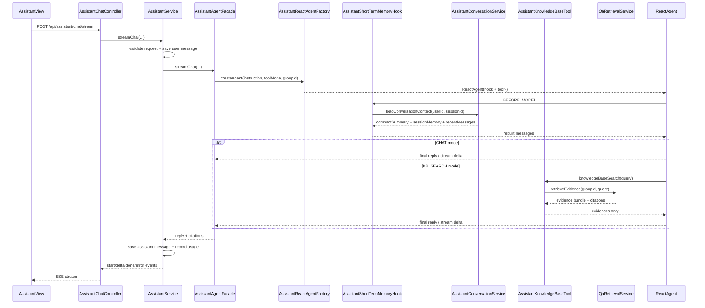

# Argus 助手模块整体流程与代码定位

> 适用读者：准备系统学习 Argus assistant 模块的开发者。
>
> 本文聚焦 assistant 模块本身，以及它和会话持久化、短期记忆、ReactAgent、知识库检索工具、qa retrieval 能力、前端 SSE 页面之间的协作关系。

---

## 1. 文档目标

这份文档回答 7 个问题：

1. Argus 的 assistant 模块由哪些子部分组成。
2. assistant 和 qa 的关系是什么，哪些能力复用、哪些能力不复用。
3. assistant 同步聊天和流式聊天分别怎么走。
4. assistant 的会话、消息、短期记忆和摘要分别由谁负责。
5. KB_SEARCH 模式下知识库工具是怎么工作的。
6. 前端 assistant 页面当前接了哪些接口，真实用户路径是什么。
7. 这一整套流程在项目里的具体代码位置分别在哪里。

---

## 2. 模块总览

Argus 的 assistant 模块不是“单个聊天接口”，而是由四条线共同组成：

```text
前端 Assistant 页面 / SSE 会话 UI
    ↓
接口层（AssistantChatController / AssistantSessionController / AssistantConversationController）
    ↓
应用编排层（AssistantService / AssistantSessionService / AssistantConversationService）
    ↓
Agent 执行层（AssistantAgentFacade / AssistantReactAgentFactory）
    ↓
上下文注入层（AssistantShortTermMemoryHook / AssistantPromptContextBuilder / AssistantRunnableConfigFactory）
    ↓
可选知识库工具层（AssistantKnowledgeBaseTool）
    ↓
qa retrieval 能力（QaRetrievalService -> qa 混合检索链路）
    ↓
消息与短期记忆持久化（assistant_sessions / assistant_messages / assistant_session_contexts）
```

从职责上看：

- `AssistantChatController` 负责同步聊天和 SSE 流式聊天入口。
- `AssistantSessionController` 负责会话的创建、列表、详情、重命名、删除。
- `AssistantConversationController` 负责返回某个会话的上下文信息。
- `AssistantService` 是聊天主编排层，负责参数校验、保存消息、调用 Agent、记录用量。
- `AssistantAgentFacade` 封装 ReactAgent 的同步 / 流式调用。
- `AssistantShortTermMemoryHook` 在每次模型调用前，把数据库里的压缩上下文和最近消息重组成真正送给模型的消息列表。
- `AssistantKnowledgeBaseTool` 只在 `KB_SEARCH` 模式下启用，负责把 assistant 的“查知识库”能力对接到 qa 的 retrieval 能力。
- `AssistantConversationService` 和 `AssistantSessionService` 则把 assistant 从“纯临时聊天”提升成“有持久化会话和上下文恢复能力”的模块。

这套设计的核心价值是：

- assistant 不直接复用 qa 的“问答页面接口”，而是只复用 qa 的“知识检索能力”。
- assistant 不是每次把全量历史消息都塞给模型，而是通过短期记忆、紧凑摘要和最近消息一起控制上下文。
- assistant 既能做纯对话，也能做带知识库工具的代理式回答。

---

## 3. 代码目录定位

### 3.1 后端 assistant 目录

路径：`Argus-backend/src/main/java/com/argus/rag/assistant`

```text
assistant/
├── agent/
│   ├── AssistantAgentFacade.java
│   ├── AssistantKnowledgeBaseTool.java
│   ├── AssistantKnowledgeBaseToolResultHolder.java
│   └── AssistantReactAgentFactory.java
├── controller/
│   ├── AssistantChatController.java
│   ├── AssistantConversationController.java
│   └── AssistantSessionController.java
├── mapper/
├── memory/
│   ├── AssistantMemoryPromptConfiguration.java
│   ├── AssistantMemorySummarizer.java
│   ├── AssistantSessionSummaryService.java
│   ├── AssistantShortTermMemoryHook.java
│   └── AssistantShortTermMemoryMaintenanceService.java
├── model/
│   ├── dto/
│   ├── entity/
│   ├── enums/
│   └── vo/
├── service/
│   ├── AssistantConversationService.java
│   ├── AssistantService.java
│   └── AssistantSessionService.java
└── support/
    └── config/
        ├── AssistantPromptContextBuilder.java
        └── AssistantRunnableConfigFactory.java
```

### 3.2 与 assistant 强关联但不在 assistant 目录的代码

- `Argus-backend/src/main/java/com/argus/rag/qa/service/QaRetrievalService.java`
- `Argus-backend/src/main/java/com/argus/rag/group/service/GroupMembershipService.java`
- `Argus-backend/src/main/java/com/argus/rag/auth/CurrentUserService.java`
- `Argus-backend/src/main/java/com/argus/rag/metrics/collector/LlmUsageCollector.java`
- `Argus-backend/src/main/java/com/argus/rag/metrics/cost/LlmCostCalculator.java`

assistant 模块虽然在名字上和 qa 平级，但它的知识库能力并不是自己重新做一套 retrieval，而是向下调用：

- `QaRetrievalService`

### 3.3 Prompt 模板位置

assistant 当前和“记忆压缩”直接相关的 Prompt 模板位于：

- `Argus-backend/src/main/resources/prompts/assistant/session-memory-update.st`
- `Argus-backend/src/main/resources/prompts/assistant/session-compact-summary.st`
- `Argus-backend/src/main/resources/prompts/assistant/runtime-compact-summary.st`

要注意：

- assistant 的主聊天 instruction 当前不是从 `.st` 文件加载的，而是运行时由 `AssistantPromptContextBuilder` 直接拼接生成。

### 3.4 前端配合代码

- `Argus-frontend/src/api/assistant.ts`
- `Argus-frontend/src/types/assistant.ts`
- `Argus-frontend/src/views/assistant/AssistantView.vue`
- `Argus-frontend/src/views/assistant/components/AssistantSidebar.vue`
- `Argus-frontend/src/views/assistant/components/AssistantTranscript.vue`
- `Argus-frontend/src/views/assistant/components/AssistantComposer.vue`
- `Argus-frontend/src/views/assistant/components/AssistantCitationBar.vue`

### 3.5 相关数据表

assistant 模块当前明确落库的表有三张：

- `sql/schema.sql` 中的 `assistant_sessions`
- `sql/schema.sql` 中的 `assistant_messages`
- `sql/schema.sql` 中的 `assistant_session_contexts`

其中：

- `assistant_sessions` 管会话元数据。
- `assistant_messages` 管对话消息。
- `assistant_session_contexts` 管短期记忆、紧凑摘要和历史摘要。

---

## 4. 配置层流程

### 4.1 assistant 复用项目当前聊天模型

位置：

- `Argus-backend/src/main/resources/application-dev.yml`

当前 Spring AI 聊天模型配置是：

```yaml
spring:
  ai:
    model:
      chat: dashscope
    dashscope:
      chat:
        options:
          model: qwen-plus
```

这意味着 assistant 当前底层聊天模型也是：

- `qwen-plus`

### 4.2 assistant 的主聊天 system instruction 由代码动态生成

位置：

- `AssistantPromptContextBuilder.java`

assistant 当前没有像 qa 那样把主聊天 prompt 单独放在资源文件里，而是通过代码动态拼接出 instruction，内容包括：

1. 角色定义
2. 回答原则
3. 信息不足时的处理规则
4. 表达风格约束
5. `KB_SEARCH` 模式下的工具调用规则

这意味着 assistant 的主系统提示词目前更偏“运行时生成策略”，不是“静态模板配置策略”。

### 4.3 RunnableConfig 会把用户、会话、模式写进 Agent 元数据

位置：

- `AssistantRunnableConfigFactory.java`

它会把以下内容写入 `RunnableConfig`：

- `threadId = user:{userId}:session:{sessionId}`
- `userId`
- `sessionId`
- `toolMode`
- `groupId`

这些元数据的直接消费方是：

- `AssistantShortTermMemoryHook`

### 4.4 assistant 的记忆压缩 Prompt 由独立配置类注册

位置：

- `AssistantMemoryPromptConfiguration.java`

当前注册了 3 个 `PromptTemplate` Bean：

1. `assistantSessionMemoryPromptTemplate`
2. `assistantCompactSummaryPromptTemplate`
3. `assistantRuntimeCompactPromptTemplate`

它们分别对应：

- 会话记忆更新
- 紧凑摘要生成
- 运行时上下文压缩

### 4.5 短期记忆和摘要阈值当前主要写在代码默认值里

位置：

- `AssistantShortTermMemoryMaintenanceService.java`
- `AssistantSessionSummaryService.java`

当前关键默认值包括：

- `session-token-threshold = 6500`
- `session-memory-message-trigger = 4`
- `session-memory-token-trigger = 1200`
- `compact-message-trigger = 6`
- `compact-token-trigger = 1800`
- `summary.message-threshold = 20`
- `summary.token-threshold = 8000`
- `summary.stale-days = 7`

这些值当前是通过 `@Value(...:默认值)` 写在代码里的，仓库里的 yml 没有看到单独的 assistant 配置段去覆盖它们。

### 4.6 ReactAgent 当前递归上限为 10

位置：

- `AssistantReactAgentFactory.java`

当前 Agent 编译配置里设置：

- `recursionLimit = 10`

它的目的很明确：

- 在 `KB_SEARCH` 模式下，至少要允许模型经历“决定调工具 -> 工具返回 -> 基于工具结果生成最终答案”这几个阶段。

### 4.7 MemorySaver 只是图运行态 checkpoint，不是业务记忆事实源

位置：

- `AssistantReactAgentFactory.java`

这点非常重要：

- assistant 的正式业务记忆事实源是数据库里的 `assistant_messages / assistant_session_contexts`
- `MemorySaver` 只是 ReactAgent 运行过程里的 checkpoint 组件

---

## 5. 数据模型与状态模型

### 5.1 AssistantToolMode

assistant 当前只有两个工作模式：

- `CHAT`
- `KB_SEARCH`

含义分别是：

- `CHAT`：纯对话，不使用知识库工具。
- `KB_SEARCH`：允许 Agent 调知识库工具后再生成回答。

### 5.2 AssistantChatRequest

assistant 聊天入参当前字段包括：

- `sessionId`
- `message`
- `toolMode`
- `groupId`

并且有两条显式规则：

- `CHAT` 模式不允许传 `groupId`
- `KB_SEARCH` 模式必须传 `groupId`

### 5.3 AssistantChatResponse

同步聊天返回：

- `sessionId`
- `messageId`
- `reply`
- `toolMode`
- `groupId`
- `citations`

这里的 `citations` 不是 assistant 自己单独定义的新模型，而是复用了 qa 的：

- `AskQuestionResponse.Citation`

### 5.4 AssistantChatStreamEvent

流式事件当前分四类：

- `start`
- `delta`
- `done`
- `error`

其中：

- `delta` 负责逐段文本
- `done` 负责最终 `messageId / reply / citations`

### 5.5 assistant_sessions

`assistant_sessions` 当前主要字段包括：

- `id`
- `user_id`
- `title`
- `status`
- `last_message_at`
- `created_at`
- `updated_at`

它解决的是“会话容器”的问题。

### 5.6 assistant_messages

`assistant_messages` 当前主要字段包括：

- `id`
- `session_id`
- `role`
- `tool_mode`
- `group_id`
- `content`
- `structured_payload`
- `created_at`

它解决的是“消息历史”和“模式切换后的上下文追踪”问题。

### 5.7 assistant_session_contexts

`assistant_session_contexts` 当前主要字段包括：

- `session_memory`
- `compact_summary`
- `summary_text`
- `session_memory_base_message_id`
- `session_memory_range_end_message_id`
- `compact_summary_base_message_id`
- `compact_summary_range_end_message_id`
- `source_message_id`
- `context_version`
- `updated_at`

这张表不是消息表，而是“会话压缩上下文表”。

### 5.8 三种上下文资产要区分开

assistant 当前存在三种不同形态的上下文资产：

1. `summary_text`：偏历史摘要，来自 `AssistantSessionSummaryService` 的本地文本压缩。
2. `session_memory`：LLM 生成的增量会话记忆。
3. `compact_summary`：LLM 生成的更紧凑压缩结果。

这个区分很重要，因为 assistant 不是所有摘要都靠大模型生成。

---

## 6. assistant 模块详细流程（完整落地版）

下面将 assistant 模块整体流程拆成 40 步，对应到项目实际代码位置。

### 第 1 步：前端进入 Assistant 页面

位置：

- `Argus-frontend/src/views/assistant/AssistantView.vue`

页面挂载时会并行做两件事：

1. 拉当前用户的 assistant 会话列表
2. 拉当前可见群组列表

### 第 2 步：前端默认会选中已有的第一个会话

如果会话列表非空，页面会自动：

- 取第一条 session
- 调 `/api/assistant/sessions/{sessionId}/context`
- 恢复最近消息

### 第 3 步：前端当前主聊天路径使用流式接口

位置：

- `Argus-frontend/src/views/assistant/AssistantView.vue`
- `Argus-frontend/src/api/assistant.ts`

虽然前端同时定义了：

- `sendAssistantMessage()`
- `streamAssistantMessage()`

但当前页面真正使用的是：

- `streamAssistantMessage()`

### 第 4 步：前端先确定模式和群组范围

assistant 当前页面支持两种模式：

- `CHAT`
- `KB_SEARCH`

其中：

- `CHAT` 模式下 `groupId` 传空
- `KB_SEARCH` 模式下必须先选择一个群组

### 第 5 步：如果当前没有会话，前端会先自动创建会话

位置：

- `AssistantView.vue -> ensureSession()`
- `POST /api/assistant/sessions`

也就是说，assistant 的聊天不是“无 session 的裸请求”，而是强依赖 `sessionId`。

### 第 6 步：前端先乐观插入用户消息和 assistant 占位气泡

位置：

- `AssistantView.vue -> handleAsk()`

当前前端在发流式请求前就会：

1. 先插入一条用户消息
2. 再插入一条空的 assistant 占位消息

后面所有 `delta` 都会追加到这个占位消息上。

### 第 7 步：AssistantChatController 提供同步和流式两个入口

位置：

- `AssistantChatController.java`

当前聊天入口有两条：

1. `POST /api/assistant/chat`
2. `POST /api/assistant/chat/stream`

### 第 8 步：流式入口会先建立 SseEmitter

位置：

- `AssistantChatController.streamChat()`

当前 SSE 超时时间设置为：

- `0L`

也就是无限超时。

### 第 9 步：流式入口会先把 UserContext 从请求线程转移到工作线程

位置：

- `AssistantChatController.streamChat()`

因为 SSE 使用独立线程池，`UserContext` 作为 `ThreadLocal` 不会自动透传，所以 Controller 先取出：

- `AuthenticatedUser`

再交给工作线程重新 set。

### 第 10 步：AssistantService 成为真正的聊天主入口

位置：

- `AssistantService.chat()`
- `AssistantService.streamChat()`

无论同步还是流式，核心业务编排都在这里。

### 第 11 步：AssistantService 先校验当前用户身份

位置：

- `CurrentUserService.requireBusinessUser()`

assistant 当前所有主流程都先要求：

- 当前必须是已登录业务用户

### 第 12 步：AssistantService 再校验聊天请求本身

位置：

- `AssistantService.requireChatRequest()`

这里会重点检查：

- 请求不能为 null
- `CHAT` 模式不能传 `groupId`
- `KB_SEARCH` 模式必须传 `groupId`

### 第 13 步：聊天开始前先保存用户消息

位置：

- `AssistantService.saveUserMessage()`
- `AssistantConversationService.saveUserMessage()`

assistant 当前是“先落用户消息，再调 Agent”，不是等模型回答后再一起补写历史。

### 第 14 步：首条用户消息可能触发自动重命名会话

位置：

- `AssistantSessionService.autoRenameSessionIfNeeded()`

如果会话标题还是默认值“新会话”，会尝试用首条用户消息的前 24 个字符做标题。

### 第 15 步：用户消息落库后会先触发一次短期记忆维护

位置：

- `AssistantConversationService.maintainShortTermMemory()`
- `AssistantShortTermMemoryMaintenanceService.maintainBeforeResponse()`

这里的目的不是立即回答，而是先让数据库里的上下文压缩资产尽量更新到最新状态。

### 第 16 步：KB_SEARCH 模式下会先校验群组可读权限

位置：

- `AssistantService.requireKnowledgeBaseReadableIfNeeded()`
- `GroupMembershipService.requireGroupReadable()`

所以 assistant 虽然是 Agent 形式，但知识库边界仍然严格收口在群组权限上。

### 第 17 步：AssistantAgentFacade 负责真正调起 Agent

位置：

- `AssistantAgentFacade.chat()`
- `AssistantAgentFacade.streamChat()`

它不是直接调用一个简单的 `ChatClient`，而是先组装运行时 instruction 和 `RunnableConfig`。

### 第 18 步：AssistantPromptContextBuilder 动态生成系统指令

位置：

- `AssistantPromptContextBuilder.buildChatInstruction()`

这里会根据：

- `sessionId`
- `toolMode`
- `groupId`

把当前会话环境写进最外层 system instruction。

### 第 19 步：AssistantRunnableConfigFactory 写入运行时元数据

位置：

- `AssistantRunnableConfigFactory.create()`

这些元数据稍后会被短期记忆 Hook 读取，用来回查会话上下文。

### 第 20 步：AssistantReactAgentFactory 创建 ReactAgent

位置：

- `AssistantReactAgentFactory.createAgent()`

当前创建出来的 Agent 固定带上：

1. `AssistantShortTermMemoryHook`
2. `MemorySaver`
3. `recursionLimit = 10`

### 第 21 步：CHAT 模式虽然不调知识库，也仍然走 ReactAgent 运行时

位置：

- `AssistantReactAgentFactory`
- `AssistantAgentFacade`

这意味着 assistant 当前的“纯聊天模式”不是单独做了一套轻量化通路，而是继续复用同一套 Agent 基础设施。

### 第 22 步：KB_SEARCH 模式会给 Agent 注入 knowledgeBaseSearch 工具

位置：

- `AssistantReactAgentFactory.createAgent()`
- `AssistantKnowledgeBaseTool.java`

只有当 `toolMode == KB_SEARCH` 时，Agent 才会额外挂上：

- `AssistantKnowledgeBaseTool`

同时会把 `groupId` 和 `resultHolder` 放进 tool context。

### 第 23 步：每次模型调用前，短期记忆 Hook 会重建真正送给模型的消息列表

位置：

- `AssistantShortTermMemoryHook.beforeModel()`

这个 Hook 是 assistant 的关键实现之一。

它不是在原消息列表上打补丁，而是直接重建：

1. `compact summary`
2. `session memory`
3. 最近消息
4. 运行时工具消息
5. 当前问题

### 第 24 步：Hook 会从数据库回查会话上下文

位置：

- `AssistantConversationService.loadConversationContext()`

也就是说，assistant 当前真正给模型看的上下文，并不是前端传什么就原样喂什么，而是后端按 session 主动组装的。

### 第 25 步：ConversationService 会决定优先复用已有摘要还是重新生成摘要

位置：

- `AssistantSessionSummaryService.loadReusableSummary()`
- `AssistantSessionSummaryService.shouldSummarize()`
- `AssistantSessionSummaryService.summarizeAndPersist()`

这里的 `summary_text` 逻辑是：

- 先看已有摘要是不是还能复用
- 如果不能复用，再根据消息量、token 估算和活跃时间决定是否生成新摘要

### 第 26 步：短期记忆维护服务负责更新 session_memory 和 compact_summary

位置：

- `AssistantShortTermMemoryMaintenanceService`
- `AssistantMemorySummarizer`

这里和 `summary_text` 不一样：

- `session_memory` / `compact_summary` 是调用 LLM 生成的
- 不是本地字符串拼接

### 第 27 步：CHAT 模式下，Agent 直接生成最终回答

位置：

- `AssistantService.executeAssistant()`
- `AssistantService.executeAssistantStreaming()`

在这个模式下不会额外做知识库权限校验，也不会注入知识库工具。

### 第 28 步：KB_SEARCH 模式下，Agent 可以调用 knowledgeBaseSearch 工具

位置：

- `AssistantKnowledgeBaseTool.search()`

这一步不会直接生成最终答案，而是先返回：

- evidence 列表
- evidenceLevel
- evidenceGuidance
- citations

### 第 29 步：knowledgeBaseSearch 实际复用的是 qa 的 retrieval 能力

位置：

- `AssistantKnowledgeBaseTool`
- `QaRetrievalService.retrieveEvidence()`

assistant 当前复用的是 qa 的“检索证据”能力，而不是 qa 的“问答回答”接口。

### 第 30 步：KB_SEARCH 工具一轮只允许一次有效检索

位置：

- `AssistantKnowledgeBaseTool.search()`
- `AssistantKnowledgeBaseToolResultHolder`

如果 Agent 再次重复调用工具，会收到：

- `DUPLICATE_TOOL_CALL`

要求它基于上一次工具返回的 evidences 直接回答。

### 第 31 步：如果证据不足，工具会返回 INSUFFICIENT_EVIDENCE，而不是让 Agent 自由发挥

位置：

- `AssistantKnowledgeBaseTool.search()`

这一步保证 `KB_SEARCH` 模式下的回答边界和 qa 一样，仍然是“先证据，后回答”。

### 第 32 步：Agent 返回最终文本后，AssistantService 保存 assistant 消息

位置：

- `AssistantService.saveAssistantMessage()`
- `AssistantConversationService.saveAssistantMessage()`

这里保存的是：

- 最终 reply
- 结构化载荷（当前主路径一般为 null）

### 第 33 步：assistant 回复落库后会再触发一次短期记忆维护

位置：

- `AssistantShortTermMemoryMaintenanceService.maintainAfterResponse()`

这样做的目的很明确：

- 不仅用户消息进入短期记忆
- assistant 自己刚生成的回复也会进入下一轮上下文资产

### 第 34 步：流式路径会把开始、增量、完成、错误拆成四类 SSE 事件

位置：

- `AssistantService.streamChat()`
- `AssistantChatController.streamChat()`

事件顺序通常是：

1. `start`
2. 若干个 `delta`
3. `done`

异常时则是：

4. `error`

### 第 35 步：流式增量会做“全文裁前缀 -> 真正 delta”处理

位置：

- `AssistantAgentFacade.normalizeStreamingDelta()`

这是因为某些模型流式节点会重复返回“截至当前的全文”，后端要先裁掉累计前缀，才能把真正增量发给前端。

### 第 36 步：最终引用来源不是从回答文本里抽，而是从 ToolResultHolder 里取

位置：

- `AssistantKnowledgeBaseToolResultHolder`
- `AssistantAgentFacade`

也就是说 assistant 当前的 citations 来源于知识库工具返回结果，而不是模型正文中的伪引用。

### 第 37 步：聊天结束后 assistant 会记录 LLM 用量和费用

位置：

- `AssistantService.recordUsage()`

当前记录维度包括：

- userId
- groupId
- sessionId
- endpoint
- prompt/completion/total tokens
- latency
- cost
- success
- errorMessage
- modelName

### 第 38 步：assistant 当前 token 统计采用字符数除以 4 的近似估算

位置：

- `AssistantService.estimateTokens()`

这是因为当前 ReactAgent 链路不直接暴露精确 token usage。

### 第 39 步：前端收到 done 事件后，会把最终 messageId、reply、citations 回填到占位消息

位置：

- `AssistantView.vue -> onStreamEvent()`

因此前端看到的 assistant 消息虽然是先空壳创建，但最终会被后端 authoritative reply 覆盖成完整内容。

### 第 40 步：历史恢复当前主要依赖 context 接口里的 recentMessages

位置：

- `AssistantView.vue -> loadSessionHistory()`

前端当前恢复会话历史时，主要消费的是：

- `recentMessages`

并没有把 `summaryText` 直接可视化展示到页面上。

---

## 7. assistant 聊天与知识库工具时序图



---

## 8. 权限、记忆与上下游边界

### 8.1 assistant 的知识库权限边界只在 KB_SEARCH 模式触发

位置：

- `AssistantService.requireKnowledgeBaseReadableIfNeeded()`

当前规则是：

- `CHAT` 模式不校验 group 可读权限
- `KB_SEARCH` 模式必须通过 `requireGroupReadable(groupId)`

### 8.2 assistant 和 qa 的关系是“复用 retrieval，不复用问答接口”

位置：

- `AssistantKnowledgeBaseTool`
- `QaRetrievalService`

assistant 当前没有调用 qa 的：

- `QaService`
- `QaChatService`

而是只调用：

- `QaRetrievalService`

### 8.3 assistant 的业务记忆事实源在数据库，不在 ReactAgent 运行时

位置：

- `assistant_messages`
- `assistant_session_contexts`
- `AssistantShortTermMemoryHook`

这意味着 assistant 的上下文恢复能力主要来自：

- 持久化消息
- 持久化摘要 / 记忆

### 8.4 短期记忆是“运行前注入 + 回答前后维护”双向机制

位置：

- `AssistantConversationService`
- `AssistantShortTermMemoryHook`
- `AssistantShortTermMemoryMaintenanceService`

这件事要分两半理解：

1. 调模型前，Hook 从数据库读上下文并注入模型。
2. 调模型前后，维护服务又持续更新数据库里的记忆资产。

---

## 9. 前端配合机制

### 9.1 当前页面的主用户体验是“有 sidebar 的持久化会话聊天页”

位置：

- `AssistantSidebar.vue`
- `AssistantTranscript.vue`
- `AssistantComposer.vue`

这和 qa 页面不同，assistant 当前明确做了：

- 会话列表
- 历史恢复
- 重命名与删除

### 9.2 前端当前主流程使用流式聊天，不走同步 chat 接口

位置：

- `Argus-frontend/src/api/assistant.ts`
- `Argus-frontend/src/views/assistant/AssistantView.vue`

同步 `sendAssistantMessage()` 已经定义，但当前页面没把它作为主流程。

### 9.3 前端当前的历史恢复主要依赖 context 接口，而不是直接查消息分页

位置：

- `fetchAssistantConversationContext()`
- `AssistantView.vue -> loadSessionHistory()`

这意味着当前页面的“恢复能力”依赖后端上下文组装结果，而不是前端自己拼消息。

### 9.4 assistant 的 citation 预览复用了 document 模块的预览弹窗

位置：

- `AssistantView.vue -> openCitation()`
- `DocumentPreviewModal.vue`

assistant 和 qa 在前端这一层是类似的：

- 都复用 document 预览能力，而不是自己重新做一个文档详情页。

---

## 10. 异常与返回结构

### 10.1 同步聊天走 ApiResponse 包装

`POST /api/assistant/chat` 当前返回：

- `ApiResponse<AssistantChatResponse>`

### 10.2 流式聊天走 SSE，而不是 JSON

`POST /api/assistant/chat/stream` 当前输出事件流：

- `start`
- `delta`
- `done`
- `error`

### 10.3 session 列表和 context 接口当前直接返回对象 / 数组

例如：

- `GET /api/assistant/sessions`
- `GET /api/assistant/sessions/{sessionId}`
- `GET /api/assistant/sessions/{sessionId}/context`

这些接口当前不是统一 `ApiResponse<T>` 包装。

### 10.4 assistant 里比较典型的业务错误口径

当前主链路中比较常见的错误包括：

- `CHAT 模式不允许传 groupId`
- `KB_SEARCH 模式必须传 groupId`
- `知识库检索 query 不能为空`
- `会话不存在`
- `助手返回内容为空`
- `DUPLICATE_TOOL_CALL`
- `INSUFFICIENT_EVIDENCE`

### 10.5 assistant 对用量记录是“失败不影响主流程”的降级策略

位置：

- `AssistantService.recordUsage()`

即便 metrics 记录失败，也只是 warn，不会打断主业务流程。

---

## 11. 当前版本需要特别留意的点

下面这些不是 assistant 的抽象设计，而是当前仓库实现里值得单独记住的事实。

### 11.1 当前前端真正使用的是流式接口，同步 chat 接口还没有接入页面主路径

代码位置：

- `Argus-frontend/src/api/assistant.ts`
- `Argus-frontend/src/views/assistant/AssistantView.vue`

### 11.2 assistant 的 CHAT 模式虽然不使用知识库工具，但仍然走 ReactAgent 运行时

代码位置：

- `AssistantAgentFacade`
- `AssistantReactAgentFactory`

也就是说当前没有“纯聊天专用轻量链路”。

### 11.3 assistant 复用的是 qa retrieval，而不是 qa 完整问答链路

代码位置：

- `AssistantKnowledgeBaseTool`
- `QaRetrievalService`

不要把 assistant 讲成“直接套壳 qa 问答页”，这在实现上是不对的。

### 11.4 assistant 的 token / cost 当前是估算值，不是模型原生精确统计

代码位置：

- `AssistantService.estimateTokens()`
- `AssistantService.recordUsage()`

当前算法就是：

- `chars / 4`

### 11.5 schema 虽然支持 TOOL 角色消息，但当前主链路只明确持久化 USER 和 ASSISTANT

代码位置：

- `assistant_messages.role`
- `AssistantConversationService.saveUserMessage()`
- `AssistantConversationService.saveAssistantMessage()`

运行时的工具观察主要是在 Hook 组装模型消息时参与，并没有看到当前主链路把 TOOL 消息单独落库。

### 11.6 runtime compact 相关能力存在，但当前没看到接入主路径

代码位置：

- `AssistantMemorySummarizer.summarizeRuntimeContext()`
- `AssistantShortTermMemoryHook.shouldRuntimeCompact()`
- `AssistantShortTermMemoryHook.runtimeCompact()`

这些能力当前在代码里存在，但从调用链看还不是现行主路径的一部分。

### 11.7 summary_text 和 session_memory / compact_summary 不是同一种摘要资产

代码位置：

- `AssistantSessionSummaryService`
- `AssistantShortTermMemoryMaintenanceService`

`summary_text` 更偏本地生成的历史摘要。

`session_memory` 和 `compact_summary` 是通过 LLM 更新出来的短期记忆资产。

### 11.8 context 接口会返回 summaryText，但当前前端恢复历史主要只用 recentMessages

代码位置：

- `AssistantConversationController`
- `AssistantView.vue -> loadSessionHistory()`

这意味着后端已经具备摘要能力，但当前页面没有把摘要直接可视化展示出来。

### 11.9 KB_SEARCH 模式一轮最多一次有效检索，是当前 system instruction + tool 返回双重约束的结果

代码位置：

- `AssistantPromptContextBuilder`
- `AssistantKnowledgeBaseTool`

这对理解 assistant 的“代理度”很重要：

- 它不是开放式多工具多轮规划代理
- 当前更像“有一次知识库检索机会的受约束 Agent”

---

## 12. 对简历和面试最值得保留的讲法

### 12.1 建议重点保留的 6 个工程点

1. assistant 模块不是简单聊天框，而是“持久化会话 + ReactAgent + 可选知识库工具 + 短期记忆注入”的组合式助手。
2. assistant 通过 `AssistantShortTermMemoryHook` 在每次模型调用前重建上下文，而不是每轮直接塞全量聊天记录。
3. assistant 在 `KB_SEARCH` 模式下复用了 qa 的混合检索能力，但没有直接复用 qa 的问答生成接口。
4. assistant 同时支持同步返回和 SSE 流式返回，前端当前主流程是流式体验。
5. 会话消息和上下文资产是持久化的，包含 `assistant_sessions / assistant_messages / assistant_session_contexts` 三张表。
6. assistant 的用量、延迟和费用都有统计，只是当前 token 统计还是估算版。

### 12.2 面试时建议收口的地方

1. 不要把 assistant 讲成“完整多工具 Agent 平台”，当前工具能力主要还是单一的知识库检索工具。
2. 不要把 assistant 讲成“直接复用 qa 回答接口”，它复用的是 retrieval 而不是 answer generation。
3. 不要把当前记忆系统讲成“长期记忆体系”，当前更准确的说法是“短期记忆 + 历史摘要 + 会话持久化”。
4. 不要把当前 token/cost 统计讲成精确账单级数据，它现在是业务可观测意义上的近似值。

---

## 13. 推荐阅读顺序

如果你第一次系统学习 assistant 模块，建议按下面顺序阅读：

1. `Argus-backend/src/main/java/com/argus/rag/assistant/controller/AssistantChatController.java`
2. `Argus-backend/src/main/java/com/argus/rag/assistant/service/AssistantService.java`
3. `Argus-backend/src/main/java/com/argus/rag/assistant/agent/AssistantAgentFacade.java`
4. `Argus-backend/src/main/java/com/argus/rag/assistant/agent/AssistantReactAgentFactory.java`
5. `Argus-backend/src/main/java/com/argus/rag/assistant/memory/AssistantShortTermMemoryHook.java`
6. `Argus-backend/src/main/java/com/argus/rag/assistant/service/AssistantConversationService.java`
7. `Argus-backend/src/main/java/com/argus/rag/assistant/memory/AssistantShortTermMemoryMaintenanceService.java`
8. `Argus-backend/src/main/java/com/argus/rag/assistant/memory/AssistantSessionSummaryService.java`
9. `Argus-backend/src/main/java/com/argus/rag/assistant/agent/AssistantKnowledgeBaseTool.java`
10. `Argus-backend/src/main/java/com/argus/rag/qa/service/QaRetrievalService.java`
11. `Argus-backend/src/main/java/com/argus/rag/assistant/support/config/AssistantPromptContextBuilder.java`
12. `Argus-backend/src/main/java/com/argus/rag/assistant/memory/AssistantMemoryPromptConfiguration.java`
13. `Argus-backend/src/main/resources/prompts/assistant/session-memory-update.st`
14. `Argus-backend/src/main/resources/prompts/assistant/session-compact-summary.st`
15. `Argus-frontend/src/views/assistant/AssistantView.vue`
16. `Argus-frontend/src/api/assistant.ts`
17. `sql/schema.sql`

这样可以先建立“聊天主链 -> Agent -> 短期记忆 -> 知识库工具 -> 前端接线”的整体视图，再回头看细节实现。

---

## 14. 一句话总结

Argus 的 assistant 模块本质上是一套“有持久化会话和短期记忆注入能力的 ReactAgent 聊天入口”，在纯对话模式下可直接聊天，在 `KB_SEARCH` 模式下则通过知识库工具复用 qa 的检索能力，再把证据约束下的回答和引用结果以同步或 SSE 流式方式返回给前端。