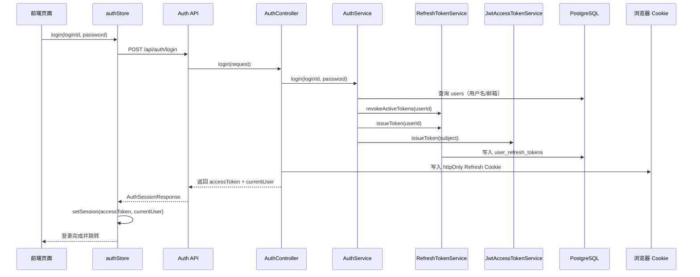
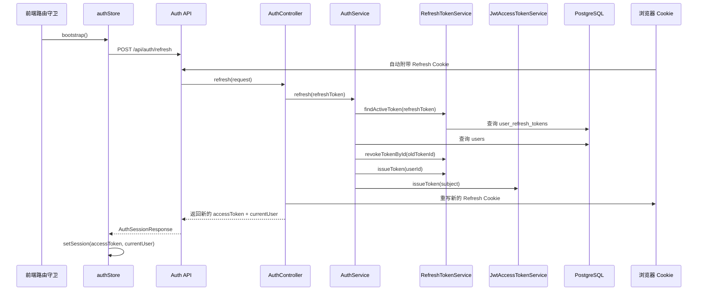

# Argus 认证模块整体流程与代码定位

> 适用读者：准备系统学习 Argus 项目认证链路的开发者。
>
> 本文聚焦 auth 模块本身，以及它和前端路由、账户设置、数据库、异常处理之间的协作关系。

---

## 1. 文档目标

这份文档回答 5 个问题：

1. Argus 的认证模块由哪些类组成。
2. 登录、注册、鉴权、刷新、登出、改密分别怎么走。
3. Access Token 和 Refresh Token 分别存在哪里、什么时候更新。
4. 前端如何恢复会话、做路由守卫、处理强制改密。
5. 这一套流程在项目里的具体代码位置分别在哪里。

---

## 2. 模块总览

Argus 的认证体系不是“单个 AuthController”这么简单，而是由以下几层共同组成：

```text
前端页面/路由/状态
    ↓
认证接口层（AuthController / AccountController）
    ↓
认证编排层（AuthService / AccountService）
    ↓
令牌层（JwtAccessTokenService / RefreshTokenService / AuthCookieSupport）
    ↓
请求认证层（JwtAuthenticationFilter / UserContext / CurrentUserService）
    ↓
数据层（users / user_refresh_tokens）
```

从职责上看：

- 前端负责发起登录、保存 Access Token、恢复会话、根据角色和 mustChangePassword 做跳转。
- AuthController 负责认证协议入口。
- AuthService 负责登录、注册、刷新、登出的业务编排。
- JwtAccessTokenService 负责 Access Token 的签发与解析。
- RefreshTokenService 负责 Refresh Token 的签发、校验、吊销和重放检测。
- JwtAuthenticationFilter 负责把 Bearer Token 变成请求内的当前用户上下文。
- CurrentUserService 负责在业务层“正式拿当前用户”，并回库校验状态。

---

## 3. 代码目录定位

### 3.1 后端 auth 目录

路径：`Argus-backend/src/main/java/com/argus/rag/auth`

```text
auth/
├── config/
│   ├── AuthConfiguration.java
│   ├── AuthProperties.java
│   └── DevAdminInitializer.java
├── constant/
│   └── AuthConstant.java
├── controller/
│   └── AuthController.java
├── mapper/
│   └── UserRefreshTokenMapper.java
├── model/
│   ├── dto/
│   │   ├── LoginRequest.java
│   │   └── RegisterRequest.java
│   ├── entity/
│   │   └── UserRefreshToken.java
│   └── vo/
│       ├── AuthTokensResponse.java
│       └── CurrentUserProfileResponse.java
├── security/
│   ├── AuthCookieSupport.java
│   ├── JwtAccessTokenService.java
│   ├── JwtAuthenticationFilter.java
│   └── RefreshTokenService.java
├── service/
│   ├── AuthService.java
│   ├── PasswordHasher.java
│   ├── PasswordPolicyValidator.java
│   └── RefreshTokenRecord.java
└── CurrentUserService.java
```

### 3.2 与 auth 强关联但不在 auth 目录的代码

- 账户密码修改：`Argus-backend/src/main/java/com/argus/rag/user/controller/AccountController.java`
- 账户密码修改服务：`Argus-backend/src/main/java/com/argus/rag/user/service/AccountService.java`
- 当前用户回库查询：`Argus-backend/src/main/java/com/argus/rag/user/service/UserQueryService.java`
- 用户登录查询 SQL：`Argus-backend/src/main/resources/mappers/UserMapper.xml`
- 统一异常出口：`Argus-backend/src/main/java/com/argus/rag/common/exception/GlobalExceptionHandler.java`
- 统一响应结构：`Argus-backend/src/main/java/com/argus/rag/common/api/ApiResponse.java`
- 请求级用户上下文：`Argus-backend/src/main/java/com/argus/rag/common/security/UserContext.java`
- 请求级已认证用户：`Argus-backend/src/main/java/com/argus/rag/common/security/AuthenticatedUser.java`

### 3.3 前端配合代码

- 登录页：`Argus-frontend/src/views/LoginView.vue`
- 首页登录/注册弹窗：`Argus-frontend/src/components/LoginModal.vue`
- 认证 API：`Argus-frontend/src/api/auth.ts`
- 全局 HTTP 客户端：`Argus-frontend/src/api/http.ts`
- 认证状态仓库：`Argus-frontend/src/stores/auth.ts`
- 路由守卫：`Argus-frontend/src/router/index.ts`
- 设置页：`Argus-frontend/src/views/settings/SettingsView.vue`
- 账户改密组件：`Argus-frontend/src/components/AccountPasswordForm.vue`

### 3.4 数据库表

- 用户表：`sql/schema.sql` 中的 `users`
- Refresh Token 表：`sql/schema.sql` 中的 `user_refresh_tokens`

---

## 4. 配置层流程

### 4.1 认证配置入口

认证相关配置位于：

- `Argus-backend/src/main/resources/application-dev.yml`
- `Argus-backend/src/main/java/com/argus/rag/auth/config/AuthProperties.java`

当前关键配置包括：

```yaml
rag:
  auth:
    jwt-secret: ${DD_RAG_JWT_SECRET:change-me-to-a-32byte-secret-key}
    issuer: argus-rag
    access-token-expire-minutes: 30
    refresh-token-expire-days: 14
    refresh-cookie-name: ARGUS_DD_RAG_REFRESH_TOKEN
    refresh-cookie-secure: false
```

这些配置决定了：

- JWT 签发者是谁。
- Access Token 多久过期。
- Refresh Token 多久过期。
- Refresh Token Cookie 用什么名字。
- 开发环境是否允许非 HTTPS 发送 Refresh Cookie。

### 4.2 认证基础 Bean

`AuthConfiguration.java` 提供两个关键 Bean：

1. `Clock`
2. `PasswordHasher`

`PasswordHasher` 的默认实现基于 `BCryptPasswordEncoder`，并额外限制密码字节数不超过 72 字节，避免 BCrypt 截断带来的安全和行为歧义。

---

## 5. 数据模型与令牌模型

### 5.1 users 表的认证相关字段

`sql/schema.sql` 中 `users` 表的关键字段：

- `username`：登录用户名
- `email`：登录邮箱
- `password_hash`：BCrypt 哈希后的密码
- `system_role`：系统角色，`ADMIN | USER`
- `status`：账号状态，`ACTIVE | DISABLED`
- `must_change_password`：是否强制修改密码
- `last_login_at`：最后登录时间

### 5.2 user_refresh_tokens 表

`sql/schema.sql` 中 `user_refresh_tokens` 用于持久化 Refresh Token：

- `user_id`：关联用户
- `token_id`：Refresh Token 的索引字段
- `token_hash`：完整 Refresh Token 的 BCrypt 哈希
- `expires_at`：过期时间
- `revoked_at`：吊销时间
- `created_at`：创建时间

这张表说明项目采用的是“可持久化、可吊销、可轮换”的 Refresh Token 模式，而不是无状态长令牌。

### 5.3 Access Token 与 Refresh Token 的分工

Argus 将两类令牌分开管理：

- Access Token：短期 JWT，用于每次业务请求的 Bearer 鉴权。
- Refresh Token：长期凭证，用于 Access Token 过期后的会话恢复。

存放位置也不同：

- Access Token：前端内存状态中保存，不落本地持久化。
- Refresh Token：浏览器 `httpOnly Cookie` 中保存，前端 JavaScript 不直接读取。

---

## 6. 认证模块详细流程（完整落地版）

下面将 auth 模块整体流程拆成 28 步，对应到项目实际代码位置。

### 第 1 步：应用启动读取认证配置

入口位置：

- `Argus-backend/src/main/resources/application-dev.yml`
- `Argus-backend/src/main/java/com/argus/rag/auth/config/AuthProperties.java`

Spring Boot 启动时先加载认证相关配置，再绑定到 `AuthProperties`，为后续 JWT 和 Cookie 策略提供运行参数。

### 第 2 步：注册认证基础 Bean

位置：`Argus-backend/src/main/java/com/argus/rag/auth/config/AuthConfiguration.java`

系统注册：

- `Clock`
- `PasswordHasher`

后续签发令牌、判断过期时间、哈希密码都依赖这里的 Bean。

### 第 3 步：dev 环境管理员初始化

位置：`Argus-backend/src/main/java/com/argus/rag/auth/config/DevAdminInitializer.java`

在 `dev` profile 下，启动后会自动确保存在一个管理员账号。

### 第 4 步：前端展示登录页或登录弹窗

位置：

- `Argus-frontend/src/views/LoginView.vue`
- `Argus-frontend/src/components/LoginModal.vue`

用户可以从独立登录页进入，也可以从首页弹窗进入。

### 第 5 步：前端提交注册请求

位置：

- `Argus-frontend/src/components/LoginModal.vue`
- `Argus-frontend/src/api/auth.ts`

注册请求走 `POST /api/auth/register`。

### 第 6 步：后端接收注册请求

位置：`Argus-backend/src/main/java/com/argus/rag/auth/controller/AuthController.java`

`AuthController.register()` 接收 `RegisterRequest`，随后调用 `AuthService.register()`。

### 第 7 步：注册参数校验与归一化

位置：

- `Argus-backend/src/main/java/com/argus/rag/auth/model/dto/RegisterRequest.java`
- `Argus-backend/src/main/java/com/argus/rag/auth/service/AuthService.java`
- `Argus-backend/src/main/java/com/argus/rag/auth/service/PasswordPolicyValidator.java`

这一步负责：

- 非空校验
- 长度校验
- 用户名合法性校验
- 保留用户名过滤
- 密码复杂度校验

### 第 8 步：注册前检查用户名/邮箱唯一性

位置：`Argus-backend/src/main/java/com/argus/rag/auth/service/AuthService.java`

`ensureUniqueIdentity()` 会分别检查用户名和邮箱是否已被占用。

### 第 9 步：写入 users 表

位置：

- `Argus-backend/src/main/java/com/argus/rag/auth/service/AuthService.java`
- `sql/schema.sql`

注册成功后插入一条用户记录，默认：

- `system_role = USER`
- `status = ACTIVE`
- `must_change_password = false`

### 第 10 步：前端提交登录请求

位置：

- `Argus-frontend/src/views/LoginView.vue`
- `Argus-frontend/src/components/LoginModal.vue`
- `Argus-frontend/src/stores/auth.ts`
- `Argus-frontend/src/api/auth.ts`

登录请求走 `POST /api/auth/login`。

### 第 11 步：后端登录入口接收请求

位置：`Argus-backend/src/main/java/com/argus/rag/auth/controller/AuthController.java`

`AuthController.login()` 接收 `LoginRequest`，调用 `AuthService.login()`。

### 第 12 步：登录参数校验

位置：

- `Argus-backend/src/main/java/com/argus/rag/auth/model/dto/LoginRequest.java`
- `Argus-backend/src/main/java/com/argus/rag/auth/service/AuthService.java`

主要校验：

- `loginId` 非空与长度
- `password` 非空与长度
- BCrypt 72 字节限制

### 第 13 步：按用户名或邮箱查找用户

位置：

- `Argus-backend/src/main/java/com/argus/rag/auth/service/AuthService.java`
- `Argus-backend/src/main/java/com/argus/rag/user/mapper/UserMapper.java`
- `Argus-backend/src/main/resources/mappers/UserMapper.xml`

`selectByLoginIdForUpdate()` 的 SQL 是：按用户名或邮箱查用户，并加 `for update` 行锁。

### 第 14 步：校验用户状态与密码

位置：`Argus-backend/src/main/java/com/argus/rag/auth/service/AuthService.java`

这一步负责：

- 拒绝禁用账户登录
- 使用 `PasswordHasher.matches()` 校验密码

### 第 15 步：吊销旧的 Refresh Token

位置：

- `Argus-backend/src/main/java/com/argus/rag/auth/service/AuthService.java`
- `Argus-backend/src/main/java/com/argus/rag/auth/security/RefreshTokenService.java`

登录成功后，系统会先把该用户所有仍有效的 Refresh Token 吊销。

这意味着当前实现偏向单设备登录。

### 第 16 步：签发新的 Refresh Token

位置：`Argus-backend/src/main/java/com/argus/rag/auth/security/RefreshTokenService.java`

Refresh Token 生成后格式为：

```text
tokenId.secret
```

其中：

- `tokenId` 用于查库
- 完整 token 会被 BCrypt 哈希后再持久化

### 第 17 步：签发新的 Access Token

位置：`Argus-backend/src/main/java/com/argus/rag/auth/security/JwtAccessTokenService.java`

Access Token 里包含以下关键信息：

- `uid`
- `userCode`
- `displayName`
- `systemRole`
- `mustChangePassword`
- `issuedAt`
- `expiration`

### 第 18 步：后端写入 Refresh Cookie 并返回登录响应

位置：

- `Argus-backend/src/main/java/com/argus/rag/auth/controller/AuthController.java`
- `Argus-backend/src/main/java/com/argus/rag/auth/security/AuthCookieSupport.java`
- `Argus-backend/src/main/java/com/argus/rag/auth/model/vo/AuthTokensResponse.java`

响应体只返回：

- `accessToken`
- `currentUser`

Refresh Token 不在 JSON 中返回，而是写入 `httpOnly Cookie`。

### 第 19 步：前端建立本地认证状态

位置：`Argus-frontend/src/stores/auth.ts`

`setSession()` 会：

- 保存 `accessToken`
- 保存 `currentUser`
- 把 `Authorization: Bearer <accessToken>` 挂到全局 axios 默认请求头

### 第 20 步：前端根据角色和 mustChangePassword 决定落点

位置：`Argus-frontend/src/stores/auth.ts`

登录成功后的跳转规则主要由：

- `resolveAuthorizedPath()`
- `resolveRoleRedirect()`

共同决定。

优先级是：

1. 如果 `mustChangePassword = true`，先去 `/app/settings`
2. 如果是 `ADMIN`，默认去 `/app/admin/users`
3. 如果是普通用户，默认去 `/app/groups`

### 第 21 步：前端路由守卫尝试恢复会话

位置：`Argus-frontend/src/router/index.ts`

每次路由切换前，都会先调用 `authStore.bootstrap()`。

### 第 22 步：前端优先用现有 Access Token 获取当前用户

位置：`Argus-frontend/src/stores/auth.ts`

如果内存里还有 Access Token，则优先调用 `GET /api/auth/me`。

### 第 23 步：如果 Access Token 不可用，则调用刷新接口

位置：

- `Argus-frontend/src/stores/auth.ts`
- `Argus-frontend/src/api/auth.ts`

前端调用 `POST /api/auth/refresh`，浏览器会自动把 Refresh Cookie 带上。

### 第 24 步：后端从 Cookie 中提取 Refresh Token

位置：`Argus-backend/src/main/java/com/argus/rag/auth/controller/AuthController.java`

`extractRefreshToken()` 会遍历 Cookie，找到配置中的 `refreshCookieName`。

### 第 25 步：后端校验 Refresh Token 是否有效

位置：`Argus-backend/src/main/java/com/argus/rag/auth/security/RefreshTokenService.java`

刷新时系统会进行 4 层验证：

1. 解析 token 格式
2. 按 `tokenId` 查找数据库记录
3. BCrypt 比对完整 token
4. 检查是否未过期且未吊销

### 第 26 步：刷新时执行 token rotation 和重放检测

位置：

- `Argus-backend/src/main/java/com/argus/rag/auth/service/AuthService.java`
- `Argus-backend/src/main/java/com/argus/rag/auth/mapper/UserRefreshTokenMapper.java`

旧 Refresh Token 在使用成功后会立刻被原子吊销，并签发一张新的。

如果旧 Token 已经被别人先一步使用，就会触发“疑似重放攻击”的分支，刷新失败并要求重新登录。

### 第 27 步：前端更新新的 Access Token 和当前用户信息

位置：`Argus-frontend/src/stores/auth.ts`

刷新成功后，前端重新执行 `setSession()`，恢复登录态。

### 第 28 步：后续受保护请求进入 JWT 鉴权过滤器

位置：`Argus-backend/src/main/java/com/argus/rag/auth/security/JwtAuthenticationFilter.java`

除了 `/api/auth/login`、`/api/auth/register`、`/api/auth/refresh`、`/api/auth/logout` 这些白名单路径，其余受保护请求都会经过该过滤器。

### 第 29 步：过滤器解析 Bearer Token

位置：`Argus-backend/src/main/java/com/argus/rag/auth/security/JwtAuthenticationFilter.java`

过滤器从 `Authorization` 头中提取 Bearer Token，然后调用 `JwtAccessTokenService.parse()` 做签名校验和声明解析。

### 第 30 步：过滤器写入请求级用户上下文

位置：

- `Argus-backend/src/main/java/com/argus/rag/auth/security/JwtAuthenticationFilter.java`
- `Argus-backend/src/main/java/com/argus/rag/common/security/UserContext.java`
- `Argus-backend/src/main/java/com/argus/rag/common/security/AuthenticatedUser.java`

解析成功后，过滤器会把当前认证用户放进 `ThreadLocal` 形式的 `UserContext`。

### 第 31 步：业务层正式获取当前用户

位置：`Argus-backend/src/main/java/com/argus/rag/auth/CurrentUserService.java`

业务代码不会直接使用 JWT 中的结果，而是统一通过 `CurrentUserService.getRequiredCurrentUser()` 获取当前用户。

### 第 32 步：CurrentUserService 回库确认用户状态

位置：

- `Argus-backend/src/main/java/com/argus/rag/auth/CurrentUserService.java`
- `Argus-backend/src/main/java/com/argus/rag/user/service/UserQueryService.java`

CurrentUserService 会根据 `userId` 再查一遍数据库，确认：

- 用户仍然存在
- 用户没有被禁用

这一步让数据库状态优先于 JWT。

### 第 33 步：/auth/me 返回当前登录用户信息

位置：

- `Argus-backend/src/main/java/com/argus/rag/auth/controller/AuthController.java`
- `Argus-backend/src/main/java/com/argus/rag/auth/model/vo/CurrentUserProfileResponse.java`

该接口把当前用户转换成前端可直接消费的用户信息结构。

### 第 34 步：用户主动登出

位置：

- 前端：`Argus-frontend/src/stores/auth.ts`
- 后端：`Argus-backend/src/main/java/com/argus/rag/auth/controller/AuthController.java`
- 令牌吊销：`Argus-backend/src/main/java/com/argus/rag/auth/service/AuthService.java`

登出时后端会吊销当前 Refresh Token，并清除 Cookie。

### 第 35 步：前端清理本地会话

位置：`Argus-frontend/src/stores/auth.ts`

无论服务端登出是否成功，前端都会调用 `clearSession()` 清掉：

- `accessToken`
- `currentUser`
- 全局 Authorization 请求头

### 第 36 步：用户修改密码

位置：

- `Argus-frontend/src/views/settings/SettingsView.vue`
- `Argus-frontend/src/components/AccountPasswordForm.vue`
- `Argus-backend/src/main/java/com/argus/rag/user/controller/AccountController.java`
- `Argus-backend/src/main/java/com/argus/rag/user/service/AccountService.java`

修改密码不走 `/api/auth/*`，而是走 `/api/account/change-password`。

### 第 37 步：后端校验改密请求并更新密码

位置：`Argus-backend/src/main/java/com/argus/rag/user/service/AccountService.java`

改密时会检查：

- 新密码复杂度
- 当前密码是否正确
- 新旧密码是否不同

成功后更新 `password_hash`，并把 `must_change_password` 置回 `false`。

### 第 38 步：改密后吊销全部 Refresh Token

位置：`Argus-backend/src/main/java/com/argus/rag/user/service/AccountService.java`

密码修改成功后，会吊销该用户所有有效的 Refresh Token，让历史会话失效。

### 第 39 步：前端处理强制改密状态

位置：

- `Argus-frontend/src/stores/auth.ts`
- `Argus-frontend/src/views/settings/SettingsView.vue`

如果当前用户 `mustChangePassword = true`，前端会强制把他导向设置页，直到完成密码修改。

### 第 40 步：异常统一输出

位置：

- `Argus-backend/src/main/java/com/argus/rag/common/exception/GlobalExceptionHandler.java`
- `Argus-backend/src/main/java/com/argus/rag/auth/security/JwtAuthenticationFilter.java`

标准业务异常走 `GlobalExceptionHandler`，非法 Access Token 则由 `JwtAuthenticationFilter` 直接写回 401 JSON。

---

## 7. 登录链路时序图



---

## 8. 刷新链路时序图



---

## 9. 当前用户获取流程

后端业务代码获取“当前登录用户”时，走的不是 Controller 参数注入，而是下面这条链：

```text
HTTP 请求
    ↓
JwtAuthenticationFilter
    ↓
JwtAccessTokenService.parse(accessToken)
    ↓
UserContext.set(AuthenticatedUser)
    ↓
CurrentUserService.getRequiredCurrentUser()
    ↓
UserQueryService.findById(userId)
    ↓
返回 CurrentUser
```

这条设计的核心价值有两点：

1. 业务层拿当前用户的方式统一。
2. 即便 JWT 仍未过期，只要数据库里用户状态变成禁用，请求也会被拦住。

---

## 10. 前端配合机制

### 10.1 authStore 的职责

`Argus-frontend/src/stores/auth.ts` 负责：

- 保存 `accessToken`
- 保存 `currentUser`
- 给 axios 设置默认 Authorization 头
- 在页面刷新后通过 `refresh()` 恢复会话
- 根据角色和强制改密状态做路由跳转

### 10.2 路由守卫职责

`Argus-frontend/src/router/index.ts` 的全局守卫会：

1. 先调用 `authStore.bootstrap()` 尝试恢复会话
2. 未登录访问受保护页面时跳转到 `/login`
3. 已登录访问公开页面时跳转到首页
4. 已登录但角色不匹配时重定向到允许访问的首页
5. 如果 `mustChangePassword = true`，优先跳转到 `/app/settings`

### 10.3 HTTP 客户端职责

`Argus-frontend/src/api/http.ts` 中的 axios 实例默认：

- `baseURL = /api`
- `withCredentials = true`

这使得浏览器能自动携带 Refresh Cookie。

---

## 11. 密码策略

密码策略位于：

- `Argus-backend/src/main/java/com/argus/rag/auth/service/PasswordPolicyValidator.java`
- `Argus-backend/src/main/java/com/argus/rag/auth/constant/AuthConstant.java`

当前后端真实要求是：

- 至少 8 位
- 最多 256 位
- 必须同时包含字母和数字
- UTF-8 编码后不得超过 72 字节

这里以后端为准。

---

## 12. 异常与返回结构

### 12.1 标准接口返回

后端控制器大多返回统一结构：

```json
{
  "success": true,
  "data": {},
  "message": "操作成功"
}
```

位置：`Argus-backend/src/main/java/com/argus/rag/common/api/ApiResponse.java`

### 12.2 异常映射

位置：`Argus-backend/src/main/java/com/argus/rag/common/exception/GlobalExceptionHandler.java`

映射关系：

- `BusinessException` -> 400
- `UnauthorizedException` -> 401
- `ForbiddenException` -> 403
- 参数校验失败 -> 400
- 未处理异常 -> 500

### 12.3 JWT 认证失败的特殊出口

位置：`Argus-backend/src/main/java/com/argus/rag/auth/security/JwtAuthenticationFilter.java`

Access Token 非法或已过期时，不进入 `GlobalExceptionHandler`，而是由过滤器直接返回 401 JSON。

---

## 13. 当前版本需要特别留意的点

下面这些不是“认证流程设计本身”，而是当前仓库实现里值得特别注意的地方：

### 13.1 登录标识匹配规则以 SQL 为准

`Argus-frontend/src/api/auth.ts` 注释写着“用户名或邮箱，不区分大小写”，但当前实际 SQL 位于：

- `Argus-backend/src/main/resources/mappers/UserMapper.xml`

从 SQL 看是：

```sql
where username = #{loginId} or email = #{loginId}
```

没有看到显式大小写归一化逻辑，因此学习和排查问题时应以实际 SQL 为准。

### 13.2 前端改密前置校验比后端更宽松

前端设置页和账户密码组件都主要检查“至少 6 位”，但后端密码策略要求“至少 8 位且同时包含字母和数字”。

因此：

- 页面上看似能提交的密码
- 后端未必会接受

真正生效的是后端校验。

### 13.3 mustChangePassword 流程已打通，但写 true 的入口不明显

当前代码中可以清楚看到：

- JWT 会携带 `mustChangePassword`
- `/auth/me` 会返回 `mustChangePassword`
- 前端会基于 `mustChangePassword` 强制跳转到设置页
- 修改密码后会清回 `false`

但当前版本中没有明显的业务入口把它设置成 `true`。

### 13.4 dev 管理员配置前缀与 yml 前缀存在不一致

代码位置：

- `Argus-backend/src/main/java/com/argus/rag/auth/config/DevAdminInitializer.java`
- `Argus-backend/src/main/resources/application-dev.yml`

`DevAdminInitializer` 使用的是 `ddrag.dev-admin.*`，而 yml 中写的是 `rag.dev-admin.*`。

### 13.5 PasswordPolicyValidator 的使用方式值得留意

`AuthService` 当前通过静态方式调用：

- `PasswordPolicyValidator.validate(...)`

而 `AccountService` 则通过构造器注入 `PasswordPolicyValidator`。

阅读源码时，这一点要特别留意实际运行方式是否完全一致。

---

## 14. 推荐阅读顺序

如果你第一次系统学习这套认证模块，建议按下面顺序阅读：

1. `Argus-backend/src/main/resources/application-dev.yml`
2. `Argus-backend/src/main/java/com/argus/rag/auth/config/AuthProperties.java`
3. `Argus-backend/src/main/java/com/argus/rag/auth/controller/AuthController.java`
4. `Argus-backend/src/main/java/com/argus/rag/auth/service/AuthService.java`
5. `Argus-backend/src/main/java/com/argus/rag/auth/security/JwtAccessTokenService.java`
6. `Argus-backend/src/main/java/com/argus/rag/auth/security/RefreshTokenService.java`
7. `Argus-backend/src/main/java/com/argus/rag/auth/security/JwtAuthenticationFilter.java`
8. `Argus-backend/src/main/java/com/argus/rag/auth/CurrentUserService.java`
9. `Argus-backend/src/main/java/com/argus/rag/user/service/AccountService.java`
10. `Argus-frontend/src/stores/auth.ts`
11. `Argus-frontend/src/router/index.ts`
12. `Argus-frontend/src/api/auth.ts`

这样可以先建立后端主流程，再对照前端如何配合。

---

## 15. 一句话总结

Argus 的 auth 模块本质上是一套“短期 JWT + 长期 Refresh Cookie + 请求级用户上下文 + 前端内存会话恢复”的组合式认证体系。它不是只靠某一个 Controller 或某一个 Filter，而是前端状态、后端令牌服务、数据库持久化和业务层当前用户校验共同协作的结果。
