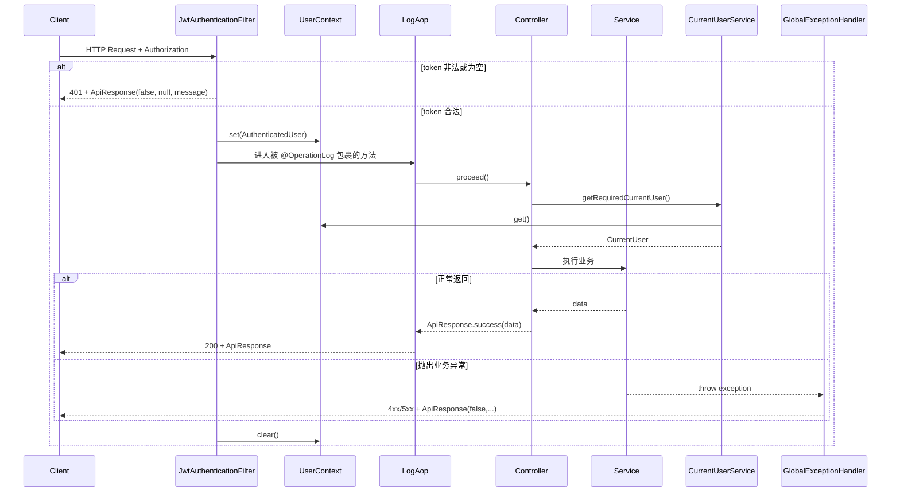

# Argus 公共基础模块整体流程与代码定位

> 适用读者：准备系统理解 Argus 后端公共基础设施层的开发者。
>
> 本文聚焦 `common` 模块本身，以及它如何给 auth、group、document、qa、assistant、metrics 等业务模块提供统一契约。

---

## 1. 文档目标

这份文档主要回答 7 个问题：

1. Argus 的 `common` 模块到底负责哪些基础能力。
2. 一个普通后端请求从进入到返回，`common` 模块参与了哪些关键节点。
3. 统一响应结构、统一异常结构和统一日志是如何落地的。
4. 当前用户上下文在这个项目里是怎么传递和读取的。
5. 为什么 `common/enums` 会对多个业务模块都产生影响。
6. OpenAPI / Knife4j 配置在当前代码里实际做到了什么程度。
7. 当前实现里哪些注释或设计意图和真实主链存在差异。

---

## 2. 模块总览

和 auth、document、qa 这些业务模块不同，`common` 本身不直接承载业务流程，它更像 Argus 后端的“公共地基层”。

当前职责可以概括为 6 块：

1. 定义统一响应体 `ApiResponse<T>`。
2. 定义统一异常类型与全局异常处理器。
3. 提供 `@OperationLog + LogAop` 的统一日志切面。
4. 提供请求级用户上下文 `UserContext` 与 `AuthenticatedUser`。
5. 提供跨模块共享的枚举状态定义。
6. 提供 OpenAPI / Knife4j 的基础配置入口。

把它放到整体请求链里，可以画成下面这条主线：

```text
HTTP 请求
    ↓
JwtAuthenticationFilter
    ↓
UserContext.set(AuthenticatedUser)
    ↓
Controller / Service
    ↓
@OperationLog -> LogAop 记录入参 / 耗时 / 成败
    ↓
正常返回 -> ApiResponse.success(...)
或
抛出异常 -> GlobalExceptionHandler 映射为 ApiResponse(false,...)
    ↓
HTTP 响应 JSON
```

所以 `common` 的本质不是“工具包”，而是全项目后端统一交互规则的一组实现。

---

## 3. 代码目录定位

### 3.1 common 模块目录

路径：`Argus-backend/src/main/java/com/argus/rag/common`

```text
common/
├── api/
│   └── ApiResponse.java
├── config/
│   └── OpenApiConfiguration.java
├── enums/
│   ├── DocumentStatus.java
│   ├── GroupInvitationStatus.java
│   ├── GroupJoinRequestStatus.java
│   ├── GroupRole.java
│   ├── GroupStatus.java
│   ├── IngestionJobStatus.java
│   ├── IngestionJobType.java
│   ├── SystemRole.java
│   └── UserStatus.java
├── exception/
│   ├── BusinessException.java
│   ├── ForbiddenException.java
│   ├── GlobalExceptionHandler.java
│   └── UnauthorizedException.java
├── log/
│   ├── LogAop.java
│   └── OperationLog.java
└── security/
    ├── AuthenticatedUser.java
    └── UserContext.java
```

### 3.2 和 common 强耦合但不在 common 目录中的关键代码

- `Argus-backend/src/main/java/com/argus/rag/auth/security/JwtAuthenticationFilter.java`
- `Argus-backend/src/main/java/com/argus/rag/auth/CurrentUserService.java`
- `Argus-backend/src/main/java/com/argus/rag/assistant/controller/AssistantChatController.java`

它们的作用分别是：

- `JwtAuthenticationFilter`：负责解析 JWT 并写入 `UserContext`。
- `CurrentUserService`：负责读取 `UserContext` 并进一步加载数据库里的真实用户状态。
- `AssistantChatController`：在 SSE 工作线程中手动透传 `UserContext`。

---

## 4. 配置层流程

### 4.1 `common` 的核心规则不是靠一堆 yml，而是靠 Java 基础类直接固化

当前 `common` 模块的主要规则并不在配置文件里，而是在以下类中直接定义：

1. `ApiResponse`
2. `GlobalExceptionHandler`
3. `OperationLog` / `LogAop`
4. `UserContext` / `AuthenticatedUser`
5. `OpenApiConfiguration`
6. `common/enums/*`

### 4.2 OpenAPI 当前只有最基础的信息配置入口

位置：

- `OpenApiConfiguration.java`

当前实际返回的 `OpenAPI` Bean 只设置了：

- title
- description
- version

虽然这个类引入了 `Components`、`SecurityRequirement`、`SecurityScheme`，注释也写了支持 Bearer JWT，但在当前实现里，这个类本身没有真正注册 Bearer 安全方案。

所以更准确的说法应该是：

- 当前类是 OpenAPI 基础配置入口。
- 但从这个类本身看，Bearer 安全声明并没有完整配出来。

### 4.3 `UserContext` 是当前项目请求级身份上下文的真实承载体

位置：

- `UserContext.java`
- `JwtAuthenticationFilter.java`
- `CurrentUserService.java`

当前项目的主实现不是 request attribute，而是：

- `ThreadLocal<AuthenticatedUser>`

这点和部分仓库说明文档里的旧描述不完全一致，读代码时应以当前实现为准。

### 4.4 `LogAop` 的切点由 `@OperationLog` 决定

位置：

- `OperationLog.java`
- `LogAop.java`

当前记录逻辑只会包裹：

- 类上标了 `@OperationLog`
- 或方法上标了 `@OperationLog`

因此 Argus 不是“全量控制器统一日志”，而是“显式标注后才记录”。

### 4.5 `GlobalExceptionHandler` 统一了异常到 HTTP 状态码的映射

位置：

- `GlobalExceptionHandler.java`

当前主要映射包括：

- `BusinessException` -> 400
- `ForbiddenException` -> 403
- `UnauthorizedException` -> 401
- `MethodArgumentNotValidException` -> 400
- `HttpMessageNotReadableException` -> 400
- `MaxUploadSizeExceededException` -> 413
- `Exception` -> 500

---

## 5. 数据模型与状态模型

`common` 模块没有自己的业务表，但它定义了跨模块都依赖的数据契约和状态契约。

### 5.1 `ApiResponse<T>`

这是整个项目的统一响应结构，字段固定为：

- `success`
- `data`
- `message`

它的工程意义是：

- 前端所有普通接口都按同一个 JSON 结构解包。
- 控制器层不需要为每个模块重复设计返回壳。

### 5.2 `AuthenticatedUser`

这是 JWT 解析成功后，放进 `UserContext` 的轻量身份对象。当前字段包括：

- `userId`
- `userCode`
- `displayName`
- `systemRole`
- `mustChangePassword`

它不是完整用户实体，而是当前请求真正需要的最小身份载荷。

### 5.3 `UserContext`

当前实现是：

- `ThreadLocal<AuthenticatedUser>`

并提供：

- `set`
- `get`
- `clear`

### 5.4 共享枚举

当前 `common/enums` 承担的是全系统共享状态词汇表，主要分三组：

1. 用户与权限：`SystemRole`、`UserStatus`
2. 群组与邀请：`GroupRole`、`GroupStatus`、`GroupInvitationStatus`、`GroupJoinRequestStatus`
3. 文档与摄入：`DocumentStatus`、`IngestionJobStatus`、`IngestionJobType`

这些枚举的重要性在于：

- 它们不仅是 Java 常量，也是数据库写入值和业务分支判断依据。
- 改枚举值会同时影响 mapper、service、前端展示和已有数据兼容性。

### 5.5 `common` 当前没有错误码体系

这是很关键的一点。

当前统一响应里只有：

- 布尔成功标记
- 数据体
- 文本消息

并没有独立的：

- `code`
- `subCode`
- `traceId`

所以前后端当前更多是通过 HTTP 状态码 + `message` 协作，而不是通过稳定错误码体系协作。

---

## 6. 公共基础模块详细流程（完整主链）

下面把 `common` 在真实请求链中的作用拆成 24 步。

### 第 1 步：HTTP 请求进入 Spring 过滤器链

如果请求会走认证链路，最先碰到和 `common` 直接相关的点是：

- `JwtAuthenticationFilter`

### 第 2 步：过滤器读取 `Authorization` 头

位置：

- `JwtAuthenticationFilter.doFilterInternal()`

当前支持两种头值形式：

- `Bearer xxx`
- 直接传纯 token

### 第 3 步：如果 token 为空或非法，过滤器会直接写回 401 JSON

位置：

- `JwtAuthenticationFilter.writeUnauthorized()`

这里返回的结构同样是：

- `new ApiResponse<>(false, null, message)`

### 第 4 步：这条 401 路径不会经过 `GlobalExceptionHandler`

这是当前实现里很重要的边界。

也就是说，不是所有错误响应都来自全局异常处理器；JWT 过滤器自己的认证失败是直接写 response 的。

### 第 5 步：如果 JWT 解析成功，过滤器会构造 `AuthenticatedUser`

位置：

- `JwtAuthenticationFilter`
- `AuthenticatedUser`

### 第 6 步：过滤器把 `AuthenticatedUser` 写入 `UserContext`

位置：

- `UserContext.set(...)`

### 第 7 步：后续控制器或服务需要当前用户时，会通过 `CurrentUserService` 读取 `UserContext`

位置：

- `CurrentUserService.getRequiredCurrentUser()`

### 第 8 步：`CurrentUserService` 不直接信任 JWT 里的状态，而是会再查一遍数据库

位置：

- `CurrentUserService.loadUserById()`

这一步会进一步校验：

- 用户是否存在
- 用户是否已被禁用

### 第 9 步：控制器如果标了 `@OperationLog`，会被 `LogAop` 包裹

位置：

- `OperationLog`
- `LogAop`

### 第 10 步：`LogAop` 在调用前记录类名、方法名和入参

位置：

- `LogAop.logAroundAdvice()`

### 第 11 步：业务执行成功后，如果返回值是 `ApiResponse`，日志会额外记录 success 和 message

位置：

- `LogAop.logResult()`

### 第 12 步：控制器主流成功返回会使用 `ApiResponse.success(data)`

当前大量控制器都按这个模式返回，例如：

- auth 控制器
- group 控制器
- document 控制器
- metrics 控制器
- assistant 控制器

### 第 13 步：`ApiResponse.success(data)` 当前会把 `message` 写成“操作成功”

位置：

- `ApiResponse.success()`

这一点和类注释里“message 为 null”的描述并不一致，应以代码行为为准。

### 第 14 步：`@JsonInclude(NON_NULL)` 会让空字段在 JSON 中被省略

位置：

- `ApiResponse.java`

这意味着当 `data` 或 `message` 为 `null` 时，最终序列化结果可能不会带出对应字段。

### 第 15 步：业务代码如果抛出 `BusinessException`，最终会被映射成 400

位置：

- `BusinessException`
- `GlobalExceptionHandler.handleBusinessException()`

### 第 16 步：权限不够和未登录错误分别映射为 403 和 401

位置：

- `ForbiddenException`
- `UnauthorizedException`
- `GlobalExceptionHandler`

### 第 17 步：参数校验失败不会把整堆 BindingResult 都返回给前端

位置：

- `GlobalExceptionHandler.handleMethodArgumentNotValidException()`

当前实现只拿第一条字段错误消息。

### 第 18 步：请求体 JSON 非法时，统一返回“请求体格式非法”

位置：

- `handleHttpMessageNotReadableException()`

### 第 19 步：上传文件超限时，统一返回 413 和固定文案

位置：

- `handleMaxUploadSizeExceededException()`

### 第 20 步：其他未处理异常会被记录 error 日志，并返回 500

位置：

- `handleException()`

### 第 21 步：请求结束后，JWT 过滤器会在 `finally` 中清理 `UserContext`

位置：

- `JwtAuthenticationFilter.doFilterInternal()`

### 第 22 步：由于 `UserContext` 基于 ThreadLocal，跨线程场景不会自动继承

这是当前实现里必须记住的事实。

### 第 23 步：assistant 的 SSE 流式接口会手动抓取并重建 `UserContext`

位置：

- `AssistantChatController.streamChat()`

它在请求线程中先拿到 `AuthenticatedUser`，再在工作线程里 `UserContext.set(authenticatedUser)`，最后 `clear()`。

### 第 24 步：共享枚举贯穿多个业务模块，最终把状态语义统一到同一套常量上

位置：

- `common/enums/*`

这一步虽然不是一次“运行时调用”，但它决定了系统各模块在权限、用户状态、群组状态、文档状态、摄入状态上的共同语言。

---

## 7. 正常请求与异常请求时序图



---

## 8. 对其他模块的支撑方式

### 8.1 对 auth 模块

`common` 提供：

- `SystemRole`
- `UserStatus`
- `UnauthorizedException`
- `ForbiddenException`
- `AuthenticatedUser`
- `UserContext`

auth 模块负责身份解析，但真正的请求级身份承载契约在 `common/security`。

### 8.2 对所有 controller 模块

`common` 提供：

- `ApiResponse`
- `@OperationLog`
- `GlobalExceptionHandler`

所以所有控制器基本都共享同一套返回壳、日志切面和异常格式。

### 8.3 对 group / document / ingestion / user 模块

`common/enums` 提供了这些模块真实业务分支依赖的共享状态值。

这意味着 `common` 虽然不处理这些业务，但它定义了这些业务的状态词典。

### 8.4 对 assistant 流式链路

`UserContext` 的 ThreadLocal 设计会直接影响 SSE/异步线程场景，因此 assistant 流式接口需要显式做上下文传递。

---

## 9. 前端与接口文档配合

### 9.1 前端和 common 最直接的交点是 `ApiResponse`

前端 API 层普遍会把后端返回当作：

- `success`
- `data`
- `message`

来解包。

这就是为什么 `common/api/ApiResponse.java` 虽然只有一个文件，但它其实是前后端接口契约中心之一。

### 9.2 Knife4j / OpenAPI 的入口在 common，但当前配置比较克制

位置：

- `OpenApiConfiguration.java`

当前可以确认的是：

- API 基础信息已配置。

当前不能从这段代码直接确认的是：

- Bearer 安全声明已经在这个类里完整配置好。

---

## 10. 异常与统一返回结构

### 10.1 统一返回结构

当前成功与失败响应都尽量收敛到 `ApiResponse<T>`。

成功形态通常是：

- `ApiResponse.success(data)`

失败形态通常是：

- `new ApiResponse<>(false, null, message)`

### 10.2 需要区分两类失败来源

1. 控制器 / service 中抛异常，由 `GlobalExceptionHandler` 兜底。
2. JWT 过滤器中直接失败，由过滤器自己写回 401。

### 10.3 当前错误信息以人类可读 message 为主

这对开发调试很直接，但也意味着：

- 前端若想细粒度分支处理，当前更多依赖 HTTP 状态码和文案约定。

---

## 11. 当前版本需要特别留意的点

### 11.1 `ApiResponse.success()` 的实际 message 不是 `null`

位置：

- `ApiResponse.java`

类注释写的是成功时 message 为 null，但实际代码返回的是“操作成功”。

### 11.2 当前认证上下文主链走的是 `UserContext(ThreadLocal)`，不是 request attribute

位置：

- `JwtAuthenticationFilter.java`
- `UserContext.java`
- `CurrentUserService.java`

如果后续读到旧文档或旧理解，要以当前源码为准。

### 11.3 `UserContext` 跨线程不会自动传递，SSE 场景需要手工透传

位置：

- `AssistantChatController.streamChat()`

这是 common 安全上下文设计对业务模块产生的直接影响。

### 11.4 并不是所有 401 都走 `GlobalExceptionHandler`

位置：

- `JwtAuthenticationFilter.writeUnauthorized()`

认证过滤器自己的失败是在 filter 层直接写 response。

### 11.5 OpenAPI 配置类的注释比当前实现更“超前”

位置：

- `OpenApiConfiguration.java`

从当前代码看，类注释提到 Bearer JWT 支持，但 Bean 实现只设置了基础信息，未在该类中看到真正注册 SecurityScheme 的逻辑。

### 11.6 `LogAop` 记录的是原始参数数组，未做脱敏或裁剪

位置：

- `LogAop.java`

这在开发调试时方便，但在更高安全要求场景下会成为一个需要升级的点。

### 11.7 `common/enums` 是全系统共享状态契约，改动风险比表面看上去更大

这些枚举不是“普通常量类”，它们经常会直接影响数据库值、业务判断和接口输出。

---

## 12. 对简历和面试最值得保留的讲法

### 12.1 建议保留的 5 个表达点

1. 项目在后端统一了响应体、异常处理、日志切面和共享状态枚举，避免各业务模块各自定义一套接口规范。
2. 认证成功后的身份上下文通过 ThreadLocal 形式的 `UserContext` 在请求内传递，再由 `CurrentUserService` 二次查库校验用户状态。
3. 过滤器层认证失败和业务层异常失败采用了两条不同但最终结构一致的返回路径。
4. 公共枚举集中沉淀了用户、群组、文档、摄入等多模块共享状态语义。
5. 流式 SSE 场景因为跨线程，需要手动透传 `UserContext`，这体现了对上下文传播边界的处理。

### 12.2 面试时不要讲得过头的地方

1. 不要把 `common` 讲成完整中台，它当前是轻量而直接的公共基础层。
2. 不要说 OpenAPI 的 Bearer 方案已经在当前类里完整配置好，源码并不支持这个结论。
3. 不要忽略 ThreadLocal 跨线程问题，这正是当前 assistant 流式链路需要额外处理的原因。

---

## 13. 推荐阅读顺序

建议按下面顺序阅读：

1. `Argus-backend/src/main/java/com/argus/rag/common/api/ApiResponse.java`
2. `Argus-backend/src/main/java/com/argus/rag/common/exception/GlobalExceptionHandler.java`
3. `Argus-backend/src/main/java/com/argus/rag/common/exception/BusinessException.java`
4. `Argus-backend/src/main/java/com/argus/rag/common/exception/ForbiddenException.java`
5. `Argus-backend/src/main/java/com/argus/rag/common/exception/UnauthorizedException.java`
6. `Argus-backend/src/main/java/com/argus/rag/common/log/OperationLog.java`
7. `Argus-backend/src/main/java/com/argus/rag/common/log/LogAop.java`
8. `Argus-backend/src/main/java/com/argus/rag/common/security/AuthenticatedUser.java`
9. `Argus-backend/src/main/java/com/argus/rag/common/security/UserContext.java`
10. `Argus-backend/src/main/java/com/argus/rag/auth/security/JwtAuthenticationFilter.java`
11. `Argus-backend/src/main/java/com/argus/rag/auth/CurrentUserService.java`
12. `Argus-backend/src/main/java/com/argus/rag/assistant/controller/AssistantChatController.java`
13. `Argus-backend/src/main/java/com/argus/rag/common/config/OpenApiConfiguration.java`
14. `Argus-backend/src/main/java/com/argus/rag/common/enums/*`

这个顺序能先建立“统一返回 / 统一异常 / 统一上下文”的骨架，再理解它如何被 auth 和 assistant 等模块实际消费。

---

## 14. 一句话总结

Argus 的 `common` 模块本质上是一层轻量但关键的后端公共基础设施：它统一了响应体、异常映射、日志切面、请求级用户上下文和共享状态枚举，让各业务模块在同一套接口契约和运行时边界上协作；当前最值得记住的实现细节是，身份上下文走 ThreadLocal、过滤器 401 直写响应、SSE 需要手动透传上下文，而 OpenAPI 的 Bearer 声明在这个版本里仍未在配置类中完整落地。