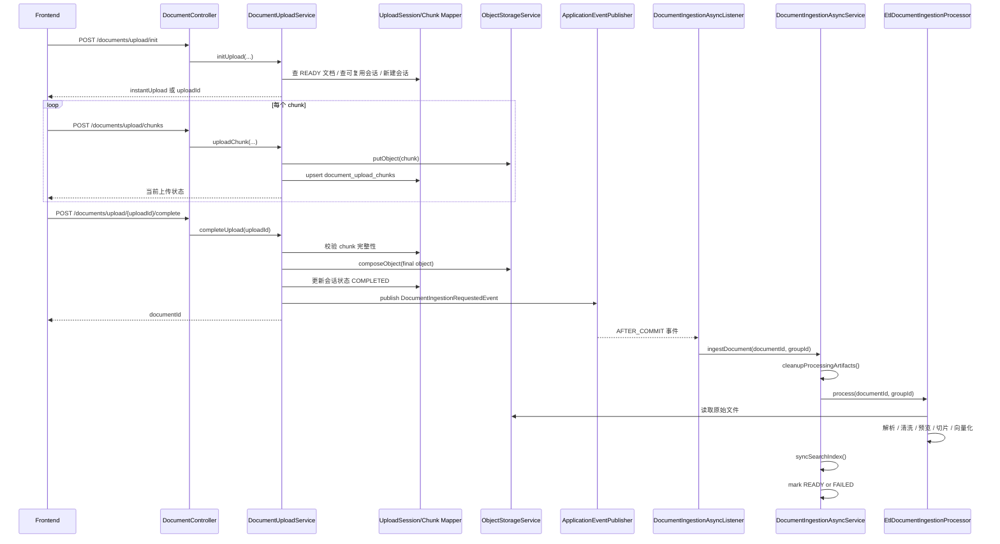

# Argus 文档模块整体流程与代码定位

> 适用读者：准备系统学习 Argus 项目 document 模块的开发者。
>
> 本文聚焦 document 模块本身，以及它和前端文档中心、群组权限、对象存储、异步 ingestion / ETL、向量检索之间的协作关系。

---

## 1. 文档目标

这份文档回答 6 个问题：

1. Argus 的 document 模块由哪些类组成。
2. 小文件直接上传、大文件分片上传分别怎么走。
3. 秒传复用、断点续传、分片合并分别落在哪些代码里。
4. 文档上传完成后，异步 ETL 是如何被触发并把文档推到 READY 的。
5. 文档列表、预览、下载、删除、失败重试分别如何做权限控制。
6. 这一整套流程在项目里的具体代码位置分别在哪里。

---

## 2. 模块总览

Argus 的 document 模块不是“一个上传接口”这么简单，而是由以下几层共同组成：

```text
前端文档中心 / 上传交互 / 列表过滤
    ↓
接口层（DocumentController）
    ↓
文档编排层（DocumentUploadService / DocumentQueryService / DocumentDeleteService / DocumentPreviewService / DocumentDownloadService）
    ↓
权限与存储层（CurrentUserService / GroupMembershipService / ObjectStorageService / DocumentMapper）
    ↓
事务后事件层（DocumentIngestionRequestedEvent / DocumentIngestionAsyncListener）
    ↓
异步摄入层（DocumentIngestionAsyncService / DocumentIngestionProcessor）
    ↓
切片 / 向量 / 搜索层（ChunkService / VectorIngestionService / ElasticsearchChunkIndexService）
    ↓
数据层（documents / document_upload_sessions / document_upload_chunks / document_chunks）
```

从职责上看：

- 前端负责选择群组、发起上传、查询文档列表、预览、下载和失败重试。
- DocumentController 负责 document 模块的 HTTP 协议入口。
- DocumentUploadService 负责小文件直接上传、分片上传、秒传复用、断点续传、分片合并、文档落库与事件发布。
- DocumentQueryService 负责把“当前用户能看到什么文档”这件事收束到查询条件和 SQL 权限过滤里。
- DocumentDeleteService 负责软删除文档，以及失败文档的重新摄入。
- DocumentPreviewService / DocumentDownloadService 负责 READY 文档的读取与输出。
- DocumentIngestionAsyncListener 负责把“上传事务已提交”转换成“可以开始异步处理”。
- DocumentIngestionAsyncService 负责异步 ETL 的重试、失败兜底、状态更新和中间产物清理。
- EtlDocumentIngestionProcessor 负责真正的文档读取、解析、清洗、预览写入、切片和向量化。

这套设计的核心价值是：

- 上传链路和 ETL 链路解耦，上传成功不等于文档立即 READY。
- 文档原始文件、上传会话、切片、向量、搜索索引分别建模，方便状态治理。
- 文档可见性不是前端自己判断，而是后端权限服务和 SQL 共同收口。

---

## 3. 代码目录定位

### 3.1 后端 document 目录

路径：`Argus-backend/src/main/java/com/argus/rag/document`

```text
document/
├── controller/
│   └── DocumentController.java
├── mapper/
│   ├── DocumentMapper.java
│   ├── DocumentUploadChunkMapper.java
│   └── DocumentUploadSessionMapper.java
├── model/
│   ├── dto/
│   │   ├── DocumentQuery.java
│   │   ├── UploadChunkRequest.java
│   │   ├── UploadDocumentRequest.java
│   │   └── UploadInitRequest.java
│   ├── entity/
│   │   ├── DocumentEntity.java
│   │   ├── DocumentUploadChunkEntity.java
│   │   └── DocumentUploadSessionEntity.java
│   └── vo/
│       ├── DocumentDownloadVO.java
│       ├── DocumentListItemVO.java
│       ├── DocumentPreviewVO.java
│       ├── UploadInitResponse.java
│       └── UploadStatusResponse.java
└── service/
    ├── DocumentDeleteService.java
    ├── DocumentDownloadService.java
    ├── DocumentIngestionAsyncListener.java
    ├── DocumentIngestionRequestedEvent.java
    ├── DocumentPreviewService.java
    ├── DocumentQueryService.java
    ├── DocumentUploadService.java
    └── StaleProcessingDocumentRecoveryRunner.java
```

### 3.2 与 document 强关联但不在 document 目录的代码

- `Argus-backend/src/main/java/com/argus/rag/auth/CurrentUserService.java`
- `Argus-backend/src/main/java/com/argus/rag/group/service/GroupMembershipService.java`
- `Argus-backend/src/main/java/com/argus/rag/engine/storage/ObjectStorageService.java`
- `Argus-backend/src/main/java/com/argus/rag/common/enums/DocumentStatus.java`
- `Argus-backend/src/main/java/com/argus/rag/ingestion/config/DocumentIngestionConfiguration.java`
- `Argus-backend/src/main/java/com/argus/rag/ingestion/service/DocumentIngestionAsyncService.java`
- `Argus-backend/src/main/java/com/argus/rag/ingestion/service/DocumentIngestionProcessor.java`
- `Argus-backend/src/main/java/com/argus/rag/ingestion/service/EtlDocumentIngestionProcessor.java`
- `Argus-backend/src/main/java/com/argus/rag/ingestion/service/pipeline/reader/StoredObjectDocumentReader.java`
- `Argus-backend/src/main/java/com/argus/rag/ingestion/service/pipeline/parser/DocumentParserFactory.java`
- `Argus-backend/src/main/java/com/argus/rag/ingestion/mapper/DocumentChunkMapper.java`
- `Argus-backend/src/main/java/com/argus/rag/ingestion/vector/VectorIngestionService.java`
- `Argus-backend/src/main/java/com/argus/rag/engine/elasticsearch/ElasticsearchChunkIndexService.java`
- `Argus-backend/src/main/java/com/argus/rag/common/exception/GlobalExceptionHandler.java`
- `Argus-backend/src/main/java/com/argus/rag/common/api/ApiResponse.java`

### 3.3 MyBatis XML 位置

- `Argus-backend/src/main/resources/mappers/document/DocumentMapper.xml`
- `Argus-backend/src/main/resources/mappers/document/DocumentUploadSessionMapper.xml`
- `Argus-backend/src/main/resources/mappers/document/DocumentUploadChunkMapper.xml`
- `Argus-backend/src/main/resources/mappers/ingestion/DocumentChunkMapper.xml`

### 3.4 前端配合代码

- `Argus-frontend/src/api/document.ts`
- `Argus-frontend/src/views/documents/DocumentListView.vue`
- `Argus-frontend/src/views/documents/components/UploadDialog.vue`
- `Argus-frontend/src/views/documents/components/DocFiltersBar.vue`
- `Argus-frontend/src/views/documents/components/DocTable.vue`
- `Argus-frontend/src/views/documents/components/RecentFailuresPanel.vue`
- `Argus-frontend/src/components/DocumentPreviewModal.vue`

### 3.5 数据库表

- `sql/schema.sql` 中的 `documents`
- `sql/schema.sql` 中的 `document_upload_sessions`
- `sql/schema.sql` 中的 `document_upload_chunks`
- `sql/schema.sql` 中的 `document_chunks`
- `sql/schema.sql` 中的 `vector_store`

---

## 4. 配置层流程

### 4.1 对象存储与检索相关配置

document 模块运行时依赖的主要配置位于：

- `Argus-backend/src/main/resources/application-dev.yml`
- `Argus-backend/src/main/java/com/argus/rag/ingestion/config/DocumentIngestionConfiguration.java`

当前关键配置包括：

```yaml
storage:
  minio:
    endpoint: ${MINIO_ENDPOINT:http://localhost:9000}
    access-key: ${MINIO_ACCESS_KEY:your-minio-access-key}
    secret-key: ${MINIO_SECRET_KEY:your-minio-secret-key}
    bucket: ${MINIO_BUCKET:argus-rag-documents}

elasticsearch:
  index-name: dd_rag_document_chunks

ingestion:
  chunking:
    target-tokens: 240
    max-tokens: 320
    overlap-tokens: 32
  vector:
    add-batch-size: 9
```

这些配置决定了：

- 文档原始文件和分片临时对象会存到哪个 MinIO bucket。
- 文档 chunk 会同步到哪个 Elasticsearch 索引。
- ETL 切片时的目标 token、大致最大长度和 overlap 策略。
- 向量写入时每批 chunk 的大小。

### 4.2 上传限制并没有外置到 yml

和 auth 模块的 token 过期时间不同，document 模块很多上传约束当前写死在 `DocumentUploadService.java` 常量里：

- 分片上传最大文件：256MB
- 单个分片最大大小：10MB
- 直接上传最大文件：10MB
- 上传会话过期时间：24 小时
- 支持扩展名：txt / md / pdf / docx

这意味着：

- 当前上传策略是“代码内约束”，不是“配置驱动”。
- 如果后面要把上传上限、分片大小改成环境可配置，优先改这里。

### 4.3 ETL Bean 装配入口

`DocumentIngestionConfiguration.java` 负责装配：

1. `DocumentIngestionProcessor`
2. `TextCleanupTransformer`

它的职责不是直接执行业务，而是把 ETL 所需的 `DocumentMapper`、`ObjectStorageService`、`DocumentParserFactory`、`ChunkService`、`VectorIngestionService` 这些依赖组起来，最终得到 `EtlDocumentIngestionProcessor`。

---

## 5. 数据模型与状态模型

### 5.1 documents 表

`documents` 是 document 模块最核心的业务表，关键字段包括：

- `group_id`：文档所属群组
- `uploader_user_id`：上传者
- `file_name` / `file_ext` / `content_type` / `file_size`
- `file_hash`：文件哈希，用于秒传判断
- `storage_bucket` / `storage_object_key`：原始文件在对象存储中的落点
- `status`：文档处理状态
- `preview_text`：ETL 后写入的预览文本
- `failure_reason`：失败原因
- `uploaded_at` / `processed_at`

这里要特别注意：

- `preview_text` 不是预览接口返回的完整文本。
- 它是 `EtlDocumentIngestionProcessor` 在 ETL 过程中截取前 200 个字符后落库的摘要型字段。

### 5.2 document_upload_sessions 表

`document_upload_sessions` 用于承载大文件分片上传会话，关键字段包括：

- `upload_id`：前后端跟踪分片会话的标识
- `group_id` / `uploader_user_id`
- `file_name` / `file_ext` / `content_type` / `file_size`
- `file_hash`
- `chunk_size` / `chunk_count`
- `status`
- `storage_bucket`
- `merged_object_key`
- `expires_at`

它的意义在于：

- 秒传失败后，可以继续做断点续传。
- 断点续传不是靠前端缓存自己猜，而是靠数据库会话和 chunk 记录恢复。

### 5.3 document_upload_chunks 表

`document_upload_chunks` 用于承载每一个已上传分片的元数据，关键字段包括：

- `upload_id`
- `chunk_index`
- `chunk_size`
- `chunk_hash`
- `storage_bucket`
- `storage_object_key`
- `uploaded_at`

这里的一个关键设计点是：

- `DocumentUploadChunkMapper.xml` 的 `upsert` 基于 `(upload_id, chunk_index)` 做冲突更新。
- 这让“同一分片重复上传”变成幂等行为，而不是脏数据。

### 5.4 document_chunks 表

`document_chunks` 不是上传阶段直接写入的，而是 ETL 成功后由 `ChunkService` 落库。

它承载的是：

- `document_id`
- `group_id`
- `chunk_index`
- `chunk_text`
- `chunk_summary`
- `char_start` / `char_end`
- `metadata_json`

这张表才是后续向量检索、关键词索引、引用溯源更直接依赖的数据基础。

### 5.5 状态模型要以真实代码为准

文档状态枚举位于 `DocumentStatus.java`：

- `UPLOADED`
- `PROCESSING`
- `READY`
- `FAILED`

但从当前真实上传主链路看：

- `DocumentUploadService` 在文档入库时直接写 `PROCESSING`
- `DocumentIngestionAsyncService` 成功后写 `READY`
- 重试耗尽后写 `FAILED`

也就是说，当前这条链路里最值得记住的是：

- `PROCESSING -> READY`
- `PROCESSING -> FAILED`

分片会话状态则以 `DocumentUploadService` 的常量为准：

- `INIT`
- `UPLOADING`
- `COMPLETING`
- `COMPLETED`

不要只看 VO 或实体类注释里的旧状态名。

---

## 6. document 模块详细流程（完整落地版）

下面将 document 模块整体流程拆成 28 步，对应到项目实际代码位置。

### 第 1 步：应用启动加载对象存储、索引和 chunking 配置

入口位置：

- `Argus-backend/src/main/resources/application-dev.yml`
- `Argus-backend/src/main/java/com/argus/rag/ingestion/config/DocumentIngestionConfiguration.java`

Spring Boot 启动时先把 MinIO、Elasticsearch 和 chunking 参数准备好，为上传和 ETL 提供运行基础。

### 第 2 步：前端进入文档中心页面

位置：

- `Argus-frontend/src/views/documents/DocumentListView.vue`

页面加载时会先拉取当前用户可见的群组，再按当前选中群组查询文档列表。

### 第 3 步：前端查询当前用户可读文档

位置：

- `Argus-frontend/src/api/document.ts`
- `Argus-backend/src/main/java/com/argus/rag/document/controller/DocumentController.java`
- `Argus-backend/src/main/java/com/argus/rag/document/service/DocumentQueryService.java`
- `Argus-backend/src/main/resources/mappers/document/DocumentMapper.xml`

请求入口是 `GET /api/documents`。

后端会把 `currentUserId` 注入到 `DocumentQuery`，再由 SQL 通过 `group_memberships` 做可见性过滤。

### 第 4 步：群组管理员发起上传

当前前端实际入口位于：

- `Argus-frontend/src/views/documents/components/UploadDialog.vue`

当前页面已接入的是“小文件直接上传”对话框；分片上传 API 已存在，但前端页面还没有把它接成完整交互。

### 第 5 步：前端小文件上传前做基础校验

位置：

- `Argus-frontend/src/views/documents/components/UploadDialog.vue`

当前前端会先校验：

- 扩展名必须在 `txt / md / pdf / docx` 里
- 文件大小不得超过 10MB

通过后再调用 `POST /api/documents/upload`。

### 第 6 步：后端接收直接上传请求

位置：`Argus-backend/src/main/java/com/argus/rag/document/controller/DocumentController.java`

`DocumentController.uploadDocument()` 会先通过 `CurrentUserService.requireBusinessUser()` 提取当前业务用户，再把 `userId + UploadDocumentRequest` 交给 `DocumentUploadService.uploadDocument()`。

### 第 7 步：直接上传服务校验权限和文件合法性

位置：`Argus-backend/src/main/java/com/argus/rag/document/service/DocumentUploadService.java`

`uploadDocument()` 里会完成：

- `groupId` 合法性校验
- `groupMembershipService.requireGroupOwner(groupId)` 管理员权限校验
- 文件非空校验
- 文件大小不超过 10MB
- 文件扩展名合法

### 第 8 步：直接上传原始文件到对象存储

位置：`Argus-backend/src/main/java/com/argus/rag/document/service/DocumentUploadService.java`

`uploadDocument()` 会把原始文件上传到对象存储，object key 规则是：

```text
groups/{groupId}/users/{userId}/{uuid}.{ext}
```

这说明 document 模块保存的是“原始文件”，而不是只保存解析后的文本。

### 第 9 步：直接上传落库文档元数据并发布异步 ETL 事件

位置：

- `Argus-backend/src/main/java/com/argus/rag/document/service/DocumentUploadService.java`

`persistAndFinalizeUploadedDocument()` 会：

1. 构造 `DocumentEntity`
2. 插入 `documents`
3. 将状态写为 `PROCESSING`
4. 发布 `DocumentIngestionRequestedEvent`

这里是 document 模块最关键的解耦点：

- 上传接口只负责把文档保存下来并触发后续处理
- 不会同步阻塞等待全文解析、切片、向量化完成

### 第 10 步：前端收到文档 ID 并刷新列表

位置：

- `Argus-frontend/src/api/document.ts`
- `Argus-frontend/src/views/documents/DocumentListView.vue`

前端拿到文档 ID 后，会重新拉一次文档列表；此时新文档通常先显示为 `PROCESSING`。

### 第 11 步：大文件上传先初始化上传会话

位置：

- `Argus-backend/src/main/java/com/argus/rag/document/controller/DocumentController.java`
- `Argus-backend/src/main/java/com/argus/rag/document/service/DocumentUploadService.java`
- `Argus-backend/src/main/java/com/argus/rag/document/model/dto/UploadInitRequest.java`
- `Argus-backend/src/main/java/com/argus/rag/document/model/vo/UploadInitResponse.java`

接口入口是 `POST /api/documents/upload/init`。

请求里要带：

- `groupId`
- `fileName`
- `fileSize`
- `contentType`
- `fileHash`
- `chunkSize`
- `chunkCount`

### 第 12 步：初始化时先做参数规范化和管理员权限校验

位置：`Argus-backend/src/main/java/com/argus/rag/document/service/DocumentUploadService.java`

`initUpload()` 的真实入口顺序是：

1. 校验请求体非空
2. 规范化 `groupId / fileName / fileExt / contentType / fileHash`
3. 校验 `fileSize <= 256MB`
4. 校验 `chunkSize <= 10MB`
5. 校验 `chunkCount` 和文件大小匹配
6. 调用 `groupMembershipService.requireGroupOwner(groupId)`

### 第 13 步：优先尝试秒传复用

位置：

- `Argus-backend/src/main/java/com/argus/rag/document/service/DocumentUploadService.java`
- `Argus-backend/src/main/resources/mappers/document/DocumentMapper.xml`

`initUpload()` 会先按 `(groupId, fileHash)` 查询同群组下最近一条 `READY` 文档。

如果命中：

- 不会返回 `uploadId`
- 会调用 `createInstantUploadedDocument()` 新建一条文档记录
- 新文档仍然会走 `PROCESSING -> READY` 这条事件链路

这里要注意它的复用范围：

- 只在同一个群组里复用
- 只复用状态已 `READY` 的文档
- 复用的是对象存储落点，不是“直接把旧文档 ID 返回给前端”

### 第 14 步：秒传不命中时，再尝试断点续传恢复

位置：

- `Argus-backend/src/main/resources/mappers/document/DocumentUploadSessionMapper.xml`

`selectLatestReusableSession()` 的条件是：

- 同 `groupId`
- 同 `uploaderUserId`
- 同 `fileHash`
- 状态在 `INIT / UPLOADING / COMPLETING`
- `expires_at > now()`

如果命中，后端会把 `uploadId + uploadedChunks + chunkSize + chunkCount` 返回给前端。

### 第 15 步：如果没有可复用会话，就新建上传会话

位置：`Argus-backend/src/main/java/com/argus/rag/document/service/DocumentUploadService.java`

新建会话时会写入：

- 随机生成的 `uploadId`
- 文件元信息
- `chunkSize / chunkCount`
- 状态 `INIT`
- 默认对象存储桶
- `expiresAt = now + 24h`

对应数据表是 `document_upload_sessions`。

### 第 16 步：前端逐片上传 chunk

后端接口位置：

- `POST /api/documents/upload/chunks`
- `DocumentController.uploadChunk()`
- `DocumentUploadService.uploadChunk()`

每次请求会携带：

- `uploadId`
- `chunkIndex`
- `chunkHash`
- `chunk` 二进制内容

### 第 17 步：后端校验会话归属、有效期和分片合法性

位置：`Argus-backend/src/main/java/com/argus/rag/document/service/DocumentUploadService.java`

`requireOwnedActiveSession()` 和 `requireChunk()` 会确保：

- `uploadId` 存在
- 会话属于当前用户本人，不只是“同组其他管理员”
- 会话未过期
- 会话未完成
- `chunkIndex` 在合法范围内
- 分片非空且不超过约定大小

### 第 18 步：分片先落对象存储，再落 chunk 元数据

位置：

- `Argus-backend/src/main/java/com/argus/rag/document/service/DocumentUploadService.java`
- `Argus-backend/src/main/resources/mappers/document/DocumentUploadChunkMapper.xml`

每片上传成功后：

- 对象存储 key 会写成

```text
uploads/{groupId}/{uploadId}/chunks/{chunkIndex}
```

- `document_upload_chunks` 会做 `upsert`
- 上传会话状态会更新为 `UPLOADING`

`upsert` 的意义是：

- 同一分片重复上传不会新增脏记录
- 这为断点续传和幂等补传提供了基础

### 第 19 步：前端可以查询上传进度

位置：

- `GET /api/documents/upload/{uploadId}`
- `DocumentUploadService.getUploadStatus()`

返回数据是：

- 当前会话状态
- 已上传分片序号列表
- 已上传分片数量
- 总分片数

### 第 20 步：上传完成后，客户端调用 complete 接口

位置：

- `POST /api/documents/upload/{uploadId}/complete`
- `DocumentUploadService.completeUpload()`

这个阶段不会再接收 chunk 内容，而是要求后端开始做“分片完整性校验 + 合并 + 文档落库”。

### 第 21 步：complete 阶段先校验所有分片齐全且有序

位置：`Argus-backend/src/main/java/com/argus/rag/document/service/DocumentUploadService.java`

`ensureAllChunksPresent()` 会做两层检查：

1. 分片数量必须等于 `chunkCount`
2. 分片索引必须从 `0` 连续到 `chunkCount - 1`

缺任一片都会直接报错，拒绝合并。

### 第 22 步：对象存储合并所有分片

位置：`Argus-backend/src/main/java/com/argus/rag/document/service/DocumentUploadService.java`

`completeUpload()` 会调用 `objectStorageService.composeObject()`，把所有 chunk 合并成最终对象。

最终文档 object key 规则仍然是：

```text
groups/{groupId}/users/{userId}/{uuid}.{ext}
```

同时上传会话状态会先切到 `COMPLETING`。

### 第 23 步：分片合并成功后，创建正式文档记录

位置：`Argus-backend/src/main/java/com/argus/rag/document/service/DocumentUploadService.java`

合并完成后会调用 `finalizeUploadedDocument()`，本质上还是走：

- 构造 `DocumentEntity`
- `documents` 入库
- 状态写 `PROCESSING`
- 发布 `DocumentIngestionRequestedEvent`

然后再把上传会话状态标记为 `COMPLETED`。

### 第 24 步：事务提交后，异步监听器收到摄入事件

位置：

- `Argus-backend/src/main/java/com/argus/rag/document/service/DocumentIngestionRequestedEvent.java`
- `Argus-backend/src/main/java/com/argus/rag/document/service/DocumentIngestionAsyncListener.java`

`DocumentIngestionAsyncListener.handle()` 使用的是：

- `@TransactionalEventListener(phase = AFTER_COMMIT)`
- `@Async`

这两个点一起保证：

- 只有上传事务真正提交了，ETL 才会启动
- ETL 不会阻塞上传请求返回

### 第 25 步：异步服务先清理旧处理中间产物

位置：`Argus-backend/src/main/java/com/argus/rag/ingestion/service/DocumentIngestionAsyncService.java`

`ingestDocument()` 开始后，第一件事不是直接解析，而是先调用 `cleanupProcessingArtifacts()` 清理：

- 旧 chunk 记录
- 旧向量数据
- 旧 Elasticsearch 索引

这一步的意义是：

- 避免失败重试时把旧产物和新产物混在一起
- 让失败重跑尽量从干净状态开始

### 第 26 步：ETL 处理器执行读文件、清洗、预览落库、切片和向量化

位置：

- `Argus-backend/src/main/java/com/argus/rag/ingestion/service/EtlDocumentIngestionProcessor.java`
- `Argus-backend/src/main/java/com/argus/rag/ingestion/service/pipeline/reader/StoredObjectDocumentReader.java`
- `Argus-backend/src/main/java/com/argus/rag/ingestion/service/pipeline/parser/DocumentParserFactory.java`

`process()` 的真实顺序是：

1. 查询文档记录
2. 从对象存储读取原始文件
3. 通过解析器工厂解析成 Spring AI `Document`
4. 文本清洗
5. 把清洗后文本前 200 字落到 `documents.preview_text`
6. 做结构感知切片
7. 切片落库到 `document_chunks`
8. 把 chunk 写入向量存储

### 第 27 步：异步服务同步搜索索引并更新文档状态

位置：`Argus-backend/src/main/java/com/argus/rag/ingestion/service/DocumentIngestionAsyncService.java`

ETL 主处理器成功后，`DocumentIngestionAsyncService` 还会继续做两件事：

1. 从 `document_chunks` 取 chunk，同步到 Elasticsearch
2. 把文档状态更新为 `READY`

这意味着文档真正“可被检索”的状态收口点是这里，不是在上传接口里。

### 第 28 步：失败重试、人工重试、预览下载和删除都围绕状态治理展开

位置：

- `Argus-backend/src/main/java/com/argus/rag/ingestion/service/DocumentIngestionAsyncService.java`
- `Argus-backend/src/main/java/com/argus/rag/document/service/DocumentDeleteService.java`
- `Argus-backend/src/main/java/com/argus/rag/document/service/DocumentPreviewService.java`
- `Argus-backend/src/main/java/com/argus/rag/document/service/DocumentDownloadService.java`
- `Argus-backend/src/main/java/com/argus/rag/document/service/StaleProcessingDocumentRecoveryRunner.java`

当前完整状态治理是：

- 异步 ETL 默认重试 3 次，退避 2s / 4s / 8s
- 全部失败后 `recover()` 会把文档写成 `FAILED` 并记录 `failureReason`
- 群组管理员可以调用 `retry-ingestion` 把失败文档重置为 `PROCESSING` 并重新发布事件
- 群组成员只能预览和下载 `READY` 文档
- 删除接口是软删除，同时清理向量和 ES 索引
- 应用启动时会扫描遗留在 `PROCESSING` 的文档并标成 `FAILED`

---

## 7. 分片上传与异步摄入时序图



---

## 8. 文档可见性与权限控制

Argus 的 document 模块不是“只要登录就都能用”，它把权限分成了两档：

### 8.1 群组管理员权限

以下操作要求当前用户是群组管理员：

- 初始化分片上传
- 上传 chunk
- 完成合并上传
- 小文件直接上传
- 删除文档
- 重试失败文档摄入

对应代码里主要通过：

- `groupMembershipService.requireGroupOwner(groupId)`

### 8.2 群组成员可读权限

以下操作只要求当前用户对该群组可读：

- 查询文档列表
- 预览文档
- 下载文档

对应代码里主要通过：

- `groupMembershipService.requireGroupReadable(groupId)`
- `DocumentMapper.xml` 里按 `group_memberships.gm.user_id = currentUserId` 做 SQL 过滤

### 8.3 上传会话还有一层“必须归本人”

分片上传不是“同组管理员都能接手”，`requireOwnedActiveSession()` 还会继续校验：

- 当前登录用户必须等于 `document_upload_sessions.uploader_user_id`

这让“断点续传”绑定的是“当前上传人自己的会话”，而不是“群组里任何管理员都能续传”。

---

## 9. 前端配合机制

### 9.1 当前页面真实接入的是小文件直接上传

后端 API 已经具备：

- `initDocumentUpload`
- `uploadDocumentChunk`
- `fetchUploadStatus`
- `completeDocumentUpload`

但从当前前端真实调用看：

- `UploadDialog.vue` 目前只调用 `uploadDocument()`
- 也就是只接了小文件直接上传入口

因此当前前端用户可见的主链路是：

- 选群组
- 选文件
- 直接上传
- 刷新列表

### 9.2 列表过滤和状态展示由页面状态驱动

`DocumentListView.vue` 当前负责：

- 拉取可见群组
- 以 `groupId` 查询当前群组文档
- 按文件名和状态过滤
- 打开上传对话框
- 触发删除、下载、失败重试

### 9.3 预览和下载是两套不同出口

前端 API 位于：`Argus-frontend/src/api/document.ts`

- 预览：走 JSON 接口，读取完整文本
- 下载：走 blob 接口，浏览器触发附件下载

### 9.4 Markdown 预览和列表摘要不是同一份文本

当前实现里：

- 列表里的 `previewText` 来自 `documents.preview_text`
- 预览接口对 Markdown 会直接返回原始 Markdown 源码
- 对 PDF / DOCX / TXT 则返回解析后的完整纯文本

所以“列表摘要”和“打开预览后看到的全文”本来就不是同一个字段。

---

## 10. 异常与返回结构

和 auth 模块一样，document 模块大部分接口都走统一响应包装：

- `ApiResponse<T>`

主要例外是：

- 下载接口 `GET /api/documents/{documentId}/download`
- 这里直接返回 `ResponseEntity<InputStreamResource>`，因为它输出的是文件流，不是 JSON

当前 document 模块典型异常包括：

- `groupId 非法`
- `文件名非法`
- `文件类型不支持`
- `上传文件超过大小限制`
- `上传会话不存在`
- `上传会话已过期`
- `缺少分片，无法完成上传`
- `文档尚未就绪，暂不可预览`
- `文档尚未就绪，暂不可下载`
- `仅失败文档支持重新处理`

这些异常最终会由：

- `GlobalExceptionHandler`

统一映射成规范的 HTTP 错误响应。

---

## 11. 当前版本需要特别留意的点

下面这些不是“document 流程设计本身”，而是当前仓库实现里值得特别注意的地方：

### 11.1 前端当前只接了小文件直接上传，分片上传 API 还没有落成页面主流程

代码位置：

- `Argus-frontend/src/api/document.ts`
- `Argus-frontend/src/views/documents/components/UploadDialog.vue`

从 API 能看出分片上传接口已经准备好，但当前上传对话框只调用了 `uploadDocument()`，也就是小文件直接上传。

因此现在真正用户可见的“上传产品形态”还不是完整的：

- 初始化会话
- 断点续传
- 秒传复用
- 分片完成

这几段更多是后端能力已具备，前端尚未完全接上。

### 11.2 直接上传路径没有提供 fileHash，但 schema.sql 中 documents.file_hash 被定义为 NOT NULL

代码位置：

- `Argus-backend/src/main/java/com/argus/rag/document/service/DocumentUploadService.java`
- `sql/schema.sql`

从 `uploadDocument()` 的实现看，直接上传落库时传给 `FinalizedUploadCommand` 的 `fileHash` 是 `null`。

但 `schema.sql` 里：

```sql
file_hash VARCHAR(128) NOT NULL
```

这说明当前源码与 schema 存在潜在不一致。学习和改造时，要优先以实际运行库表结构为准。

### 11.3 上传状态相关注释和真实代码值不完全一致

代码位置：

- `Argus-backend/src/main/java/com/argus/rag/document/service/DocumentUploadService.java`
- `Argus-backend/src/main/java/com/argus/rag/document/model/vo/UploadStatusResponse.java`
- `Argus-backend/src/main/java/com/argus/rag/document/model/entity/DocumentUploadSessionEntity.java`

当前真实服务里用的是：

- `INIT`
- `UPLOADING`
- `COMPLETING`
- `COMPLETED`

但部分注释仍然写着：

- `MERGING`
- `UPLOADED`
- `FAILED`

所以排查问题、写接口文档或做前端状态适配时，应以 `DocumentUploadService` 的真实常量为准。

### 11.4 启动恢复 PROCESSING 文档的超时参数当前没有真正参与过滤

代码位置：

- `Argus-backend/src/main/java/com/argus/rag/document/service/StaleProcessingDocumentRecoveryRunner.java`
- `Argus-backend/src/main/resources/mappers/document/DocumentMapper.xml`

`StaleProcessingDocumentRecoveryRunner` 的构造器虽然接收了：

- `document.ingestion.processing-timeout-minutes`

但当前 `run()` 里调用 `markStaleProcessingDocumentsFailed()` 时传入的 `staleBefore` 是 `null`。

这意味着当前实现更接近：

- 启动时把所有遗留 `PROCESSING` 文档都标成 `FAILED`

而不是“只回收超过阈值的那一批”。

### 11.5 schema 里有 ingestion_jobs，但当前 document 主链路实际走的是 Spring 事件 + @Async + @Retryable

代码位置：

- `sql/schema.sql`
- `Argus-backend/src/main/java/com/argus/rag/document/service/DocumentIngestionAsyncListener.java`
- `Argus-backend/src/main/java/com/argus/rag/ingestion/service/DocumentIngestionAsyncService.java`

当前 schema 和 ingestion 包里已经能看到 `ingestion_jobs` 及其 mapper。

但从 document 上传完成后的真实控制路径看，目前主链路是：

- 发布 `DocumentIngestionRequestedEvent`
- `@TransactionalEventListener(AFTER_COMMIT)` 接收
- `@Async` 异步执行
- `@Retryable` 重试

也就是说，当前你最应该掌握的是这条事件驱动链路，而不是先把它讲成“已经完全落地的任务表 Worker 调度系统”。

---

## 12. 对简历和面试最值得保留的讲法

### 12.1 建议重点保留的 5 个工程点

1. 上传不是单个 multipart 接口，而是区分了“小文件直传”和“大文件分片上传”两条链路。
2. 分片上传不是只做切片，而是把 `init -> chunk -> status -> complete`、秒传复用、断点续传、幂等补传完整建模了。
3. 上传成功和文档可检索之间做了解耦，依靠事务后事件、异步执行和重试机制把 ETL 从接口响应里拆出来。
4. 文档状态治理比较完整，包含 `PROCESSING / READY / FAILED`、失败原因记录、人工重试和启动恢复。
5. 文档权限不是前端自己判断，而是群组级权限服务和 SQL 过滤共同收口，能讲清群组隔离。

### 12.2 面试时建议收口的地方

1. 不要直接说“前端已经完整上线断点续传和秒传体验”，因为当前页面主入口还是小文件直接上传。
2. 不要把 `ingestion_jobs` 直接讲成当前线上主链路，当前更真实的说法是“已有任务表方向，但现主流程是 Spring 事件异步摄入”。
3. 不要把 Elasticsearch 讲成 document 模块唯一不可替代的前提，更稳妥的说法是“当前用它做 chunk 搜索索引，同类关键词检索层可以替换”。
4. 不要把自己包装成“完整企业级文档平台负责人”，更适合的口径是“我重点吃透并能讲清上传工程化、异步摄入和权限隔离这三段”。

---

## 13. 推荐阅读顺序

如果你第一次系统学习这套 document 模块，建议按下面顺序阅读：

1. `Argus-backend/src/main/java/com/argus/rag/document/controller/DocumentController.java`
2. `Argus-backend/src/main/java/com/argus/rag/document/service/DocumentUploadService.java`
3. `Argus-backend/src/main/resources/mappers/document/DocumentMapper.xml`
4. `Argus-backend/src/main/resources/mappers/document/DocumentUploadSessionMapper.xml`
5. `Argus-backend/src/main/resources/mappers/document/DocumentUploadChunkMapper.xml`
6. `Argus-backend/src/main/java/com/argus/rag/document/service/DocumentIngestionAsyncListener.java`
7. `Argus-backend/src/main/java/com/argus/rag/ingestion/service/DocumentIngestionAsyncService.java`
8. `Argus-backend/src/main/java/com/argus/rag/ingestion/service/EtlDocumentIngestionProcessor.java`
9. `Argus-backend/src/main/java/com/argus/rag/document/service/DocumentPreviewService.java`
10. `Argus-backend/src/main/java/com/argus/rag/document/service/DocumentDeleteService.java`
11. `Argus-backend/src/main/java/com/argus/rag/document/service/StaleProcessingDocumentRecoveryRunner.java`
12. `Argus-backend/src/main/resources/application-dev.yml`
13. `sql/schema.sql`
14. `Argus-frontend/src/api/document.ts`
15. `Argus-frontend/src/views/documents/DocumentListView.vue`
16. `Argus-frontend/src/views/documents/components/UploadDialog.vue`

这样可以先建立后端主流程，再对照前端当前实际接了哪些交互。

---

## 14. 一句话总结

Argus 的 document 模块本质上是一套“群组权限约束下的对象存储上传 + 文档元数据建模 + 事务后异步 ETL + 切片向量化与状态治理”的组合式文档链路。它的重点不只是把文件传上去，而是把上传、处理、检索和可见性串成了一条能落到源码和数据库表的完整工程链路。