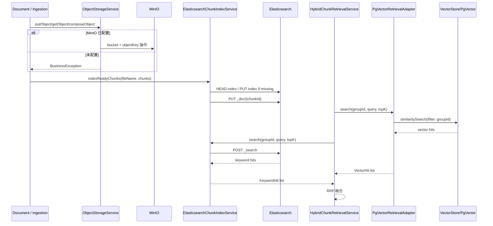

# Argus 引擎基础设施模块整体流程与代码定位

> 适用读者：准备系统理解 Argus 底层基础设施适配层的开发者。
>
> 本文聚焦 `engine` 模块本身，以及它如何支撑 document、ingestion、qa、assistant 等上层业务模块。

---

## 1. 文档目标

这份文档主要回答 7 个问题：

1. Argus 的 `engine` 模块在整个项目里到底扮演什么角色。
2. 对象存储、ES 检索、PgVector 检索分别由哪些类承接。
3. 文档上传、预览、摄入、问答检索是怎么接入这些引擎能力的。
4. 对象存储在“已配置”和“未配置”两种情况下分别怎么表现。
5. ES 关键词检索和 PgVector 语义检索各自做了哪些过滤与安全校验。
6. 哪些操作是强失败，哪些操作会降级为空结果或只打日志。
7. 当前版本里 engine 模块与配置文件、业务模块之间有哪些真实实现边界。

---

## 2. 模块总览

Argus 的 `engine` 不是一个“统一 AI 编排引擎”，而是一层很明确的基础设施适配层。

当前只包含 3 个子域：

1. `storage`：统一对象存储抽象与 MinIO 实现。
2. `elasticsearch`：文档切片 ES 索引写入、删除与关键词检索。
3. `pgvector`：基于 Spring AI `VectorStore` 的向量语义检索适配。

把它放到业务主链里，大致可以分成两半：

```text
写入链
DocumentUploadService / Ingestion
    ↓
ObjectStorageService
    ↓
MinIO bucket/objectKey
    ↓
DocumentIngestionAsyncService
    ↓
ElasticsearchChunkIndexService.indexReadyChunks(...)

检索链
Qa Hybrid Retrieval
    ↓                    ↓
PgVectorRetrievalAdapter  ElasticsearchChunkIndexService.search(...)
    ↓                    ↓
向量召回                 关键词召回
    ↓                    ↓
HybridChunkRetrievalService 融合
```

所以 `engine` 的本质是：

- 给上层业务提供统一基础设施接口。
- 屏蔽 MinIO / Elasticsearch / VectorStore 这些底层实现细节。
- 把“存储、索引、检索”统一收敛在一层，而不是散落到各业务模块里。

---

## 3. 代码目录定位

### 3.1 engine 模块目录

路径：`Argus-backend/src/main/java/com/argus/rag/engine`

```text
engine/
├── elasticsearch/
│   └── ElasticsearchChunkIndexService.java
├── pgvector/
│   └── PgVectorRetrievalAdapter.java
└── storage/
    ├── MissingObjectStorageService.java
    ├── MinioStorageService.java
    └── ObjectStorageService.java
```

### 3.2 和 engine 强耦合但不在 engine 目录中的关键调用方

- `Argus-backend/src/main/java/com/argus/rag/document/service/DocumentUploadService.java`
- `Argus-backend/src/main/java/com/argus/rag/document/service/DocumentPreviewService.java`
- `Argus-backend/src/main/java/com/argus/rag/document/service/DocumentDownloadService.java`
- `Argus-backend/src/main/java/com/argus/rag/document/service/DocumentDeleteService.java`
- `Argus-backend/src/main/java/com/argus/rag/ingestion/service/DocumentIngestionAsyncService.java`
- `Argus-backend/src/main/java/com/argus/rag/ingestion/service/pipeline/reader/StoredObjectDocumentReader.java`
- `Argus-backend/src/main/java/com/argus/rag/qa/rag/HybridChunkRetrievalService.java`

这些文件分别代表：

- `document`：上传、下载、预览、删除依赖对象存储与 ES 索引删除。
- `ingestion`：从对象存储读原文件，并把 READY chunk 建到 ES 索引。
- `qa`：混合检索时同时调用 ES 和 PgVector。

### 3.3 engine 相关配置位置

- `Argus-backend/src/main/resources/application.yml`
- `Argus-backend/src/main/resources/application-dev.yml`

---

## 4. 配置层流程

### 4.1 对象存储实现选择依赖 Spring 条件装配

位置：

- `MinioStorageService.java`
- `MissingObjectStorageService.java`

当前规则是：

- 配置存在 `storage.minio.endpoint`、`storage.minio.access-key`、`storage.minio.secret-key` 时，装配 `MinioStorageService`
- 否则，装配 `MissingObjectStorageService`

### 4.2 这个选择判断的是“属性是否存在”，不是“属性是否真的可用”

这是非常重要的实现细节。

也就是说：

- 只要属性存在，即使值是占位值，仍可能命中 `MinioStorageService`
- `MissingObjectStorageService` 并不是“任何连不上 MinIO 都会自动切过去”的兜底实现

### 4.3 当前仓库可见配置里，默认 active profile 是 `local`

位置：

- `application.yml`

当前可见事实是：

- `application.yml` 里设置了 `spring.profiles.active: local`
- 仓库可见资源中没有看到 `application-local.yml`
- `application-dev.yml` 提供了 MinIO / ES / PGvector 相关配置

所以更准确的说法是：

- 默认是否能走真实存储链路，取决于本地额外配置或环境变量
- 从仓库可见文件本身，并不能假设生产级存储配置一定已就绪

### 4.4 MinIO 配置项

位置：

- `application-dev.yml`

当前包含：

- `storage.minio.endpoint`
- `storage.minio.access-key`
- `storage.minio.secret-key`
- `storage.minio.bucket`

### 4.5 Elasticsearch 配置项

位置：

- `application-dev.yml`

当前包含：

- `elasticsearch.host`
- `elasticsearch.port`
- `elasticsearch.scheme`
- `elasticsearch.index-name`

### 4.6 PgVector 相关配置由 Spring AI 负责

位置：

- `application-dev.yml`

当前可见配置在：

- `spring.ai.vectorstore.pgvector.dimensions`
- `spring.ai.vectorstore.pgvector.index-type`
- `spring.ai.vectorstore.pgvector.distance-type`

而 `PgVectorRetrievalAdapter` 自己并不直接读 yml，它只依赖注入好的 `VectorStore` Bean。

---

## 5. 数据模型与契约模型

`engine` 当前没有自己的 MyBatis Mapper、业务表或 XML，它更偏向外部系统适配层。

### 5.1 对象存储契约：`ObjectStorageService`

这是统一存储抽象接口，当前暴露的方法是：

- `getDefaultBucket()`
- `getObject(...)`
- `putObject(...)`
- `composeObject(...)`
- `deleteObject(...)`

它的核心契约是：

- 上层只依赖 bucket + objectKey 模型
- 不关心底层究竟是 MinIO、S3 还是别的实现

### 5.2 `StoredObjectDocumentReader` 里的来源标识

对象存储文档被读取成 Spring AI `Document` 时，会带一个：

- `source = minio://bucket/objectKey`

这相当于把对象存储位置转成了后续 ETL 可识别的元数据来源。

### 5.3 ES 检索结果模型：`KeywordHit`

字段包括：

- `documentId`
- `chunkId`
- `chunkIndex`
- `fileName`
- `chunkText`
- `rawScore`
- `normalizedScore`

### 5.4 PgVector 检索结果模型：`VectorHit`

字段包括：

- `documentId`
- `chunkId`
- `chunkIndex`
- `chunkText`
- `score`

### 5.5 engine 复用而不是定义 `DocumentChunkEntity`

ES 建索引时直接消费的是：

- `ingestion.model.entity.DocumentChunkEntity`

这说明 engine 当前是适配层，不自己维护独立 chunk 实体。

### 5.6 engine 的“数据面”主要存在于外部系统

具体包括：

- MinIO bucket/objectKey
- Elasticsearch index `dd_rag_document_chunks`
- PgVector 背后的向量表 / VectorStore

---

## 6. 引擎基础设施模块详细流程（完整主链）

下面把 engine 的真实运行链拆成 26 步。

### 第 1 步：文档上传时，`DocumentUploadService` 会先向 `ObjectStorageService` 请求默认桶名

位置：

- `DocumentUploadService`
- `ObjectStorageService.getDefaultBucket()`

### 第 2 步：直传路径会调用 `putObject(...)` 把原文件写入对象存储

位置：

- `DocumentUploadService.uploadDocument()`
- `ObjectStorageService.putObject(...)`

### 第 3 步：分片上传完成后，会调用 `composeObject(...)` 在服务端合并分片

位置：

- `DocumentUploadService.completeUpload()`

### 第 4 步：合并完成后，分片对象不会由存储层自动删除，需要调用方自己清理

这不是推测，而是 `ObjectStorageService` 契约和 `MinioStorageService` 注释里都明确写了的行为边界。

### 第 5 步：文档预览和下载路径会通过 `getObject(...)` 重新读取对象流

位置：

- `DocumentPreviewService`
- `DocumentDownloadService`

### 第 6 步：如果当前没有可用对象存储实现，`MissingObjectStorageService` 会直接抛 `BusinessException`

位置：

- `MissingObjectStorageService`

这条路是 fail-fast，不会返回空流，也不会伪造成功。

### 第 7 步：如果装配的是 `MinioStorageService`，构造时会读取 endpoint / access-key / secret-key

位置：

- `MinioStorageService(Environment)`

### 第 8 步：MinIO 客户端初始化后，真正写入前会先 `ensureBucketExists(bucket)`

位置：

- `MinioStorageService.putObject()`
- `MinioStorageService.composeObject()`

### 第 9 步：`ensureBucketExists` 采用“缓存 + 全局锁 + 二次检查”的方式避免重复建桶

位置：

- `MinioStorageService.ensureBucketExists()`

### 第 10 步：摄入读取原文件时，`StoredObjectDocumentReader` 会先解析 bucket 和 parser

位置：

- `StoredObjectDocumentReader.get()`

### 第 11 步：读取器通过 `ObjectStorageService.getObject()` 拿到输入流，再交给解析器转成纯文本

位置：

- `StoredObjectDocumentReader`

### 第 12 步：解析成功后，读取器会构造成带元数据的 Spring AI `Document`

位置：

- `StoredObjectDocumentReader.buildDocument()`

元数据里会带上：

- `groupId`
- `documentId`
- `fileName`
- `source=minio://bucket/objectKey`

### 第 13 步：当摄入流程产出 READY chunk 后，`DocumentIngestionAsyncService` 会调用 ES 服务同步索引

位置：

- `DocumentIngestionAsyncService.syncSearchIndex()`
- `ElasticsearchChunkIndexService.indexReadyChunks(...)`

### 第 14 步：在写 ES 之前，`ElasticsearchChunkIndexService` 会先确保索引存在

位置：

- `ensureIndexInitialized()`

### 第 15 步：若索引不存在，会自动创建 `dd_rag_document_chunks` 并配置 IK 中文分词器

位置：

- `indexExists()`
- `createIndex()`
- `buildCreateIndexRequestBody()`

### 第 16 步：索引写入时，每个 chunk 会被单独 PUT 到 `_doc/{chunkId}`

位置：

- `indexChunk()`

这意味着相同 `chunkId` 的写入是幂等覆盖式的。

### 第 17 步：ES 索引文档会写入群组、文档、切片、文件名、文本、状态和 deleted 标记

位置：

- `indexChunk()`

### 第 18 步：文档删除或重建索引时，会按 `documentId` 调用 `_delete_by_query` 清理旧 chunk

位置：

- `deleteDocumentChunks()`

### 第 19 步：`deleteDocumentChunks` 失败只记 warn，不阻断主流程

位置：

- `ElasticsearchChunkIndexService.deleteDocumentChunks()`

所以 ES 清理是“尽力而为”，不是强事务行为。

### 第 20 步：QA 混合检索时，会同时触发 PgVector 和 ES 两条召回通道

位置：

- `HybridChunkRetrievalService.mergeVectorHits()`
- `HybridChunkRetrievalService.mergeKeywordHits()`

### 第 21 步：PgVector 路会构造带 `groupId` 过滤条件的 `SearchRequest`

位置：

- `PgVectorRetrievalAdapter.search()`

### 第 22 步：向量结果返回后，适配器会再次校验 metadata 里的 `groupId`

位置：

- `PgVectorRetrievalAdapter.toVectorHit()`

这是一个明确的防御式校验，用来防跨群组数据泄露。

### 第 23 步：ES 关键词检索同样先用 filter 强制约束 `groupId + status=READY + deleted=false`

位置：

- `buildKeywordSearchRequestBody()`

### 第 24 步：关键词召回采用“初排 + rescore 精排”两阶段打分

位置：

- `buildKeywordShouldClauses()`
- `buildKeywordRescoreShouldClauses()`

它会同时考虑：

- `fileName` 短语匹配
- `fileName` 分词匹配
- `chunkText` 短语匹配
- `chunkText` 分词匹配

### 第 25 步：ES 原始 `_score` 会被归一化到 [0, 1]，再交给上层融合

位置：

- `normalizeKeywordScore()`

### 第 26 步：最终 QA 层把 PgVector 和 ES 两路结果用 RRF 融合，assistant 知识库检索则间接复用这条链路

位置：

- `HybridChunkRetrievalService`
- `AssistantKnowledgeBaseTool` 的上游检索链

也就是说，assistant 当前并不是直接调用 engine，而是通过 qa 的检索能力间接复用 engine。

---

## 7. 存储与检索时序图



---

## 8. 对其他模块的支撑方式

### 8.1 对 document 模块

`engine/storage` 支撑：

- 文档直传
- 分片上传合并
- 预览原文件
- 下载原文件

`engine/elasticsearch` 支撑：

- 文档删除时清理 ES chunk 索引

### 8.2 对 ingestion 模块

`engine/storage` 支撑：

- 从对象存储重新读取原始文档

`engine/elasticsearch` 支撑：

- 把 READY 状态的 chunk 建立到 ES 关键词检索索引

### 8.3 对 qa 模块

`engine/pgvector` 支撑：

- 向量语义召回

`engine/elasticsearch` 支撑：

- 关键词召回

最终由 `HybridChunkRetrievalService` 做融合。

### 8.4 对 assistant 模块

assistant 当前没有直接依赖 engine 的主路径，而是：

- 通过知识库检索工具复用 qa 的混合检索链

所以 assistant 对 engine 的依赖是间接依赖。

---

## 9. 前端关系

前端当前不会直接调用 `engine` 模块中的任何类或接口。

`engine` 对前端的影响都是间接的：

1. 文档上传、下载、预览是否能真正访问底层对象存储。
2. 文档摄入后是否能被 ES 检索到。
3. QA / assistant 知识库问答的召回质量如何。

所以 `engine` 是一个典型的“前端无感、业务强依赖”的后端基础设施层。

---

## 10. 异常与降级策略

### 10.1 对象存储未配置时：强失败

位置：

- `MissingObjectStorageService`

表现为：

- 所有读写删合并操作直接抛 `BusinessException`

### 10.2 MinIO 真实调用失败时：强失败

位置：

- `MinioStorageService`

表现为：

- 读取、上传、合并、删除异常都被包装成 `BusinessException`

### 10.3 ES 索引写入 / 初始化失败：强失败

位置：

- `indexExists()`
- `createIndex()`
- `sendJsonRequest(..., ignoreMissingIndex=false)`

这条路直接关系到摄入结果是否可检索，所以当前没有做静默吞掉。

### 10.4 ES 删除旧索引失败：只记 warn

位置：

- `deleteDocumentChunks()`

### 10.5 ES 关键词检索失败：降级为空结果

位置：

- `search()`

这是当前检索链最典型的可用性兜底策略。

### 10.6 PgVector 检索结果若出现跨群组数据：直接抛错

位置：

- `PgVectorRetrievalAdapter.toVectorHit()`

这体现了“宁可失败，也不允许跨群组泄露”的安全优先级。

---

## 11. 当前版本需要特别留意的点

### 11.1 engine 当前只覆盖 3 类底层能力，不包含 parser、chunking、embedding 编排

这些能力当前分别更多落在：

- `ingestion`
- `qa`
- Spring AI 自动配置

所以不要把 engine 理解成“所有底层能力都在这里”。

### 11.2 `MissingObjectStorageService` 是“无 Bean 时兜底”，不是“连不上 MinIO 时自动熔断回退”

位置：

- `MinioStorageService`
- `MissingObjectStorageService`

Bean 是否装配，只看属性存在性，不看配置值是否真能连通目标服务。

### 11.3 从当前仓库可见配置看，默认 local 环境下是否能直接走真实存储链，取决于额外本地配置

位置：

- `application.yml`
- `application-dev.yml`

当前仓库可见文件里没有看到 `application-local.yml`。

### 11.4 ES 检索链的容错级别高于索引写入链

位置：

- `ElasticsearchChunkIndexService`

具体表现是：

- 搜索失败可降级为空列表
- 索引初始化 / 索引写入失败则直接抛错

### 11.5 PgVector 适配器做了二次 `groupId` 校验，这是当前非常关键的安全防线

它说明项目并不完全信任底层向量存储返回结果，而是做了防御式再校验。

### 11.6 ES 服务当前走的是 JDK 原生 `HttpClient`，不是官方 ES Java Client

位置：

- `ElasticsearchChunkIndexService`

这让依赖更轻，但也意味着 DSL、超时和错误处理全部由项目自己维护。

### 11.7 `ObjectStorageService` 抽象理论上支持 S3 / 本地文件系统，但当前可见实现只有 MinIO 和 Missing 占位实现

所以这个抽象已经为扩展留了口，但当前真实运行路径仍很明确。

---

## 12. 对简历和面试最值得保留的讲法

### 12.1 建议保留的 5 个表达点

1. 项目把对象存储、关键词检索、向量检索统一下沉到独立基础设施层，业务模块只依赖抽象接口和适配器。
2. 文档链路通过 `ObjectStorageService` 完成上传、分片合并、预览和下载，避免业务层直接耦合 MinIO SDK。
3. 检索链路采用 ES 关键词召回 + PgVector 语义召回的双路方案，再由 QA 层做融合。
4. 向量检索和关键词检索都强制按 `groupId` 做范围约束，其中向量结果还会做二次 group 校验，重点防跨群组数据泄露。
5. 模块内部对不同能力采用不同容错策略：存储与索引写入强失败，关键词检索可降级为空结果，兼顾数据正确性和整体可用性。

### 12.2 面试时不要讲得过头的地方

1. 不要把 engine 讲成统一 AI 中台，它当前只是底层适配层。
2. 不要说 Missing 存储实现会在“连接失败时自动回退”，当前不是这种机制。
3. 不要说 assistant 直接依赖 engine 做知识库检索，当前主路径是 assistant 复用 qa 检索链。

---

## 13. 推荐阅读顺序

建议按下面顺序阅读：

1. `Argus-backend/src/main/java/com/argus/rag/engine/storage/ObjectStorageService.java`
2. `Argus-backend/src/main/java/com/argus/rag/engine/storage/MissingObjectStorageService.java`
3. `Argus-backend/src/main/java/com/argus/rag/engine/storage/MinioStorageService.java`
4. `Argus-backend/src/main/java/com/argus/rag/ingestion/service/pipeline/reader/StoredObjectDocumentReader.java`
5. `Argus-backend/src/main/java/com/argus/rag/engine/elasticsearch/ElasticsearchChunkIndexService.java`
6. `Argus-backend/src/main/java/com/argus/rag/engine/pgvector/PgVectorRetrievalAdapter.java`
7. `Argus-backend/src/main/java/com/argus/rag/document/service/DocumentUploadService.java`
8. `Argus-backend/src/main/java/com/argus/rag/document/service/DocumentPreviewService.java`
9. `Argus-backend/src/main/java/com/argus/rag/document/service/DocumentDownloadService.java`
10. `Argus-backend/src/main/java/com/argus/rag/document/service/DocumentDeleteService.java`
11. `Argus-backend/src/main/java/com/argus/rag/ingestion/service/DocumentIngestionAsyncService.java`
12. `Argus-backend/src/main/java/com/argus/rag/qa/rag/HybridChunkRetrievalService.java`
13. `Argus-backend/src/main/resources/application.yml`
14. `Argus-backend/src/main/resources/application-dev.yml`

---

## 14. 一句话总结

Argus 的 `engine` 模块本质上是一层围绕对象存储、ES 关键词检索和 PgVector 向量检索的基础设施适配层：它不直接承载业务流程，但决定了文档能否被保存、能否被重新读取、能否被建立索引，以及 QA / assistant 最终能否稳定、安全地召回知识库证据。