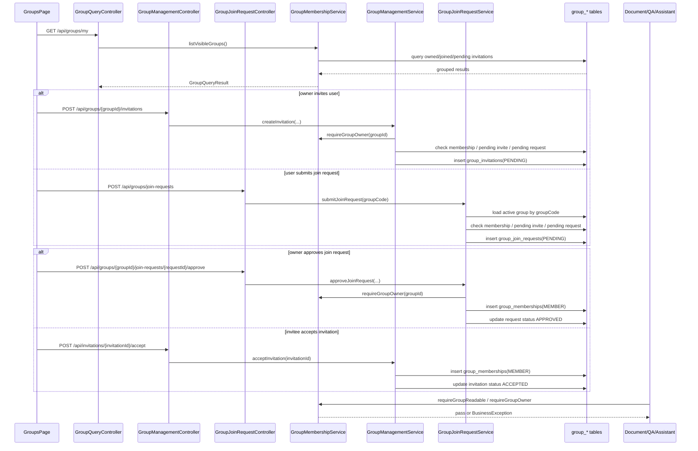

# Argus 群组与权限模块整体流程与代码定位

> 适用读者：准备系统学习 Argus 群组、成员关系与业务权限边界的开发者。
>
> 本文聚焦 group 模块本身，以及它和 document、qa、assistant 之间的权限复用关系。

---

## 1. 文档目标

这份文档回答 7 个问题：

1. Argus 的群组模块到底负责哪些事。
2. “群组”和“权限”在当前代码里是不是两个独立模块。
3. 群组创建、邀请加入、申请加入、成员移除、退出群组分别怎么走。
4. 群组可读和 OWNER 权限到底由谁校验。
5. document、qa、assistant 是如何复用这套权限边界的。
6. 前端 groups 页面当前真实接了哪些接口。
7. 这一整套流程在项目里的具体代码位置分别在哪里。

---

## 2. 模块总览

Argus 当前的群组与权限并不是两个完全分开的子系统，而是同一个业务模块的两面：

```text
前端 groups 页面
    ↓
接口层（GroupQueryController / GroupManagementController / GroupJoinRequestController / InvitationDecisionController）
    ↓
应用服务层（GroupMembershipService / GroupManagementService / GroupJoinRequestService）
    ↓
数据访问层（GroupMembershipMapper / GroupJoinRequestMapper + 对应 XML）
    ↓
数据模型层（groups / group_memberships / group_invitations / group_join_requests）
    ↓
权限复用方（document / qa / assistant）
```

这套设计的关键点是：

- “群组”负责知识库协作空间的组织边界。
- “权限”没有单独做 ACL 表或 policy engine，而是直接收口在 `group_memberships.role` 和 `GroupMembershipService` 上。
- document、qa、assistant 这几个业务模块都不自己重复做权限判断，而是回到 group 模块统一判定“可读”或“OWNER”。

从职责上看：

- `GroupQueryController` 负责返回当前用户可见的群组、已加入的群组和待处理邀请。
- `GroupManagementController` 负责创建群组、邀请成员、查询成员、移除成员、退出群组。
- `GroupJoinRequestController` 负责按 `groupCode` 提交加入申请，以及 OWNER 侧审批申请。
- `InvitationDecisionController` 负责接收方接受 / 拒绝邀请，以及 OWNER 取消邀请。
- `GroupMembershipService` 是当前权限边界的真正收口点。
- `GroupManagementService` 和 `GroupJoinRequestService` 则是两条核心业务流程编排服务。

---

## 3. 代码目录定位

### 3.1 后端 group 目录

路径：`Argus-backend/src/main/java/com/argus/rag/group`

```text
group/
├── controller/
│   ├── GroupManagementController.java
│   ├── GroupQueryController.java
│   ├── GroupJoinRequestController.java
│   └── InvitationDecisionController.java
├── mapper/
│   ├── GroupMembershipMapper.java
│   └── GroupJoinRequestMapper.java
├── model/
│   ├── dto/
│   ├── entity/
│   └── vo/
└── service/
    ├── GroupMembershipService.java
    ├── GroupManagementService.java
    └── GroupJoinRequestService.java
```

### 3.2 与 group 强关联但不在 group 目录的代码

- `Argus-backend/src/main/java/com/argus/rag/auth/CurrentUserService.java`
- `Argus-backend/src/main/java/com/argus/rag/document/service/DocumentUploadService.java`
- `Argus-backend/src/main/java/com/argus/rag/document/service/DocumentQueryService.java`
- `Argus-backend/src/main/java/com/argus/rag/document/service/DocumentPreviewService.java`
- `Argus-backend/src/main/java/com/argus/rag/document/service/DocumentDownloadService.java`
- `Argus-backend/src/main/java/com/argus/rag/document/service/DocumentDeleteService.java`
- `Argus-backend/src/main/java/com/argus/rag/qa/service/QaService.java`
- `Argus-backend/src/main/java/com/argus/rag/assistant/service/AssistantService.java`

这些文件之所以重要，是因为它们说明：

- group 模块不只是 groups 页面自己的模块
- 它还是 document / qa / assistant 的统一权限边界

### 3.3 MyBatis XML 位置

- `Argus-backend/src/main/resources/mappers/GroupMembershipMapper.xml`
- `Argus-backend/src/main/resources/mappers/GroupJoinRequestMapper.xml`

### 3.4 前端配合代码

- `Argus-frontend/src/api/group.ts`
- `Argus-frontend/src/views/groups/GroupsPage.vue`
- `Argus-frontend/src/views/groups/components/OwnedGroupsTab.vue`
- `Argus-frontend/src/views/groups/components/JoinedGroupsTab.vue`
- `Argus-frontend/src/views/groups/components/InvitationsTab.vue`
- `Argus-frontend/src/views/groups/components/MyRequestsTab.vue`
- `Argus-frontend/src/views/groups/components/modals/CreateGroupModal.vue`
- `Argus-frontend/src/views/groups/components/modals/JoinGroupModal.vue`
- `Argus-frontend/src/views/groups/components/modals/GroupManageModal.vue`

### 3.5 相关数据表

group 模块当前核心表有四张：

- `sql/schema.sql` 中的 `groups`
- `sql/schema.sql` 中的 `group_memberships`
- `sql/schema.sql` 中的 `group_invitations`
- `sql/schema.sql` 中的 `group_join_requests`

这四张表正好对应四类业务对象：

1. 群组本体
2. 成员关系与角色
3. 邀请流
4. 申请流

---

## 4. 配置层流程

### 4.1 group 当前没有单独的 yml / config 配置层

和 auth、qa 不同，group 模块当前几乎没有独立的配置类或 yml 参数。

它的业务规则主要直接写在三处：

1. 数据库表结构
2. 枚举
3. Service 代码

### 4.2 权限模型当前非常简单：只有 OWNER 和 MEMBER

位置：

- `com.argus.rag.common.enums.GroupRole`

当前角色只有：

- `OWNER`
- `MEMBER`

这意味着 Argus 现在的群组权限不是细粒度 RBAC，也没有“编辑者 / 审核者 / 访客”这类中间层角色。

### 4.3 业务状态依赖枚举，而不是单独状态机框架

当前位置：

- `GroupInvitationStatus`
- `GroupJoinRequestStatus`
- `GroupStatus`

所以当前状态流转都是在 Service 里通过：

- `requirePending()`
- `update...Status(... fromStatus=PENDING ...)`

这样的方式实现。

### 4.4 权限判断没有单独 ACL 表，而是直接落在 membership.role 上

这是 group 模块最重要的设计事实之一。

当前权限收口依赖的是：

- `groups.owner_user_id`
- `group_memberships.role`
- `GroupMembershipService.requireGroupReadable()`
- `GroupMembershipService.requireGroupOwner()`

换句话说：

- 权限不是额外的一套系统
- 权限就是群组成员关系的一部分

---

## 5. 数据模型与状态模型

### 5.1 groups

`groups` 当前主要字段包括：

- `id`
- `group_code`
- `group_name`
- `description`
- `owner_user_id`
- `status`
- `created_at`
- `updated_at`

它解决的是“知识库协作空间本体”的问题。

其中最关键的两个字段是：

- `group_code`：前端申请加入时使用
- `owner_user_id`：拥有者视角查询时使用

### 5.2 group_memberships

`group_memberships` 当前主要字段包括：

- `group_id`
- `user_id`
- `role`
- `created_at`
- `updated_at`

它解决的是“某个用户在某个群组里是否有资格、角色是什么”的问题。

当前权限模型完全建立在这张表上。

### 5.3 group_invitations

`group_invitations` 当前主要字段包括：

- `group_id`
- `inviter_user_id`
- `invitee_user_id`
- `status`
- `decided_at`

这张表对应的是“OWNER 主动拉人进组”的流程。

### 5.4 group_join_requests

`group_join_requests` 当前主要字段包括：

- `group_id`
- `applicant_user_id`
- `status`
- `decided_by_user_id`
- `decided_at`

这张表对应的是“普通用户主动申请入组”的流程。

### 5.5 当前用户可见群组结果模型

`GroupMembershipService.GroupQueryResult` 当前包含：

- `ownedGroups`
- `joinedGroups`
- `pendingInvitations`

这说明前端首页不是分别请求三种数据，而是先拿一个聚合结果。

### 5.6 状态流转模型

当前几个最关键的状态流转是：

- 群组：`ACTIVE / ARCHIVED`
- 邀请：`PENDING / ACCEPTED / REJECTED / CANCELED`
- 申请：`PENDING / APPROVED / REJECTED / CANCELED`

这里要注意：

- 代码里的真实枚举值，要比 schema 注释更值得相信

---

## 6. 群组与权限模块详细流程（完整落地版）

下面将 group 模块主链拆成 32 步，对应到项目实际代码位置。

### 第 1 步：前端 groups 页面初始化时拉三类核心数据

位置：

- `GroupsPage.vue -> loadInitialData()`

页面首次加载时会并行请求：

1. `fetchGroups()`
2. `fetchMyJoinRequests()`
3. `fetchMySentInvitations()`

### 第 2 步：`/api/groups/my` 是群组首页的主入口

位置：

- `GroupQueryController.listVisibleGroups()`

这个接口返回的不是单一列表，而是：

- 拥有的组
- 加入的组
- 待处理邀请

### 第 3 步：当前用户可见群组由 GroupMembershipService 聚合查询

位置：

- `GroupMembershipService.listVisibleGroups()`

它内部会拼出：

1. ownedGroups
2. joinedGroups
3. pendingInvitations

### 第 4 步：拥有的组查询基于 `groups.owner_user_id`

位置：

- `GroupMembershipMapper.xml -> selectOwnedGroupsByUserId`

这意味着“我拥有的组”并不是从 membership 里反推，而是直接根据 `owner_user_id` 查询。

### 第 5 步：我加入的组查询基于 membership 中 `role = MEMBER`

位置：

- `GroupMembershipMapper.xml -> selectJoinedGroupsByUserId`

所以 owner 虽然也会被插入一条 `OWNER` membership，但不会出现在 joinedGroups 里。

### 第 6 步：待处理邀请查询基于 `invitee_user_id + status=PENDING`

位置：

- `GroupMembershipMapper.xml -> selectPendingInvitationsByInviteeUserId`

当前 groups 页面上的“待处理邀请”卡片，就是从这里来的。

### 第 7 步：创建群组入口是 `POST /api/groups`

位置：

- `GroupManagementController.createGroup()`

### 第 8 步：创建群组时先校验当前用户和名称参数

位置：

- `GroupManagementService.createGroup()`

当前主要校验点包括：

- 当前必须是业务用户
- 组名不能为空
- 组名长度不能超过 128
- 描述长度不能超过 512

### 第 9 步：创建群组时后端会生成唯一的 `group_code`

位置：

- `GroupManagementService.buildGroupCode()`

当前生成方式是：

- `group-` + 去掉中划线的 UUID

### 第 10 步：群组创建成功后，创建者会自动写入 OWNER 成员关系

位置：

- `GroupManagementService.createGroup()`

当前逻辑是先：

1. 插入 `groups`
2. 再插入 `group_memberships(role=OWNER)`

### 第 11 步：前端创建群组成功后会刷新 workspace，并把当前 groupId 切到新组

位置：

- `GroupsPage.vue -> handleCreateGroup()`

这说明 group 模块不仅是后台元数据，也是前端当前工作上下文的一部分。

### 第 12 步：OWNER 邀请成员入口是 `POST /api/groups/{groupId}/invitations`

位置：

- `GroupManagementController.createInvitation()`

### 第 13 步：创建邀请前必须先通过 OWNER 校验

位置：

- `GroupManagementService.createInvitation()`
- `GroupMembershipService.requireGroupOwner()`

### 第 14 步：创建邀请前还会做三类互斥校验

位置：

- `GroupManagementService.rejectDuplicateInvitationTarget()`

当前会拒绝：

1. 目标用户已是成员
2. 已存在待处理邀请
3. 该用户已有待处理加入申请

### 第 15 步：邀请和申请在当前设计里是互斥的两条入组路径

位置：

- `GroupManagementService`
- `GroupJoinRequestService`

这意味着同一个用户同一时间不会同时挂着：

- 一条待处理邀请
- 一条待处理申请

### 第 16 步：接收方处理邀请的入口走 `/api/invitations/*`

位置：

- `InvitationDecisionController`

当前支持三种操作：

1. accept
2. reject
3. cancel

### 第 17 步：接受邀请时会先校验“我是被邀请人 + 邀请还在 PENDING”

位置：

- `GroupManagementService.acceptInvitation()`

### 第 18 步：接受邀请成功后，会插入 MEMBER 关系，再把邀请更新为 ACCEPTED

位置：

- `GroupManagementService.acceptInvitation()`
- `GroupMembershipMapper.updateInvitationStatus()`

### 第 19 步：邀请状态更新当前带有 `fromStatus = PENDING` 条件

位置：

- `GroupMembershipMapper.xml -> updateInvitationStatus`

它的意义是：

- 防止同一条邀请被重复处理

### 第 20 步：普通用户主动入组走 `POST /api/groups/join-requests`

位置：

- `GroupJoinRequestController.submitJoinRequest()`

### 第 21 步：主动入组不是按 groupId，而是按 `groupCode`

位置：

- `CreateJoinRequestRequest`
- `GroupJoinRequestService.submitJoinRequest()`
- `GroupJoinRequestMapper.xml -> selectActiveGroupByCode`

这说明当前产品把 `groupCode` 当成“入组口令 / 组织 ID”来使用。

### 第 22 步：提交申请前也会做三类互斥校验

位置：

- `GroupJoinRequestService.submitJoinRequest()`

当前会拒绝：

1. 已经是成员
2. 已存在待处理邀请
3. 已存在待处理加入申请

### 第 23 步：OWNER 查看待审批申请入口是 `GET /api/groups/{groupId}/join-requests`

位置：

- `GroupJoinRequestController.listOwnerJoinRequests()`
- `GroupJoinRequestService.listOwnerJoinRequests()`

### 第 24 步：OWNER 审批通过申请时，会先校验 OWNER 身份和 groupId 一致性

位置：

- `GroupJoinRequestService.approveJoinRequest()`
- `GroupJoinRequestService.requireSameGroup()`

### 第 25 步：审批通过时，会插入 MEMBER 关系，再更新申请状态为 APPROVED

位置：

- `GroupJoinRequestService.approveJoinRequest()`
- `GroupJoinRequestMapper.xml -> updateJoinRequestStatus`

### 第 26 步：拒绝申请时不会插入成员关系，只更新状态为 REJECTED

位置：

- `GroupJoinRequestService.rejectJoinRequest()`

### 第 27 步：申请状态更新同样带有 `fromStatus = PENDING` 条件

位置：

- `GroupJoinRequestMapper.xml -> updateJoinRequestStatus`

所以申请流和邀请流一样，都用了“只允许从待处理态成功转出”的防重处理方式。

### 第 28 步：查看成员列表当前只允许 OWNER

位置：

- `GroupManagementService.listMembers()`

当前不是“成员都能看成员列表”，而是 OWNER 才能看。

### 第 29 步：移除成员当前只允许 OWNER，且不能移除 OWNER

位置：

- `GroupManagementService.removeMember()`

这说明当前群组并没有“转让 OWNER 后再管理”的链路，OWNER 是强约束角色。

### 第 30 步：退出群组当前只允许普通成员，OWNER 不能退出自己的组

位置：

- `GroupManagementService.leaveGroup()`

### 第 31 步：真正的业务权限边界收口在 GroupMembershipService

位置：

- `requireGroupReadable()`
- `requireGroupOwner()`

这两个方法分别代表：

1. 可读当前组
2. 拥有当前组

### 第 32 步：document / qa / assistant 都复用这两个权限边界

位置：

- document：上传、删除走 `requireGroupOwner()`，查询 / 预览 / 下载走 `requireGroupReadable()`
- qa：问答走 `requireGroupReadable()`
- assistant：`KB_SEARCH` 模式走 `requireGroupReadable()`

这一步说明 group 模块在项目里的定位不是“一个页面”，而是整个 RAG 业务的授权边界。

---

## 7. 邀请、申请与权限复用时序图



---

## 8. 权限边界怎么理解

### 8.1 当前项目里的“权限模块”本质上就是 group_memberships + GroupMembershipService

如果用一句话概括当前实现：

- 谁能看、谁能传、谁能删、谁能问，最后都回到了“你是不是这个 group 的成员，角色是不是 OWNER”。

### 8.2 `requireGroupReadable()` 是最常用的读权限边界

它当前的业务语义是：

- 只要当前用户在该组里有 active membership，就算可读

### 8.3 `requireGroupOwner()` 是写权限边界

它当前主要用于：

- 创建邀请
- 查看成员列表
- 移除成员
- 查看 / 审批加入申请
- 文档上传与删除

### 8.4 当前没有更细粒度的资源权限

当前系统里没有看到这些能力：

- 文档级单独授权
- 问答级单独授权
- assistant 单独权限表
- 群组内多角色细分

所以现在最准确的说法是：

- 这是“群组级授权边界”
- 不是“细粒度权限平台”

---

## 9. 前端配合机制

### 9.1 groups 页面当前采用“总览 + tab + modal”的交互结构

位置：

- `GroupsPage.vue`

当前主要 tab 是：

- `owned`
- `joined`
- `invitations`
- `requests`

### 9.2 前端会把群组总览数据交给 appStore

位置：

- `fetchGroups()`
- `appStore.applyGroupQueryResult(...)`

这意味着群组信息不是只供 groups 页面自己用，还是应用级共享状态的一部分。

### 9.3 成员列表和 OWNER 侧申请列表是懒加载的

位置：

- `GroupsPage.vue -> openManageModal()`

只有打开管理弹窗时，前端才会额外加载：

1. 群组成员列表
2. 该组待审批申请

### 9.4 前端每次关键操作后都会刷新 workspace 数据

位置：

- `refreshWorkspace()`

当前邀请处理、申请审批、退出群组、创建群组之后，页面都会重新拉取群组主数据，保证 tab 统计和当前上下文同步。

---

## 10. 异常与返回结构

### 10.1 当前 group 模块接口基本都走 `ApiResponse<T>` 包装

例如：

- 创建群组
- 查询可见群组
- 提交加入申请
- 创建邀请
- 接受 / 拒绝邀请

### 10.2 比较常见的业务错误口径

当前比较常见的报错包括：

- `当前用户不是目标群组成员`
- `当前用户不是目标群组 OWNER`
- `被邀请人已是群组成员`
- `已存在待处理邀请`
- `该用户已有待处理加入申请，请先等待审批`
- `邀请已处理`
- `申请已处理`
- `OWNER 不能退出自己的组`
- `不能移除 OWNER`

### 10.3 invitation / join request 的状态更新都是幂等式防重思路

它们不会无条件更新，而是要求：

- 旧状态必须还是 `PENDING`

如果不是，就抛出“已处理”。

---

## 11. 当前版本需要特别留意的点

下面这些不是抽象设计，而是当前仓库实现里非常值得记住的事实。

### 11.1 当前没有单独的 permission 模块或 ACL 表

权限现在就是：

- `group_memberships.role`
- `GroupMembershipService`

所以你在讲这个项目时，不要把它夸成独立权限平台。

### 11.2 当前没有转让 OWNER、解散群组、归档群组的完整业务接口

从现有 controller / service 看，目前有：

- 创建群组
- 邀请 / 申请 / 审批
- 移除成员
- 退出群组

但没有看到：

- 转让 OWNER
- 删除群组
- 修改群组信息
- 归档群组

### 11.3 OWNER 当前不能退出自己的组，但仓库里也没有配套的“转让后退出”主路径

位置：

- `GroupManagementService.leaveGroup()`

这意味着 OWNER 生命周期当前是比较“硬”的。

### 11.4 `ownedGroups` 和 `joinedGroups` 当前是两条不同来源的查询

位置：

- `selectOwnedGroupsByUserId`
- `selectJoinedGroupsByUserId`

所以当前前端看到的“我拥有的组”和“我加入的组”不是同一个列表按 role 分组，而是后端直接分开查好的。

### 11.5 groupCode 是加入申请的真正入口，不是 groupId

位置：

- `GroupJoinRequestService.submitJoinRequest()`
- `GroupJoinRequestMapper.xml -> selectActiveGroupByCode`

这对产品理解很重要：

- 群组对外暴露的是 `groupCode`
- 不是数据库主键 ID

### 11.6 schema 注释中的邀请 / 申请状态文案和代码真实枚举存在偏差，排查问题时要以枚举为准

例如：

- schema 注释里出现了 `REFUSED / CANCELLED`
- 代码枚举实际使用的是 `REJECTED / CANCELED`

如果你后面查数据库状态问题，优先信：

- Java 枚举和真实写库代码

### 11.7 document、qa、assistant 的业务权限都已经压在 group 模块上

这意味着 group 模块不是附属页面，而是项目级基础边界。后面你看任何“为什么这个用户不能上传 / 不能问答 / 不能检索知识库”的问题，都应该先回到这里查。

---

## 12. 对简历和面试最值得保留的讲法

### 12.1 建议重点保留的 6 个工程点

1. 这个项目的权限边界不是额外 ACL 系统，而是建立在群组成员关系和角色之上的统一业务授权层。
2. group 模块同时支持两条入组路径：OWNER 邀请和用户按 groupCode 申请加入，并且两条路径互斥。
3. 邀请和申请的审批都采用“只允许从 PENDING 成功转出”的条件更新，避免重复处理。
4. document、qa、assistant 都通过 `GroupMembershipService` 复用同一套群组权限边界。
5. 前端 groups 页面不是静态展示，而是直接承载群组创建、邀请管理、申请审批、成员管理这整套协作入口。
6. 当前群组模型虽然简单，但足以成为整个 RAG 知识库协作边界的基础设施。

### 12.2 面试时建议收口的地方

1. 不要把当前实现讲成细粒度权限平台，它本质还是群组级角色控制。
2. 不要把当前群组模块讲成“完整组织管理系统”，因为还没有转让所有权、解散群组、编辑群组等主路径。
3. 不要忽略它和 document / qa / assistant 的关系，真正有价值的点在于它承担了全局业务权限边界。

---

## 13. 推荐阅读顺序

如果你第一次系统学习这个模块，建议按下面顺序阅读：

1. `Argus-backend/src/main/java/com/argus/rag/group/controller/GroupQueryController.java`
2. `Argus-backend/src/main/java/com/argus/rag/group/service/GroupMembershipService.java`
3. `Argus-backend/src/main/resources/mappers/GroupMembershipMapper.xml`
4. `Argus-backend/src/main/java/com/argus/rag/group/controller/GroupManagementController.java`
5. `Argus-backend/src/main/java/com/argus/rag/group/service/GroupManagementService.java`
6. `Argus-backend/src/main/java/com/argus/rag/group/controller/InvitationDecisionController.java`
7. `Argus-backend/src/main/java/com/argus/rag/group/controller/GroupJoinRequestController.java`
8. `Argus-backend/src/main/java/com/argus/rag/group/service/GroupJoinRequestService.java`
9. `Argus-backend/src/main/resources/mappers/GroupJoinRequestMapper.xml`
10. `Argus-backend/src/main/java/com/argus/rag/document/service/DocumentUploadService.java`
11. `Argus-backend/src/main/java/com/argus/rag/qa/service/QaService.java`
12. `Argus-backend/src/main/java/com/argus/rag/assistant/service/AssistantService.java`
13. `Argus-frontend/src/api/group.ts`
14. `Argus-frontend/src/views/groups/GroupsPage.vue`
15. `sql/schema.sql`

这样可以先建立“权限边界 -> 业务流程 -> 前端接线 -> 下游模块复用”的整体视图。

---

## 14. 一句话总结

Argus 的群组与权限模块本质上是一套“以 group 为协作边界、以 membership.role 为授权核心、以邀请和申请两条入组流程为补充”的统一业务边界系统。它不仅服务 groups 页面本身，更直接决定了 document、qa、assistant 这些核心 RAG 能力对谁开放、开放到什么程度。