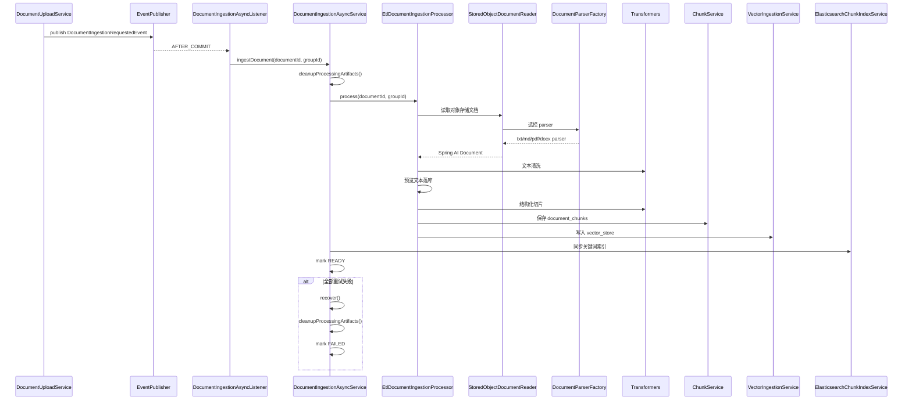

# Argus 摄入模块整体流程与代码定位

> 适用读者：准备系统学习 Argus 项目 ingestion / ETL 链路的开发者。
>
> 本文聚焦 ingestion 模块本身，以及它和 document 模块、对象存储、向量库、关键词索引、qa 检索之间的协作关系。

---

## 1. 文档目标

这份文档回答 6 个问题：

1. Argus 的 ingestion 模块由哪些类组成。
2. 文档上传完成后，异步摄入链路究竟是怎么启动的。
3. ETL 过程中“读取、解析、清洗、切片、落库、向量化、索引同步”分别由谁负责。
4. `document_chunks`、`vector_store`、`documents.status` 分别在什么阶段被写入。
5. 当前版本的摄入链路到底是“Spring 事件异步重试”，还是“任务表 Worker 调度”。
6. 这一整套流程在项目里的具体代码位置分别在哪里。

---

## 2. 模块总览

Argus 的 ingestion 模块不是“解析文件内容”这么简单，而是由以下几层共同组成：

```text
document 模块完成上传并发布事件
    ↓
事务后事件监听（DocumentIngestionAsyncListener）
    ↓
异步执行与重试层（DocumentIngestionAsyncService）
    ↓
ETL 主处理器（DocumentIngestionProcessor / EtlDocumentIngestionProcessor）
    ↓
读取与解析层（StoredObjectDocumentReader / DocumentParserFactory / 各类 Parser）
    ↓
转换层（TextCleanupTransformer / StructureAwareChunkTransformer）
    ↓
落库与向量化层（ChunkService / VectorIngestionService）
    ↓
搜索索引同步层（ElasticsearchChunkIndexService）
    ↓
数据层（documents / document_chunks / vector_store）
```

从职责上看：

- document 模块负责把原始文件和文档元数据保存下来，并触发后续摄入。
- `DocumentIngestionAsyncService` 负责摄入任务的异步执行、失败重试、失败落库和中间产物清理。
- `EtlDocumentIngestionProcessor` 负责完整 ETL 主流程本身。
- `StoredObjectDocumentReader` 负责从对象存储把原始文件读出来。
- `DocumentParserFactory` 负责按扩展名选解析器。
- `TextCleanupTransformer` 负责把解析结果做统一清洗。
- `StructureAwareChunkTransformer` 负责把长文本切成更适合检索的 chunk。
- `ChunkService` 负责把 chunk 落库到 `document_chunks`。
- `VectorIngestionService` 负责把 chunk 写入向量库。
- `ElasticsearchChunkIndexService` 负责把 chunk 同步到关键词检索索引。

这套设计的核心价值是：

- 上传链路和 ETL 链路彻底解耦。
- 摄入过程失败时，不会污染 document 主表和检索结果，而是靠状态和失败原因收口。
- 摄入的输出不是单一结果，而是一组可复用资产：`preview_text`、`document_chunks`、向量、关键词索引。

---

## 3. 代码目录定位

### 3.1 后端 ingestion 目录

路径：`Argus-backend/src/main/java/com/argus/rag/ingestion`

```text
ingestion/
├── config/
│   └── DocumentIngestionConfiguration.java
├── mapper/
│   └── DocumentChunkMapper.java
├── model/
│   └── entity/
│       └── DocumentChunkEntity.java
├── service/
│   ├── DocumentIngestionAsyncService.java
│   ├── DocumentIngestionProcessor.java
│   ├── EtlDocumentIngestionProcessor.java
│   └── pipeline/
│       ├── ChunkService.java
│       ├── reader/
│       │   └── StoredObjectDocumentReader.java
│       ├── parser/
│       │   ├── DocumentParser.java
│       │   ├── DocumentParserFactory.java
│       │   ├── TxtDocumentParser.java
│       │   ├── MdDocumentParser.java
│       │   ├── PdfDocumentParser.java
│       │   ├── DocxDocumentParser.java
│       │   └── TextDecodingSupport.java
│       └── transformer/
│           ├── ChunkingProperties.java
│           ├── StructureAwareChunkTransformer.java
│           └── TextCleanupTransformer.java
└── vector/
    └── VectorIngestionService.java
```

### 3.2 与 ingestion 强关联但不在 ingestion 目录的代码

- `Argus-backend/src/main/java/com/argus/rag/document/service/DocumentIngestionRequestedEvent.java`
- `Argus-backend/src/main/java/com/argus/rag/document/service/DocumentIngestionAsyncListener.java`
- `Argus-backend/src/main/java/com/argus/rag/document/service/StaleProcessingDocumentRecoveryRunner.java`
- `Argus-backend/src/main/java/com/argus/rag/document/mapper/DocumentMapper.java`
- `Argus-backend/src/main/java/com/argus/rag/document/model/entity/DocumentEntity.java`
- `Argus-backend/src/main/java/com/argus/rag/engine/storage/ObjectStorageService.java`
- `Argus-backend/src/main/java/com/argus/rag/engine/elasticsearch/ElasticsearchChunkIndexService.java`
- `Argus-backend/src/main/java/com/argus/rag/engine/pgvector/PgVectorRetrievalAdapter.java`
- `Argus-backend/src/main/java/com/argus/rag/qa/rag/HybridChunkRetrievalService.java`
- `Argus-backend/src/main/java/com/argus/rag/common/enums/DocumentStatus.java`
- `Argus-backend/src/main/java/com/argus/rag/common/exception/BusinessException.java`

### 3.3 MyBatis XML 位置

- `Argus-backend/src/main/resources/mappers/ingestion/DocumentChunkMapper.xml`

### 3.4 前端配合代码

ingestion 模块当前没有自己的前端页面或 Controller。

它的结果主要通过下面这些前端页面间接体现：

- `Argus-frontend/src/views/documents/DocumentListView.vue`
- `Argus-frontend/src/views/documents/components/RecentFailuresPanel.vue`
- `Argus-frontend/src/components/DocumentPreviewModal.vue`

也就是说，前端不会直接调用 ingestion 模块，而是通过 document 模块的状态和结果间接感知它。

### 3.5 数据库表

- `sql/schema.sql` 中的 `documents`
- `sql/schema.sql` 中的 `document_chunks`
- `sql/schema.sql` 中的 `vector_store`

---

## 4. 配置层流程

### 4.1 chunking 和向量写入配置

ingestion 模块运行时依赖的关键配置位于：

- `Argus-backend/src/main/resources/application-dev.yml`
- `Argus-backend/src/main/java/com/argus/rag/ingestion/service/pipeline/transformer/ChunkingProperties.java`

当前开发环境关键配置包括：

```yaml
ingestion:
  chunking:
    target-tokens: 240
    max-tokens: 320
    overlap-tokens: 32
  vector:
    add-batch-size: 9
```

这些配置决定了：

- 结构化切片时目标切片大小是多少。
- 单个切片最大能放多长，超过时需要继续拆分。
- 相邻切片之间保留多少 overlap。
- 向量写入时每批发送多少个 chunk。

### 4.2 Bean 装配入口

`DocumentIngestionConfiguration.java` 负责组装 ingestion 核心 Bean：

1. `DocumentIngestionProcessor`
2. `TextCleanupTransformer`

其中 `DocumentIngestionProcessor` 最终会被装配成 `EtlDocumentIngestionProcessor`，依赖包括：

- `DocumentMapper`
- `ObjectStorageService`
- `DocumentParserFactory`
- `TextCleanupTransformer`
- `StructureAwareChunkTransformer`
- `ChunkService`
- `VectorIngestionService`

### 4.3 真实生效值要优先看 yml，而不是默认值

`ChunkingProperties` 类本身的默认值是：

- `targetTokens = 500`
- `maxTokens = 800`
- `overlapTokens = 80`

但当前开发环境 `application-dev.yml` 已覆盖成：

- `240 / 320 / 32`

所以读代码和讲设计时，要优先区分：

- 类默认值
- 当前环境实际值

---

## 5. 数据模型与状态模型

### 5.1 document_chunks 表

`document_chunks` 是 ingestion 模块最核心的输出表，关键字段包括：

- `document_id`
- `group_id`
- `chunk_index`
- `chunk_text`
- `chunk_summary`
- `char_start`
- `char_end`
- `metadata_json`

这张表的意义在于：

- 它是检索的最小业务单元。
- 后续 qa 模块做证据组装、邻居扩展、引用溯源，主要都从这里取 chunk。

### 5.2 vector_store 表

`vector_store` 不是 ingestion 自己手写 Mapper 落库，而是通过 `VectorStore` 写入。

它承载的是：

- chunk 的向量化结果
- 与 chunk 对应的文档元数据
- 供语义检索使用的 embedding

从 ingestion 视角看，它的关键意义是：

- `document_chunks` 是结构化文本资产
- `vector_store` 是语义检索资产

### 5.3 documents 表里由 ingestion 维护的字段

虽然 `documents` 表属于 document 模块，但 ingestion 会直接维护其中几个关键字段：

- `status`
- `failure_reason`
- `processed_at`
- `preview_text`

也就是说，文档“上传成功”之后是否 READY，不由上传接口决定，而由 ingestion 决定。

### 5.4 当前版本最值得记住的状态流转

当前真实摄入主链路里，最重要的状态流转是：

- `documents.status: PROCESSING -> READY`
- `documents.status: PROCESSING -> FAILED`

当前版本不再维护 `ingestion_jobs` 任务表，摄入状态统一通过 `documents.status` 收口。

---

## 6. ingestion 模块详细流程（完整落地版）

下面将 ingestion 模块整体流程拆成 26 步，对应到项目实际代码位置。

### 第 1 步：document 模块完成上传并发布摄入事件

入口位置：

- `Argus-backend/src/main/java/com/argus/rag/document/service/DocumentUploadService.java`
- `Argus-backend/src/main/java/com/argus/rag/document/service/DocumentIngestionRequestedEvent.java`

文档上传完成并写入 `documents` 后，document 模块会发布 `DocumentIngestionRequestedEvent`。

### 第 2 步：事务提交后，监听器异步接管摄入

位置：

- `Argus-backend/src/main/java/com/argus/rag/document/service/DocumentIngestionAsyncListener.java`

监听器使用了：

- `@TransactionalEventListener(phase = AFTER_COMMIT)`
- `@Async`

因此摄入只会在上传事务成功提交后启动，而且不会阻塞上传接口响应。

### 第 3 步：异步服务成为摄入主入口

位置：

- `Argus-backend/src/main/java/com/argus/rag/ingestion/service/DocumentIngestionAsyncService.java`

`ingestDocument(documentId, groupId)` 是 ingestion 当前主链路的真实入口。

### 第 4 步：入口方法自带重试能力

位置：

- `DocumentIngestionAsyncService.ingestDocument()`

它通过 `@Retryable` 声明：

- 最大重试 3 次
- 退避时间 2s / 4s / 8s
- 最终失败交给 `@Recover` 方法处理

### 第 5 步：先确认待处理文档存在

位置：

- `DocumentIngestionAsyncService.requireDocument()`

这里会按 `documentId + groupId` 查询 `documents`，如果文档不存在，直接抛业务异常。

### 第 6 步：开始前先清理旧处理中间产物

位置：

- `DocumentIngestionAsyncService.cleanupProcessingArtifacts()`

清理顺序是：

1. 删除旧 chunk
2. 删除旧向量
3. 删除旧 Elasticsearch 索引

这一步的意义是让重试或重跑从干净状态开始，避免同一文档残留多份历史产物。

### 第 7 步：把主处理逻辑委托给 ETL Processor

位置：

- `DocumentIngestionProcessor`
- `EtlDocumentIngestionProcessor`

`DocumentIngestionAsyncService` 自己不做具体解析，而是调用 `documentIngestionProcessor.process(documentId, groupId)`。

### 第 8 步：ETL 处理器再次读取文档元数据

位置：

- `EtlDocumentIngestionProcessor.findDocument()`

主处理器会再次按 `documentId + groupId` 查询 `DocumentEntity`，确保读取和处理使用的是当前数据库中的文档信息。

### 第 9 步：构造对象存储读取器

位置：

- `StoredObjectDocumentReader`

它会拿到：

- `ObjectStorageService`
- `DocumentParserFactory`
- `DocumentEntity`

后续负责从对象存储把原始文件读出来并转成 Spring AI `Document`。

### 第 10 步：读取器校验文档实体和存储桶

位置：

- `StoredObjectDocumentReader.validateDocumentEntity()`
- `StoredObjectDocumentReader.resolveBucket()`

这里会确保：

- `documentId` 存在
- `groupId` 存在
- 如果 `storageBucket` 为空，则回退到默认 bucket

### 第 11 步：按扩展名选择解析器

位置：

- `DocumentParserFactory.getParser()`

当前支持的扩展名包括：

- `txt`
- `md`
- `pdf`
- `docx`

如果扩展名不支持，直接抛出 `BusinessException`。

### 第 12 步：不同类型文件由不同 parser 读取为纯文本

位置：

- `TxtDocumentParser`
- `MdDocumentParser`
- `PdfDocumentParser`
- `DocxDocumentParser`

当前解析策略分别是：

- TXT：自动识别文本编码并标准化换行
- Markdown：剥离 Markdown 语法，提取纯文本
- PDF：基于 PDFBox 提取全文
- DOCX：基于 Apache POI 提取全文

### 第 13 步：读取器把解析结果封装成 Spring AI Document

位置：

- `StoredObjectDocumentReader.buildDocument()`

这里会给 `Document` 附带一组关键元数据：

- `groupId`
- `documentId`
- `fileName`
- `source = minio://bucket/objectKey`

### 第 14 步：文本清洗转换器去除噪音

位置：

- `TextCleanupTransformer`

它会做的事情包括：

- 统一换行符
- 去除控制字符
- 压缩普通文本里的行内空白
- 压缩过多空行
- 尽量保持代码块原样不被普通文本清洗破坏

### 第 15 步：把清洗后的前 200 个字符写回 documents.preview_text

位置：

- `EtlDocumentIngestionProcessor.persistPreviewText()`

这里会把清洗后文本拼起来，截取前 200 个字符，写入 `documents.preview_text`。

这一步的作用是：

- 给文档列表提供摘要字段
- 不需要等完整预览接口时就能展示一个简短片段

### 第 16 步：结构化切片器按章节和段落拆分文本

位置：

- `StructureAwareChunkTransformer`

切片优先顺序是：

1. 按 Markdown 标题切章节
2. 章节太大时按空行切段落
3. 段落太大时按句子边界继续拆
4. 还太大就按字符预算硬切

### 第 17 步：切片预算由 token 配置控制，但实现是简化估算

位置：

- `StructureAwareChunkTransformer`
- `ChunkingProperties`

当前实现里：

- `1 char ≈ 1 token`

这不是模型级精确 token 统计，而是一个工程上足够轻量的预算近似。

### 第 18 步：切片会记录章节路径、字符范围和切片策略

位置：

- `StructureAwareChunkTransformer.buildDocument()`

每个切片 `Document` 会追加元数据：

- `sectionPath`
- `charStart`
- `charEnd`
- `chunkStrategy = structure-aware-token-budget-v1`

### 第 19 步：切片服务把 Spring AI Document 转成 DocumentChunkEntity

位置：

- `ChunkService.buildChunkDocuments()`

这里会：

- 跳过空白 chunk
- 计算 `chunkIndex`
- 生成 `chunkSummary`
- 生成 `charStart / charEnd`
- 组装 `metadataJson`

### 第 20 步：metadataJson 会补齐系统字段

位置：

- `ChunkService.buildMetadataJson()`

写入的关键字段包括：

- `documentId`
- `groupId`
- `chunkIndex`
- `charStart`
- `charEnd`
- `sectionPath`
- `chunkStrategy`

### 第 21 步：保存 chunk 前先删旧数据，再分批插入

位置：

- `ChunkService.saveChunkDocuments()`
- `DocumentChunkMapper.xml`

当前保存流程是：

1. `deleteByDocumentId(documentId)`
2. 按 PostgreSQL 参数上限分批 `insertBatch`
3. 若主键没自动回填，则再次查询并按 `chunkIndex` 回填 id

### 第 22 步：chunk 持久化完成后，开始写入向量库

位置：

- `VectorIngestionService.ingestChunks()`

它会先把 `DocumentChunkEntity` 转成 Spring AI `Document`，再统一送入 `VectorStore`。

### 第 23 步：向量写入前会先删同文档已有向量，保证幂等

位置：

- `VectorIngestionService.deleteExistingVectors()`

删除粒度是按 `documentId` 做过滤。

这让同一文档重跑摄入时，不会在向量库里积累历史脏数据。

### 第 24 步：向量文档使用稳定 ID，便于重跑覆盖

位置：

- `VectorIngestionService.buildStableDocumentId()`

当前稳定 ID 规则是：

```text
UUID.nameUUIDFromBytes(documentId + ":" + chunkIndex)
```

也就是说，同一文档同一 chunkIndex 的向量记录在重跑时会稳定对应到同一逻辑位置。

### 第 25 步：ETL 主处理完成后，同步 Elasticsearch 索引并更新 READY

位置：

- `DocumentIngestionAsyncService.syncSearchIndex()`
- `DocumentIngestionAsyncService.markDocumentStatus()`

当前顺序是：

1. 从 `document_chunks` 查出该文档所有 chunk
2. 调用 `ElasticsearchChunkIndexService.indexReadyChunks()` 同步关键词索引
3. 把 `documents.status` 更新为 `READY`

### 第 26 步：如果全部重试仍失败，就清理产物并写 FAILED

位置：

- `DocumentIngestionAsyncService.recover()`

最终失败时会：

1. 再清一次旧 chunk / 向量 / ES 索引
2. 把 `documents.status` 写为 `FAILED`
3. 把错误消息截断后写入 `failureReason`
4. 更新 `processedAt`

---

## 7. 异步摄入与 ETL 时序图



---

## 8. 与上下游模块的衔接

### 8.1 上游是 document 模块，而不是前端页面

ingestion 模块没有自己的上传入口或页面。

它的上游是 document 模块：

- document 负责原始文件落对象存储
- document 负责文档元数据入库
- document 负责发布摄入事件

### 8.2 下游最直接的消费方是 qa 检索模块

位置：

- `Argus-backend/src/main/java/com/argus/rag/qa/rag/HybridChunkRetrievalService.java`

当前 `HybridChunkRetrievalService` 会通过 `DocumentChunkMapper` 读取：

- `selectQaReadyChunksByIds`
- `selectReadyActiveChunksByDocumentId`

这说明 ingestion 产出的 chunk 会直接进入后续混合检索和证据组装环节。

### 8.3 assistant 模块会间接受益于 ingestion 输出

assistant 模块不是直接依赖 ingestion 包里的类，但它如果走知识库检索，本质上依赖的仍然是：

- `document_chunks`
- 向量库
- Elasticsearch chunk 索引

也就是说，ingestion 是 document 和 qa/assistant 之间的桥梁层。

---

## 9. 前端配合机制

### 9.1 ingestion 当前没有独立前端 API

和 auth、document 不同，ingestion 现在没有自己的 Controller，因此前端不会直接调用它。

### 9.2 前端通过文档状态间接感知 ingestion

当前前端能感知 ingestion 的地方主要有：

- 文档列表里显示 `PROCESSING / READY / FAILED`
- 失败面板里展示失败文档并允许重试
- 文档 READY 后才能预览和下载

### 9.3 前端重试其实是重新触发 ingestion 事件

当前用户在文档中心点“重试失败文档”时，真实触发的是 document 模块的 `retry-ingestion` 接口，随后重新发布 `DocumentIngestionRequestedEvent`，再进入 ingestion 链路。

---

## 10. 异常与返回结构

ingestion 模块当前没有直接对外的 HTTP 接口，因此它不像 auth/document 那样直接返回 `ApiResponse<T>`。

它的异常处理主要有两种出口：

### 10.1 同步内部异常

例如：

- 文档不存在
- 扩展名不支持
- 文档解析失败
- 切片结果为空
- metadata 序列化失败
- chunk 主键回填失败
- 文档状态更新失败

这些异常通常以 `BusinessException` 或 `RuntimeException` 形式在内部抛出。

### 10.2 异步失败后的状态化收口

在当前主链路里，更重要的不是“把异常直接返回给前端”，而是：

- 重试
- 记录日志
- 清理旧产物
- 把文档写成 `FAILED`
- 记录 `failureReason`

所以 ingestion 的失败更像“状态化失败”，而不是“接口即时失败”。

---

## 11. 当前版本需要特别留意的点

下面这些不是“摄入流程设计本身”，而是当前仓库实现里值得特别注意的地方：

### 11.1 当前主链路统一采用 Spring 事件驱动异步摄入

代码位置：

- `DocumentIngestionAsyncListener.java`
- `DocumentIngestionAsyncService.java`

因此当前真实主链路应理解为：

- document 发布事件
- 监听器异步接住
- async service 重试执行

而不是“任务表驱动的 Worker 消费”。当前仓库也已经不再保留 `ingestion_jobs` 相关表、实体和 mapper。

### 11.2 chunk token 预算当前是简化估算，不是模型级精确 token 统计

代码位置：

- `StructureAwareChunkTransformer.java`

当前实现里用了：

```java
private static final int CHARS_PER_TOKEN = 1;
```

这意味着切片预算更像工程上的近似控制，而不是严格对齐某个 embedding 模型 tokenizer。

### 11.3 Parser 层当前是“简单工厂 + 策略模式”，不是扩展名映射注册表

代码位置：

- `DocumentParserFactory.java`

当前实现是：

- `DocumentParser` 作为解析策略接口
- `Txt / Md / Pdf / DocxDocumentParser` 作为具体策略实现
- `DocumentParserFactory` 作为简单工厂，通过 Spring 注入的 `List<DocumentParser>` 顺序判断 `supports(extension)`，返回第一个命中的解析器

这意味着：

- 新增 parser 不需要再进工厂手工 `new`
- 只要新增一个实现 `DocumentParser` 的 Spring Bean，并正确实现 `supports()`，就能被工厂纳入选择范围
- 当前选择逻辑是简单遍历匹配，而不是预先构建 `extension -> parser` 注册表

所以如果后面新增 CSV、HTML 等解析器，当前设计下不需要改工厂本身，但应保持“同一扩展名只有一个 parser 实现”的约定，避免选择顺序歧义。

### 11.4 Markdown 在 ingestion 中会剥离语法，但在预览接口中会返回原始 Markdown

代码位置：

- `MdDocumentParser.java`
- `DocumentPreviewService.java`

这意味着当前系统对同一个 Markdown 文档存在两种口径：

- ingestion 用于检索的是“剥离语法后的纯文本”
- preview 用于展示的是“原始 Markdown 源码”

这不是 bug，而是有意区分“检索文本”和“展示文本”。

### 11.5 向量记录 ID 是稳定生成的，重跑摄入更容易保持幂等

代码位置：

- `VectorIngestionService.buildStableDocumentId()`

它不是为每个 chunk 随机生成向量记录 ID，而是基于 `documentId + chunkIndex` 生成稳定 UUID。

这会带来一个很实际的工程效果：

- 同一文档重跑 ingestion 时，更容易做到“逻辑覆盖”而不是“逻辑追加”。

### 11.6 空切片会被直接视为失败，而不是放行空结果

代码位置：

- `ChunkService.java`

如果清洗或切片后结果为空，`ChunkService` 会直接抛：

- `文档切片结果为空，无法持久化`

这意味着 ingestion 默认不接受“处理成功但没有可检索 chunk”的模糊状态。

### 11.7 启动恢复遗留 PROCESSING 文档的逻辑在 document 包，不在 ingestion 包

代码位置：

- `Argus-backend/src/main/java/com/argus/rag/document/service/StaleProcessingDocumentRecoveryRunner.java`

这说明当前“运行时摄入”与“启动恢复治理”在代码组织上是分开的。

学习时不要只盯着 ingestion 包本身，否则会漏掉这部分可靠性补偿逻辑。

---

## 12. 对简历和面试最值得保留的讲法

### 12.1 建议重点保留的 5 个工程点

1. 上传和摄入解耦，文档先入库为 `PROCESSING`，再通过事务后事件异步执行 ETL。
2. 摄入链路不是只做文本提取，而是完整覆盖“读取、解析、清洗、预览摘要、结构化切片、向量化、关键词索引同步”。
3. 失败处理比较完整，包含自动重试、失败原因记录、中间产物清理和人工重试入口。
4. 切片不是简单按固定长度硬切，而是优先考虑 Markdown 标题、段落、句子边界，再辅以 overlap。
5. ingestion 的输出同时服务于列表摘要、预览、混合检索和知识库问答，不是一次性中间过程。

### 12.2 面试时建议收口的地方

1. 不要把当前实现讲成“完整的分布式 Worker 调度系统”，当前真实主链路就是 Spring 事件 + `@Async` + `@Retryable`。
2. 不要把 token 控制讲得过重，当前切片预算是工程近似，不是严格 tokenizer 级别对齐。
3. 不要把自己包装成“搜索基础设施负责人”，更稳妥的口径是“我重点吃透了异步 ETL、状态治理和 chunk 资产化这一段”。
4. 不要忽略 document 和 qa 两侧的衔接，ingestion 最有价值的讲法正是它把上传结果转成可检索资产。

---

## 13. 推荐阅读顺序

如果你第一次系统学习这套 ingestion 模块，建议按下面顺序阅读：

1. `Argus-backend/src/main/java/com/argus/rag/document/service/DocumentIngestionAsyncListener.java`
2. `Argus-backend/src/main/java/com/argus/rag/ingestion/service/DocumentIngestionAsyncService.java`
3. `Argus-backend/src/main/java/com/argus/rag/ingestion/service/DocumentIngestionProcessor.java`
4. `Argus-backend/src/main/java/com/argus/rag/ingestion/service/EtlDocumentIngestionProcessor.java`
5. `Argus-backend/src/main/java/com/argus/rag/ingestion/service/pipeline/reader/StoredObjectDocumentReader.java`
6. `Argus-backend/src/main/java/com/argus/rag/ingestion/service/pipeline/parser/DocumentParserFactory.java`
7. `Argus-backend/src/main/java/com/argus/rag/ingestion/service/pipeline/parser/TxtDocumentParser.java`
8. `Argus-backend/src/main/java/com/argus/rag/ingestion/service/pipeline/parser/MdDocumentParser.java`
9. `Argus-backend/src/main/java/com/argus/rag/ingestion/service/pipeline/parser/PdfDocumentParser.java`
10. `Argus-backend/src/main/java/com/argus/rag/ingestion/service/pipeline/parser/DocxDocumentParser.java`
11. `Argus-backend/src/main/java/com/argus/rag/ingestion/service/pipeline/transformer/TextCleanupTransformer.java`
12. `Argus-backend/src/main/java/com/argus/rag/ingestion/service/pipeline/transformer/StructureAwareChunkTransformer.java`
13. `Argus-backend/src/main/java/com/argus/rag/ingestion/service/pipeline/ChunkService.java`
14. `Argus-backend/src/main/java/com/argus/rag/ingestion/vector/VectorIngestionService.java`
15. `Argus-backend/src/main/resources/mappers/ingestion/DocumentChunkMapper.xml`
16. `Argus-backend/src/main/resources/application-dev.yml`
17. `Argus-backend/src/main/java/com/argus/rag/qa/rag/HybridChunkRetrievalService.java`

这样可以先建立“事件驱动 + ETL 主流程”的骨架，再看解析、切片、向量化和下游检索消费。

---

## 14. 一句话总结

Argus 的 ingestion 模块本质上是一套“事务后异步 ETL + 文本清洗与结构化切片 + chunk 落库 + 向量写入 + 关键词索引同步 + 失败状态治理”的组合式摄入体系。它真正解决的问题不是单纯把文件转成文本，而是把上传后的原始文件稳定转换成后续 qa 和 assistant 都能消费的检索资产。