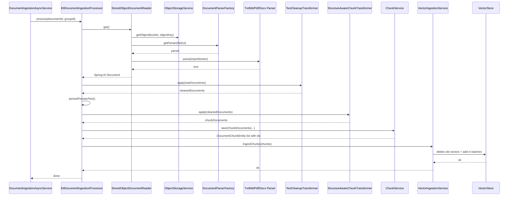

# Argus 摄入流水线内部技术链路详解

> 适用读者：已经看过 ingestion 模块总览，现在想继续深入 reader、parser、清洗、分块、落库、向量写入等内部技术层的开发者。
>
> 本文不是重复上一份“摄入模块整体流程与代码定位”，而是专门把 ETL 主处理器内部那条技术流水线拆开讲透。

---

## 1. 文档目标

这份文档主要回答 8 个问题：

1. `EtlDocumentIngestionProcessor` 内部到底按什么顺序串起 reader、parser、transformer、chunk、vector 这些技术层。
2. `DocumentIngestionConfiguration` 是怎么把这条流水线装配起来的。
3. `StoredObjectDocumentReader` 和 `DocumentParserFactory` 分别负责什么。
4. 当前支持哪些文档类型，以及不同类型分别怎么解析。
5. 文本清洗和结构分块到底做了哪些具体处理。
6. chunk 落库时如何生成摘要、字符范围、metadataJson 和自增主键回填。
7. 向量写入时如何保证幂等、批量写入和 metadata 兼容。
8. 当前实现里有哪些“看起来像 token 逻辑、但其实是字符估算”或“看起来可扩展、但实际仍是手工注册”的边界。

---

## 2. 这份文档和上一份摄入总览的关系

上一份文档：

- `docs/ingestion/摄入模块整体流程与代码定位.md`

重点回答的是：

- 摄入是怎么被 document 模块触发的
- 异步执行、失败重试、状态收口和搜索索引同步怎么走
- `documents`、`document_chunks`、向量库、ES 索引这些资产在哪些阶段写入

而这份文档只聚焦更内层的一条技术链：

```text
StoredObjectDocumentReader
    ↓
DocumentParserFactory + Parser
    ↓
TextCleanupTransformer
    ↓
StructureAwareChunkTransformer
    ↓
ChunkService
    ↓
VectorIngestionService
```

也就是说，这份文档关心的是“怎么加工”，而不是“谁触发加工”。

---

## 3. 技术分层总览

当前 ETL 内部流水线可以拆成 6 层：

```text
1. 装配层
DocumentIngestionConfiguration

2. 读取与解析层
StoredObjectDocumentReader
    -> ObjectStorageService
    -> DocumentParserFactory
    -> Txt / Md / Pdf / Docx Parser

3. 文本清洗层
TextCleanupTransformer

4. 结构分块层
StructureAwareChunkTransformer
    -> ChunkingProperties

5. 持久化层
ChunkService
    -> document_chunks

6. 向量写入层
VectorIngestionService
    -> VectorStore / PgVector
```

把它嵌回主处理器里，真实控制路径是：

```text
EtlDocumentIngestionProcessor.process(documentId, groupId)
    ↓
findDocument()
    ↓
StoredObjectDocumentReader.get()
    ↓
TextCleanupTransformer.apply()
    ↓
persistPreviewText()
    ↓
StructureAwareChunkTransformer.apply()
    ↓
ChunkService.saveChunkDocuments()
    ↓
VectorIngestionService.ingestChunks()
```

---

## 4. 装配层流程

### 4.1 `DocumentIngestionConfiguration` 是技术流水线的组装入口

位置：

- `Argus-backend/src/main/java/com/argus/rag/ingestion/config/DocumentIngestionConfiguration.java`

它当前负责装配：

- `DocumentIngestionProcessor`
- `TextCleanupTransformer`
- `ChunkingProperties`

### 4.2 主处理器的真正实现是 `EtlDocumentIngestionProcessor`

当前通过 `documentIngestionProcessor(...)` 这个 `@Bean` 方法，把以下依赖组装进去：

1. `DocumentMapper`
2. `ObjectStorageService`
3. `DocumentParserFactory`
4. `TextCleanupTransformer`
5. `StructureAwareChunkTransformer`
6. `ChunkService`
7. `VectorIngestionService`

### 4.3 装配层用了 `ObjectProvider`，但不是可选依赖模式，而是“延迟拿必需依赖”

这点要看清。

当前设计不是“有就用，没有也能跑”，而是：

- 通过 `ObjectProvider` 延迟解析
- 然后由 `requireBean(...)` 强制拿到必需 Bean
- 缺任意一个，启动阶段直接抛 `IllegalStateException`

### 4.4 `TextCleanupTransformer` 当前允许被覆盖

位置：

- `@ConditionalOnMissingBean(TextCleanupTransformer.class)`

说明这个清洗层是预留了可替换扩展点的。

### 4.5 `ChunkingProperties` 通过 `ingestion.chunking` 绑定

位置：

- `ChunkingProperties.java`
- `application-dev.yml`

当前仓库里可见的 dev 配置值是：

- `target-tokens: 240`
- `max-tokens: 320`
- `overlap-tokens: 32`

---

## 5. 读取与解析层

### 5.1 `StoredObjectDocumentReader` 是 reader 层的唯一主入口

位置：

- `Argus-backend/src/main/java/com/argus/rag/ingestion/service/pipeline/reader/StoredObjectDocumentReader.java`

它当前做 5 件事：

1. 校验 `documentId` 和 `groupId`
2. 解析 bucket
3. 根据扩展名拿 parser
4. 通过 `ObjectStorageService` 读取输入流
5. 解析成 Spring AI `Document`

### 5.2 bucket 选择有明确优先级

当前逻辑是：

- 文档实体里有 `storageBucket`，优先用它
- 否则回退到 `ObjectStorageService.getDefaultBucket()`

### 5.3 reader 自己不懂 PDF / DOCX / Markdown

这很重要。

reader 只管：

- 从对象存储把二进制流拿出来
- 再委托给 `DocumentParserFactory`

也就是说，reader 是“文件来源适配层”，不是“格式解析层”。

### 5.4 reader 产出的是 Spring AI `Document`

当前位置：

- `StoredObjectDocumentReader.buildDocument()`

当前会写入的 metadata 至少包括：

- `groupId`
- `documentId`
- `fileName`
- `source`

其中 `source` 当前固定写成：

- `minio://bucket/objectKey`

### 5.5 `DocumentParserFactory` 当前不是自动发现全部 Spring Bean，而是手工注册默认解析器

位置：

- `DocumentParserFactory.java`

默认构造器里直接注册的是：

- `TxtDocumentParser`
- `MdDocumentParser`
- `PdfDocumentParser`
- `DocxDocumentParser`

所以从当前主路径看：

- 新增 parser 并不是“加个 `@Component` 就自动生效”
- 还需要进入工厂注册路径

### 5.6 当前支持的文件类型只有 4 种

1. `txt`
2. `md`
3. `pdf`
4. `docx`

不支持：

- `doc`
- `csv`
- `xlsx`
- `pptx`

至少从当前工厂主路径看，没有这些类型的 parser 注册。

---

## 6. Parser 细节

### 6.1 TXT 解析：自动编码检测 + 统一换行

位置：

- `TxtDocumentParser.java`
- `TextDecodingSupport.java`

当前 TXT 路径会：

1. 先用 `TextDecodingSupport.decode(...)` 做编码检测
2. 再统一换行符为 `\n`
3. 去掉首尾空白

### 6.2 Markdown 解析：不是保留原始 Markdown，而是转纯文本

位置：

- `MdDocumentParser.java`

当前会显式剥离：

- fenced code block
- 图片语法
- 标题标记 `#`
- 引用标记 `>`
- 列表符号
- 强调符号

保留或近似保留的是：

- 行内代码内容
- 普通链接文本

这意味着 ingestion 当前更偏向“为检索准备纯文本语义内容”，而不是“保存 Markdown 原始结构”。

### 6.3 PDF 解析：PDFBox 全文提取

位置：

- `PdfDocumentParser.java`

当前策略很直接：

- `PDDocument.load(inputStream)`
- `PDFTextStripper().getText(document)`

它没有额外做版面重建或表格结构恢复，所以复杂 PDF 的结构保真度主要取决于 PDFBox 默认抽取效果。

### 6.4 DOCX 解析：Apache POI，仅支持 `docx`

位置：

- `DocxDocumentParser.java`

当前用的是：

- `XWPFDocument`
- `XWPFWordExtractor`

而且明确只支持：

- `docx`

不支持旧版 `doc`。

### 6.5 文本解码工具当前的无 BOM 回退策略是 `UTF-8 -> GB18030`

位置：

- `TextDecodingSupport.java`

当前解码优先级是：

1. UTF-8 BOM
2. UTF-16 LE BOM
3. UTF-16 BE BOM
4. 无 BOM 时严格尝试 UTF-8
5. 再严格尝试 GB18030

### 6.6 `TextDecodingSupport` 用的是严格模式，不会静默吞乱码

位置：

- `CodingErrorAction.REPORT`

这意味着它遇到非法字节时会直接失败，而不是偷偷替换成问号字符。

---

## 7. 文本清洗层

### 7.1 `TextCleanupTransformer` 的目标不是“语义改写”，而是“噪声清洗”

位置：

- `TextCleanupTransformer.java`

它当前不会改写句子语义，只做这些处理：

- 去控制字符
- 统一换行
- 压缩行内多余空白
- 压缩过多空行

### 7.2 代码块是这个清洗器当前最特别的保护对象

当前位置：

- `cleanLines()`
- `parseOpeningFence()`
- `isClosingFence()`

当前实现会把 fenced code block 作为单独 segment 保留，不会对代码块内部行做普通文本空白压缩。

### 7.3 普通文本段和代码块段走的是两套处理逻辑

普通文本段会：

- `strip()`
- 把连续空格和制表符压成单空格
- 把 3 个及以上连续换行压成 2 个

代码块段则基本原样保留。

这说明当前清洗层在“整洁度”和“代码内容不被破坏”之间做了明确权衡。

---

## 8. 结构分块层

### 8.1 `StructureAwareChunkTransformer` 是当前 chunk 策略核心

位置：

- `StructureAwareChunkTransformer.java`

当前策略标识写死为：

- `structure-aware-token-budget-v1`

它会写进后续 chunk metadata。

### 8.2 它的第一优先级是“结构边界”，不是机械定长切分

当前拆分顺序是：

1. 先按 Markdown 标题拆章节
2. 章节过大时按段落拆
3. 段落过大时按句子拆
4. 仍过大再按字符预算硬截断

### 8.3 标题识别会显式跳过代码块中的 `#`

这点很关键。

当前位置：

- `collectHeadings()`
- `openFence()`
- `isClosingFence()`

也就是说，代码块里看起来像标题的行不会被错误当成章节边界。

### 8.4 当前所谓的 token 预算，本质上是字符数估算

位置：

- `CHARS_PER_TOKEN = 1`
- `estimateTokens(String text) { return Math.max(1, text.length()); }`

这意味着：

- `targetTokens`
- `maxTokens`
- `overlapTokens`

在当前实现里，本质上都按字符数近似处理，不是真正调用 tokenizer 精算 token。

### 8.5 overlap 只会往前回退，但不会越过章节起点

位置：

- `overlapStart(int start, int sectionStart)`

所以当前 overlap 不是无边界扩展，而是被章节边界保护住的。

### 8.6 chunk metadata 会补进 sectionPath、charStart、charEnd 和 chunkStrategy

位置：

- `buildDocument(...)`

这为后续：

- chunk 落库
- 证据组装
- 检索解释

提供了结构位置信息。

---

## 9. 预览文本与 chunk 落库层

### 9.1 预览文本不是原文摘要算法生成，而是清洗后文本前 200 字截断

位置：

- `EtlDocumentIngestionProcessor.persistPreviewText()`

当前逻辑是：

- 合并所有 cleaned document 的 text
- `trim()`
- 截取前 200 字
- 回写 `documents.preview_text`

### 9.2 `ChunkService` 负责把 Spring AI `Document` 变成 `DocumentChunkEntity`

位置：

- `ChunkService.java`

当前 entity 字段包括：

- `documentId`
- `groupId`
- `chunkIndex`
- `chunkText`
- `chunkSummary`
- `charStart`
- `charEnd`
- `metadataJson`
- `createdAt`
- `updatedAt`

### 9.3 chunkSummary 当前只是前 120 个字符加省略号

位置：

- `buildSummary()`

这不是语义摘要，也不是 LLM 总结。

### 9.4 ChunkService 会先删旧 chunk，再批量插入新 chunk

位置：

- `saveChunkDocuments()`

这意味着当前 chunk 落库策略是“重建式覆盖”，不是增量更新。

### 9.5 批量插入时显式考虑了 PostgreSQL 参数上限

位置：

- `MAX_INSERT_BATCH_SIZE`
- `persistChunkBatches()`

当前单批大小不是随意定的，而是按：

- `POSTGRES_PARAMETER_LIMIT = 65535`
- 每条 10 个参数

倒算出来的。

### 9.6 批量插入后还会反查并回填主键

位置：

- `backfillChunkIds()`

当前做法是：

- 再查一次 `selectByDocumentId(documentId)`
- 按 `chunkIndex -> id` 建映射
- 回填到内存里的 chunk 实体

这样后面的向量写入才能拿到稳定的 chunk 主键。

### 9.7 metadataJson 会合并来源元数据，并补写系统字段

位置：

- `buildMetadataJson(...)`

当前至少会写入：

- `documentId`
- `groupId`
- `chunkIndex`
- `charStart`
- `charEnd`
- `sectionPath`
- `chunkStrategy`

如果上游 `Document` metadata 里已有字段，也会先 merge 进去。

### 9.8 字符范围存在不可信数据时会回退到连续自增计算

位置：

- `resolveChunkRange()`

这说明 `ChunkService` 不会盲信上游 metadata，而是做了可信度检查。

---

## 10. 向量写入层

### 10.1 `VectorIngestionService` 当前的职责不只是 add，还包含“先删后写”的幂等控制

位置：

- `VectorIngestionService.java`

主流程是：

1. 校验 chunk
2. 转成 Spring AI `Document`
3. 提取去重后的 documentId 集合
4. 先删旧 vectors
5. 再分批 add 新 vectors

### 10.2 向量记录 ID 不是随机的，而是稳定 UUID

位置：

- `buildStableDocumentId()`

当前基于：

- `documentId + ":" + chunkIndex`

生成 name-based UUID。

这能保证：

- 同一文档同一 chunkIndex 重建后，向量记录 ID 稳定可复现。

### 10.3 写入批次大小来自配置，默认最终兜底为 9

位置：

- `@Value("${ingestion.vector.add-batch-size:${spring.ai.vectorstore.pgvector.max-document-batch-size:9}}")`

当前优先级是：

1. `ingestion.vector.add-batch-size`
2. `spring.ai.vectorstore.pgvector.max-document-batch-size`
3. 默认值 `9`

从当前 dev 配置看，可见值是：

- `ingestion.vector.add-batch-size: 9`

### 10.4 metadataJson 中的扩展元数据解析失败不会中断向量写入

位置：

- `extractOptionalMetadata()`

当前策略是：

- 解析失败打 warn
- 返回空 Map

也就是说，扩展 metadata 是弱依赖，不是强依赖。

### 10.5 当前只额外兼容提取 `fileName` 或遗留字段 `documentName`

位置：

- `readLegacyCompatibleFileName()`

所以向量 metadata 当前并不会无条件把 chunk metadataJson 全量展开进向量库。

---

## 11. ETL 主处理器与异步执行层的衔接

### 11.1 `EtlDocumentIngestionProcessor` 只管内部技术流水线，不负责重试和最终状态

位置：

- `EtlDocumentIngestionProcessor.process()`

它的边界很明确：

- 做完 ETL 主流程
- 失败就往上抛

### 11.2 `DocumentIngestionAsyncService` 才是外层编排器

位置：

- `DocumentIngestionAsyncService.java`

它在 ETL 外面再包了一层：

1. 清理旧 chunk / vector / ES
2. 调用 `documentIngestionProcessor.process(...)`
3. 同步 ES 索引
4. 标记 `documents.status = READY`

### 11.3 失败重试和失败收口也都在 async service，不在 processor

当前位置：

- `@Retryable`
- `@Recover`

所以技术流水线本身保持简洁，而重试/补偿留在外层编排。

---

## 12. 摄入流水线内部时序图



---

## 13. 当前版本需要特别留意的点

### 13.1 当前“token 预算分块”本质上是字符预算分块

位置：

- `StructureAwareChunkTransformer`

这是这个流水线里最容易被误讲成“真 token chunking”的点。

### 13.2 `DocumentParserFactory` 当前默认路径不是自动发现 parser，而是手工注册固定 4 种实现

位置：

- `DocumentParserFactory()`

所以扩展新文件类型时，不要只加实现类，还要检查工厂注册路径。

### 13.3 Markdown parser 当前会去掉 fenced code block 内容

位置：

- `MdDocumentParser.stripMarkdown()`

而 `TextCleanupTransformer` 是保护代码块格式的。

这意味着：

- 对 Markdown 来说，代码块已经在 parser 层被去掉了
- 清洗层保护代码块的逻辑更主要影响 TXT 或其他保留原始代码块文本的输入

### 13.4 预览文本和 chunkSummary 都不是智能摘要

位置：

- `persistPreviewText()`
- `buildSummary()`

它们当前都是截断式产物。

### 13.5 向量写入前要求 chunk 已落库并有主键

位置：

- `validateChunk()`

这就是为什么 `ChunkService` 明明已经 insert 过，还要额外做一轮主键回填。

### 13.6 metadataJson 是 ETL 各层之间的重要传递桥

它承接了：

- reader 产生的 fileName/source 等上游元数据
- chunking 产生的 sectionPath / char range / chunkStrategy
- vector 写入时可选读取的 fileName / documentName

### 13.7 当前 IngestionJobEntity / IngestionJobMapper 仍不在主流水线里

从当前主控路径看，reader/parser/transformer/chunk/vector 这条技术链并不依赖 job 表 worker 调度。

---

## 14. 对简历和面试最值得保留的讲法

### 14.1 建议保留的 5 个工程点

1. 项目把文档摄入拆成读取解析、文本清洗、结构分块、chunk 落库和向量写入等多层，每层职责单一。
2. 解析层支持 TXT、Markdown、PDF、DOCX 四种格式，其中纯文本文件具备 BOM/UTF-8/GB18030 自动解码能力。
3. 分块策略优先尊重 Markdown 标题、段落和句子边界，只有实在过大时才硬截断。
4. chunk 持久化显式处理了 PostgreSQL 参数上限、批量插入后主键回填以及 metadataJson 的统一封装。
5. 向量写入采用先删后写和稳定 UUID 策略，兼顾幂等性和重建一致性。

### 14.2 面试时不要讲得过头的地方

1. 不要把当前 chunking 讲成真正 tokenizer 驱动的 token 分块，它现在是字符近似。
2. 不要把 parser 工厂讲成插件式自动发现架构，当前默认主路径还是手工注册。
3. 不要把 preview_text 或 chunkSummary 讲成智能摘要，它们当前只是截断结果。

---

## 15. 推荐阅读顺序

建议按下面顺序阅读：

1. `Argus-backend/src/main/java/com/argus/rag/ingestion/config/DocumentIngestionConfiguration.java`
2. `Argus-backend/src/main/java/com/argus/rag/ingestion/service/EtlDocumentIngestionProcessor.java`
3. `Argus-backend/src/main/java/com/argus/rag/ingestion/service/pipeline/reader/StoredObjectDocumentReader.java`
4. `Argus-backend/src/main/java/com/argus/rag/ingestion/service/pipeline/parser/DocumentParserFactory.java`
5. `Argus-backend/src/main/java/com/argus/rag/ingestion/service/pipeline/parser/DocumentParser.java`
6. `Argus-backend/src/main/java/com/argus/rag/ingestion/service/pipeline/parser/TextDecodingSupport.java`
7. `Argus-backend/src/main/java/com/argus/rag/ingestion/service/pipeline/parser/TxtDocumentParser.java`
8. `Argus-backend/src/main/java/com/argus/rag/ingestion/service/pipeline/parser/MdDocumentParser.java`
9. `Argus-backend/src/main/java/com/argus/rag/ingestion/service/pipeline/parser/PdfDocumentParser.java`
10. `Argus-backend/src/main/java/com/argus/rag/ingestion/service/pipeline/parser/DocxDocumentParser.java`
11. `Argus-backend/src/main/java/com/argus/rag/ingestion/service/pipeline/transformer/TextCleanupTransformer.java`
12. `Argus-backend/src/main/java/com/argus/rag/ingestion/service/pipeline/transformer/ChunkingProperties.java`
13. `Argus-backend/src/main/java/com/argus/rag/ingestion/service/pipeline/transformer/StructureAwareChunkTransformer.java`
14. `Argus-backend/src/main/java/com/argus/rag/ingestion/service/pipeline/ChunkService.java`
15. `Argus-backend/src/main/java/com/argus/rag/ingestion/model/entity/DocumentChunkEntity.java`
16. `Argus-backend/src/main/java/com/argus/rag/ingestion/vector/VectorIngestionService.java`
17. `Argus-backend/src/main/java/com/argus/rag/ingestion/service/DocumentIngestionAsyncService.java`
18. `Argus-backend/src/main/resources/application-dev.yml`

---

## 16. 一句话总结

Argus 当前的摄入内部技术链本质上是一条“对象存储读流 -> 按文件类型解析纯文本 -> 噪声清洗 -> 结构感知分块 -> chunk 落库与 metadata 固化 -> 向量批量写入”的 ETL 流水线；它的实现风格很务实，优先追求可解释、可重建和可控边界，而不是一开始就做成高度抽象的插件式框架。