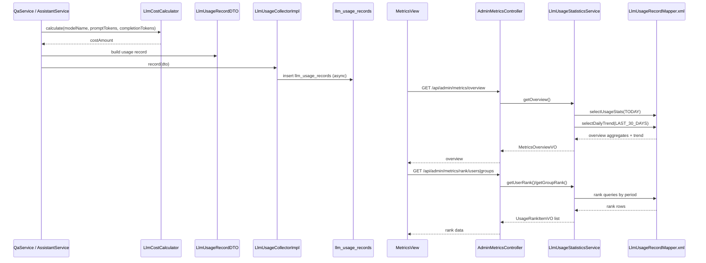

# Argus LLM调用统计模块整体流程与代码定位

> 适用读者：准备系统学习 Argus metrics 模块及其调用统计、费用计算、后台展示链路的开发者。
>
> 本文聚焦 metrics 模块本身，以及它和 qa、assistant、后台管理页之间的协作关系。

---

## 1. 文档目标

这份文档回答 7 个问题：

1. Argus 的 metrics 模块当前负责哪些事。
2. LLM 调用记录是在哪些业务模块里产生的。
3. 一次调用的 token、费用、成功率、延迟是怎么落库的。
4. 后台统计接口和前端指标页分别怎么走。
5. 平台统计、用户统计、群组统计、趋势、排行各由谁计算。
6. 当前版本里哪些统计能力已经准备好但前端还没接。
7. 这一整套流程在项目里的具体代码位置分别在哪里。

---

## 2. 模块总览

Argus 的 metrics 模块当前不是一个通用 BI 平台，而是一套围绕 LLM 调用的轻量统计系统，主链可以拆成两半：

```text
写入侧（调用结束后采集）
QA / Assistant
    ↓
LlmCostCalculator
    ↓
LlmUsageRecordDTO
    ↓
LlmUsageCollector
    ↓
llm_usage_records

读取侧（管理员后台查询）
MetricsView
    ↓
AdminMetricsController
    ↓
LlmUsageStatisticsService
    ↓
LlmUsageRecordMapper + metrics SQL
    ↓
概览 / 趋势 / 排行 / 聚合统计 VO
```

从职责上看：

- `qa` 和 `assistant` 是当前两条写入来源。
- `LlmCostCalculator` 负责把 token 数量换算成费用。
- `LlmUsageCollector` 负责异步落库，不阻塞主业务流程。
- `LlmUsageStatisticsService` 负责把调用明细聚合成后台可读的统计视图。
- `AdminMetricsController` 负责暴露管理员后台统计接口。
- `MetricsView.vue` 负责展示概览、趋势图和用户 / 群组排行。

这套设计的核心价值是：

- 不要求每个模块都自己写统计查询。
- 业务模块只负责在调用结束后上报标准化记录。
- 聚合统计统一在 metrics 模块里完成。

---

## 3. 代码目录定位

### 3.1 后端 metrics 目录

路径：`Argus-backend/src/main/java/com/argus/rag/metrics`

```text
metrics/
├── collector/
│   ├── LlmUsageCollector.java
│   └── LlmUsageCollectorImpl.java
├── controller/
│   └── AdminMetricsController.java
├── cost/
│   ├── LlmCostCalculator.java
│   └── LlmCostCalculatorImpl.java
├── mapper/
│   └── LlmUsageRecordMapper.java
├── model/
│   ├── dto/
│   │   └── LlmUsageRecordDTO.java
│   ├── entity/
│   │   └── LlmUsageRecordEntity.java
│   ├── enums/
│   │   └── StatsPeriod.java
│   └── vo/
│       ├── MetricsOverviewVO.java
│       ├── UsageRankItemVO.java
│       └── UsageStatsVO.java
├── LlmEndpoint.java
└── LlmModule.java
```

### 3.2 与 metrics 强关联但不在 metrics 目录的代码

- `Argus-backend/src/main/java/com/argus/rag/qa/service/QaService.java`
- `Argus-backend/src/main/java/com/argus/rag/assistant/service/AssistantService.java`
- `Argus-backend/src/main/java/com/argus/rag/auth/CurrentUserService.java`
- `Argus-backend/src/main/java/com/argus/rag/ArgusBackendApplication.java`

这些文件的重要性分别是：

- `QaService`：当前 qa 指标上报入口。
- `AssistantService`：当前 assistant 指标上报入口。
- `CurrentUserService`：管理员访问统计接口的权限边界。
- `ArgusBackendApplication`：启用了 `@EnableAsync`，让异步采集真正生效。

### 3.3 MyBatis XML 位置

- `Argus-backend/src/main/resources/mappers/metrics/LlmUsageRecordMapper.xml`

### 3.4 前端配合代码

- `Argus-frontend/src/api/metrics.ts`
- `Argus-frontend/src/views/admin/MetricsView.vue`

### 3.5 相关数据表

当前 metrics 模块最核心的表是：

- `sql/schema.sql` 中的 `llm_usage_records`

它存的是调用明细，而不是只存按天汇总结果。

---

## 4. 配置层流程

### 4.1 metrics 当前没有单独的 yml 配置段

和 auth、qa 不同，metrics 模块当前几乎没有独立配置类或 yml 覆盖项。

它的业务规则主要直接写在：

1. `LlmModule`
2. `LlmEndpoint`
3. `StatsPeriod`
4. `LlmCostCalculatorImpl`
5. `LlmUsageRecordMapper.xml`

### 4.2 异步采集依赖全局 `@EnableAsync`

位置：

- `ArgusBackendApplication.java`
- `LlmUsageCollectorImpl.record()`

metrics 当前采集链路的设计意图是：

- 业务完成后异步记账
- 统计失败不能反向拖垮主业务请求

### 4.3 统计时间段统一由 `StatsPeriod` 枚举控制

当前位置：

- `StatsPeriod.java`

当前支持：

- `TODAY`
- `LAST_7_DAYS`
- `LAST_14_DAYS`
- `LAST_30_DAYS`

后台接口的时间范围不是让 SQL 自己猜，而是先转成：

- `period.getStartTime()`

### 4.4 模块与端点使用统一常量

当前位置：

- `LlmModule.java`
- `LlmEndpoint.java`

当前模块值只有：

- `QA`
- `ASSISTANT`

当前端点值只有：

- `qa/ask`
- `qa/stream-ask`
- `assistant/chat`
- `assistant/chat/stream`

### 4.5 当前成本费率硬编码在 `LlmCostCalculatorImpl`

位置：

- `LlmCostCalculatorImpl.java`

目前内置了：

- `qwen-plus`
- `qwen-turbo`
- `qwen-max`

以及默认兜底费率。

这说明当前成本计算不是配置驱动，也不是外部计费系统实时回填，而是项目内置静态费率。

### 4.6 当前货币单位固定写死为 `CNY`

位置：

- `LlmUsageCollectorImpl.toEntity()`

也就是说当前表虽然有 `cost_currency` 字段，但实际写入逻辑固定是：

- `CNY`

---

## 5. 数据模型与结果模型

### 5.1 `llm_usage_records`

当前主要字段包括：

- `user_id`
- `group_id`
- `module`
- `endpoint`
- `session_id`
- `prompt_tokens`
- `completion_tokens`
- `total_tokens`
- `is_estimated`
- `cost_amount`
- `cost_currency`
- `latency_ms`
- `success`
- `error_message`
- `model_name`
- `created_at`

这张表存的是一次调用的完整明细，所以后续可以按：

- 用户
- 群组
- 模块
- 时间范围

做多种聚合。

### 5.2 `LlmUsageRecordDTO`

这是当前业务模块上报调用信息时使用的标准 DTO，字段和表结构高度对应。

它的核心意义是：

- 业务模块不需要直接关心数据库实体
- 只需要组装一份标准调用记录

### 5.3 `MetricsOverviewVO`

后台概览页当前返回：

- `todayRequests`
- `todayTokens`
- `todayCost`
- `todaySuccessRate`
- `dailyTrend`

### 5.4 `UsageStatsVO`

这是更完整的聚合统计模型，字段包括：

- `totalPromptTokens`
- `totalCompletionTokens`
- `totalTokens`
- `totalCost`
- `totalRequests`
- `successRequests`
- `failedRequests`
- `successRate`
- `avgLatencyMs`
- `avgRpm`
- `avgTpm`

### 5.5 `UsageRankItemVO`

排行模型当前字段包括：

- `id`
- `name`
- `totalRequests`
- `totalTokens`
- `totalCost`

### 5.6 `is_estimated` 字段要单独理解

它当前不是统计结果，而是明细质量标记。

它用来表示：

- 这次 token 数据是不是估算出来的

对当前仓库来说，这个字段很重要，因为：

- qa 流式路径可能在缺失 usage 时做估算
- assistant 当前整体更依赖估算 token 数

---

## 6. LLM调用统计模块详细流程（完整落地版）

下面将 metrics 模块主链拆成 29 步，对应到项目实际代码位置。

### 第 1 步：qa 或 assistant 一次 LLM 调用结束后，会进入各自模块的“记录用量”步骤

位置：

- `QaService.recordUsage()`
- `AssistantService.recordUsage()`

### 第 2 步：业务模块先确定本次记录属于哪个模块和哪个端点

位置：

- `LlmModule`
- `LlmEndpoint`

当前实际写入来源只有：

- QA
- ASSISTANT

### 第 3 步：qa 同步问答路径优先使用模型返回的真实 usage

位置：

- `QaService.ask()`

### 第 4 步：qa 流式问答路径如果拿不到完整 usage，会走近似估算兜底

位置：

- `QaService.askStream()`
- `QaChatService.askStream()`

### 第 5 步：assistant 当前 token 统计主要来自字符数除以 4 的估算

位置：

- `AssistantService.estimateTokens()`

### 第 6 步：业务模块会同时收集 userId / groupId / sessionId / success / errorMessage 等上下文

位置：

- `QaService`
- `AssistantService`

### 第 7 步：费用不是直接从模型返回，而是由 `LlmCostCalculator` 计算出来

位置：

- `QaService.recordUsage()`
- `AssistantService.recordUsage()`
- `LlmCostCalculatorImpl.calculate()`

### 第 8 步：费用计算按“每千 token 单价”分别算输入和输出，再相加

位置：

- `LlmCostCalculatorImpl`

### 第 9 步：业务模块把这次调用组装成 `LlmUsageRecordDTO`

位置：

- `QaService`
- `AssistantService`

### 第 10 步：业务模块调用 `llmUsageCollector.record(dto)` 发起统计写入

位置：

- `QaService`
- `AssistantService`

### 第 11 步：`LlmUsageCollectorImpl.record()` 当前标了 `@Async`

位置：

- `LlmUsageCollectorImpl`

### 第 12 步：全局 `@EnableAsync` 让这个采集动作真正变成异步执行

位置：

- `ArgusBackendApplication.java`

### 第 13 步：Collector 会先把 DTO 转成 `LlmUsageRecordEntity`

位置：

- `LlmUsageCollectorImpl.toEntity()`

### 第 14 步：转换时会补上 `createdAt = now()` 和 `costCurrency = CNY`

位置：

- `LlmUsageCollectorImpl.toEntity()`

### 第 15 步：最终通过 `LlmUsageRecordMapper.insert(entity)` 落到 `llm_usage_records`

位置：

- `LlmUsageCollectorImpl.record()`

### 第 16 步：如果统计写入失败，只记日志，不反向影响主业务流程

位置：

- `LlmUsageCollectorImpl.record()`

### 第 17 步：后台指标页加载时，前端会同时拉概览和排行

位置：

- `MetricsView.vue -> onMounted()`

当前页面会调用：

1. `fetchMetricsOverview()`
2. `fetchUserRank(...)`
3. `fetchGroupRank(...)`

### 第 18 步：概览接口入口是 `GET /api/admin/metrics/overview`

位置：

- `AdminMetricsController.getOverview()`

### 第 19 步：所有 metrics 后台接口都会先过 `requireSystemAdmin()`

位置：

- `AdminMetricsController`
- `CurrentUserService.requireSystemAdmin()`

### 第 20 步：概览查询会先取 TODAY 的平台聚合统计

位置：

- `LlmUsageStatisticsService.getOverview()`

这里会把 TODAY 的平台统计结果拆成：

- 今日请求数
- 今日 token 数
- 今日费用
- 今日成功率

### 第 21 步：概览查询还会固定拉取近 30 天趋势

位置：

- `LlmUsageStatisticsService.getOverview()`

当前实现里趋势并不跟页面上的 period tab 联动，而是固定：

- `LAST_30_DAYS`

### 第 22 步：用户排行和群组排行会使用页面当前选中的 period

位置：

- `MetricsView.vue`
- `fetchUserRank()`
- `fetchGroupRank()`

### 第 23 步：后台还额外提供了平台 / 用户 / 群组聚合统计接口

位置：

- `GET /api/admin/metrics/platform`
- `GET /api/admin/metrics/user/{userId}`
- `GET /api/admin/metrics/group/{groupId}`

这些接口已经在后端和前端 API 文件里准备好。

### 第 24 步：`selectUsageStats` 会聚合 token、费用、成功率、平均延迟和吞吐指标

位置：

- `LlmUsageRecordMapper.xml -> selectUsageStats`

### 第 25 步：`avgRpm` 和 `avgTpm` 当前是基于 `MAX(created_at) - MIN(created_at)` 的窗口计算

位置：

- `selectUsageStats`

这意味着它更像“统计区间内平均速率”，不是实时监控型 RPM / TPM。

### 第 26 步：`selectDailyTrend` 会按天分组，并支持按 module 过滤

位置：

- `LlmUsageRecordMapper.xml -> selectDailyTrend`

### 第 27 步：当前前端趋势图并没有调用独立 trend 接口，而是直接使用 overview 里的 `dailyTrend`

位置：

- `MetricsView.vue`
- `fetchMetricsOverview()`

### 第 28 步：当前后台页面没有接平台 / 用户 / 群组统计接口，也没有接独立 trend 接口

位置：

- `MetricsView.vue`
- `metrics.ts`

也就是说这些接口现在更多是“后端已准备、前端暂未用”的状态。

### 第 29 步：当前写入来源只有 QA 和 ASSISTANT，成本费率也仍是代码内置常量

位置：

- `QaService`
- `AssistantService`
- `LlmCostCalculatorImpl`

这说明 metrics 当前是一个已经能跑通的统计模块，但还没有做到“所有 AI 子模块自动接入 + 费率配置化”。

---

## 7. 采集与后台查询时序图



---

## 8. 与 qa / assistant 的关系

### 8.1 metrics 当前不主动发起任何 AI 调用

它的角色是：

- 记录
- 聚合
- 展示

而不是模型调用发起方。

### 8.2 qa 和 assistant 是当前唯一的写入来源

位置：

- `QaService.recordUsage()`
- `AssistantService.recordUsage()`

这意味着 document、ingestion、group 这些模块目前不会写入 `llm_usage_records`。

### 8.3 metrics 依赖业务模块主动上报，而不是中间件自动埋点

这点很重要。

当前统计不是通过统一 HTTP filter 或 AOP 自动抓的，而是：

- 业务服务在合适的时机手动组装 DTO 并上报

### 8.4 token 精度依赖上游模块提供的数据质量

因为 metrics 自己不负责重新计算 token，它只是接收：

- 精确值
- 或估算值

所以 `is_estimated` 字段在后续分析里是必须保留的。

---

## 9. 前端配合机制

### 9.1 当前 metrics 页面是纯管理员后台页面

位置：

- `Argus-frontend/src/views/admin/MetricsView.vue`

### 9.2 当前页面主展示内容是三块

1. 今日 KPI 概览
2. 近 30 天趋势图
3. 用户 / 群组排行

### 9.3 当前页面的时间 tab 只影响排行，不影响概览和趋势

位置：

- `selectedPeriod`
- `loadRanks()`
- `loadOverview()`

这意味着现在的交互语义其实是：

- 顶部 KPI 和趋势固定
- 下方排行可切时间段

### 9.4 `fetchPlatformStats`、`fetchUserStats`、`fetchGroupStats`、`fetchTrend` 虽然已经定义，但当前页面没真正调用

位置：

- `Argus-frontend/src/api/metrics.ts`
- `Argus-frontend/src/views/admin/MetricsView.vue`

---

## 10. 异常与返回结构

### 10.1 metrics 后台接口统一走 `ApiResponse<T>` 包装

例如：

- `GET /api/admin/metrics/overview`
- `GET /api/admin/metrics/platform`
- `GET /api/admin/metrics/user/{userId}`
- `GET /api/admin/metrics/group/{groupId}`
- `GET /api/admin/metrics/trend`
- `GET /api/admin/metrics/rank/users`
- `GET /api/admin/metrics/rank/groups`

### 10.2 metrics 的主要权限错误口径来自 `requireSystemAdmin()`

当前如果不是管理员访问，会直接被拒绝。

### 10.3 采集写入失败不会向上抛回业务模块

位置：

- `LlmUsageCollectorImpl.record()`

所以 metrics 的失败更多表现为：

- 日志里报错
- 统计面板数据不完整

而不是直接让 qa / assistant 接口 500。

---

## 11. 当前版本需要特别留意的点

下面这些不是抽象设计，而是当前仓库实现里非常值得单独记住的事实。

### 11.1 当前前端指标页只真正接了概览和排行接口

位置：

- `MetricsView.vue`
- `metrics.ts`

平台 / 用户 / 群组聚合统计接口以及独立 trend 接口目前更多是“后端已准备好”。

### 11.2 趋势图当前固定使用 overview 返回的近 30 天数据，不受时间 tab 控制

这会影响用户对页面交互的直觉，后面如果要加强页面一致性，这里是优先级较高的点。

### 11.3 当前写入来源只有 QA 和 ASSISTANT

位置：

- `QaService`
- `AssistantService`

所以如果你看到 metrics 面板上没有 document / ingestion 等模块数据，这不是异常，而是当前设计如此。

### 11.4 assistant 当前 token 统计主要是估算值，qa 流式场景也可能回退为估算值

位置：

- `AssistantService`
- `QaService`

所以现阶段 metrics 更适合做运营观察和趋势分析，而不是账单级精算。

### 11.5 成本费率当前硬编码在代码里，不是配置化或外部可运营化的

位置：

- `LlmCostCalculatorImpl`

如果后面模型单价变了，需要改代码而不是只改配置。

### 11.6 当前 `avgRpm / avgTpm` 的定义是“统计区间平均速率”，不是实时监控指标

位置：

- `LlmUsageRecordMapper.xml -> selectUsageStats`

排查性能问题时不要把它误当成秒级监控值。

### 11.7 Collector 虽然是异步的，但并没有做批量写入或消息队列缓冲

位置：

- `LlmUsageCollectorImpl`

所以它当前仍属于“轻量异步写库”，不是高吞吐指标采集基础设施。

---

## 12. 对简历和面试最值得保留的讲法

### 12.1 建议重点保留的 5 个工程点

1. 项目为 QA 和 Assistant 两条 AI 调用链统一设计了标准化用量上报和后台统计体系。
2. 统计写入通过异步 Collector 落库，避免反向阻塞主业务链路。
3. 指标不仅记录 token 和费用，也记录成功率、延迟、估算标记和模块 / 端点信息。
4. 后台统计通过统一明细表 + SQL 聚合支持平台、用户、群组、趋势和排行等多维分析。
5. 成本统计已经形成闭环，但当前仍是代码内置费率，适合继续演进到配置化。

### 12.2 面试时建议收口的地方

1. 不要把当前 metrics 讲成实时观测平台或完整计费平台，它还是轻量统计模块。
2. 要明确指出当前 token 数据并不全是精确值，assistant 和部分流式场景会有估算。
3. 不要忽略“前端页面只用了部分接口”这一点，这能体现你对真实落地状态的判断，而不是只看接口数量。

---

## 13. 推荐阅读顺序

如果你第一次系统学习这个模块，建议按下面顺序阅读：

1. `Argus-backend/src/main/java/com/argus/rag/metrics/collector/LlmUsageCollectorImpl.java`
2. `Argus-backend/src/main/java/com/argus/rag/metrics/cost/LlmCostCalculatorImpl.java`
3. `Argus-backend/src/main/java/com/argus/rag/metrics/model/dto/LlmUsageRecordDTO.java`
4. `Argus-backend/src/main/java/com/argus/rag/metrics/controller/AdminMetricsController.java`
5. `Argus-backend/src/main/java/com/argus/rag/metrics/service/LlmUsageStatisticsService.java`
6. `Argus-backend/src/main/resources/mappers/metrics/LlmUsageRecordMapper.xml`
7. `Argus-backend/src/main/java/com/argus/rag/metrics/model/enums/StatsPeriod.java`
8. `Argus-backend/src/main/java/com/argus/rag/metrics/LlmEndpoint.java`
9. `Argus-backend/src/main/java/com/argus/rag/metrics/LlmModule.java`
10. `Argus-backend/src/main/java/com/argus/rag/qa/service/QaService.java`
11. `Argus-backend/src/main/java/com/argus/rag/assistant/service/AssistantService.java`
12. `Argus-frontend/src/api/metrics.ts`
13. `Argus-frontend/src/views/admin/MetricsView.vue`
14. `sql/schema.sql`

这样可以先建立“写入采集 -> 落库 -> 聚合查询 -> 后台展示”的完整视图。

---

## 14. 一句话总结

Argus 的 metrics 模块本质上是一套“围绕 QA 与 Assistant 的 LLM 调用明细采集、费用估算和管理员后台聚合展示”的轻量统计系统。它已经能支撑平台概览、趋势和排行，但当前仍保持简洁架构：来源模块有限、部分 token 为估算值、费率写死在代码里、前端只接了部分已存在的统计接口。