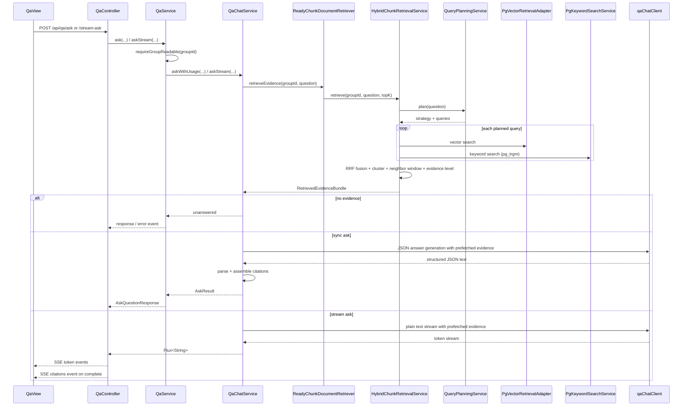

# Argus 问答模块整体流程与代码定位

> 适用读者：准备系统学习 Argus 项目 qa 模块的开发者。
>
> 本文聚焦 qa 模块本身，以及它和群组权限、document / ingestion 产物、混合检索、Spring AI ChatClient、前端 SSE 页面之间的协作关系。

---

## 1. 文档目标

这份文档回答 6 个问题：

1. Argus 的 qa 模块由哪些类组成。
2. 同步问答和流式问答分别怎么走。
3. 查询规划、混合检索、RRF 融合、证据评估分别由谁负责。
4. 大模型回答是如何拿到检索证据、如何做拒答、如何组装引用的。
5. 前端当前是如何使用 qa 模块的，哪些能力已接上、哪些还只是接口级准备。
6. 这一整套流程在项目里的具体代码位置分别在哪里。

---

## 2. 模块总览

Argus 的 qa 模块不是“一个提问接口 + 一个大模型调用”这么简单，而是由以下几层共同组成：

```text
前端问答页 / SSE 会话 UI
    ↓
接口层（QaController）
    ↓
权限与入口编排层（QaService）
    ↓
问答生成层（QaChatService）
    ↓
检索门面层（ReadyChunkDocumentRetriever / QaRetrievalService）
    ↓
混合检索层（HybridChunkRetrievalService / QueryPlanningService）
    ↓
检索基础设施层（PgVectorRetrievalAdapter / PgKeywordSearchService / DocumentChunkMapper）
    ↓
结果组装层（CitationAssembler / QaAnswerParser）
    ↓
输出模型（AskQuestionResponse / Citation / RetrievedEvidenceBundle）
```

从职责上看：

- 前端负责选择群组、提交问题、接收 SSE token、展示引用和本地会话。
- `QaController` 负责同步问答和流式问答两个 HTTP 入口。
- `QaService` 负责群组可读权限校验，以及问答调用后的 LLM 用量记录。
- `QaChatService` 负责完整的 RAG 问答流程：检索证据、构造 Prompt、调用模型、解析回答、组装引用。
- `ReadyChunkDocumentRetriever` 负责把 qa 模块的检索需求适配到 Spring AI 的 `DocumentRetriever`。
- `HybridChunkRetrievalService` 负责查询规划、双通道检索、RRF 融合、邻居窗口扩展和证据充分度评估。
- `CitationAssembler` 负责把证据文档转成引用列表。
- `QaAnswerParser` 负责在结构化输出失败时做解析回退。

这套设计的核心价值是：

- qa 模块不是“直接拿用户问题问大模型”，而是先走知识库检索，再做证据约束下的生成。
- 检索和回答是分层的，后续 assistant 模块也可以复用 qa 的 retrieval 能力，而不必复用完整回答生成链路。
- 同步回答和流式回答复用同一套检索主链路，只在模型输出和前端传输方式上分叉。

---

## 3. 代码目录定位

### 3.1 后端 qa 目录

路径：`Argus-backend/src/main/java/com/argus/rag/qa`

```text
qa/
├── config/
│   ├── QaChatClientConfiguration.java
│   └── QueryPlanningConfiguration.java
├── controller/
│   └── QaController.java
├── model/
│   ├── dto/
│   │   └── AskQuestionRequest.java
│   ├── vo/
│   │   └── AskQuestionResponse.java
│   ├── EvidenceLevel.java
│   ├── KnowledgeAnswerOutput.java
│   ├── QueryPlanResult.java
│   └── QueryPlanStrategy.java
├── rag/
│   ├── HybridChunkRetrievalService.java
│   ├── QuestionQueryRewriteService.java
│   ├── ReadyChunkDocumentRetriever.java
│   └── RetrievedEvidenceBundle.java
├── service/
│   ├── QaChatService.java
│   ├── QaRetrievalService.java
│   ├── QaService.java
│   └── QueryPlanningService.java
└── support/
    ├── CitationAssembler.java
    └── QaAnswerParser.java
```

### 3.2 与 qa 强关联但不在 qa 目录的代码

- `Argus-backend/src/main/java/com/argus/rag/group/service/GroupMembershipService.java`
- `Argus-backend/src/main/java/com/argus/rag/auth/CurrentUserService.java`
- `Argus-backend/src/main/java/com/argus/rag/engine/pgvector/PgVectorRetrievalAdapter.java`
- `Argus-backend/src/main/java/com/argus/rag/engine/search/PgKeywordSearchService.java`
- `Argus-backend/src/main/java/com/argus/rag/ingestion/mapper/DocumentChunkMapper.java`
- `Argus-backend/src/main/java/com/argus/rag/metrics/collector/LlmUsageCollector.java`
- `Argus-backend/src/main/java/com/argus/rag/metrics/cost/LlmCostCalculator.java`
- `Argus-backend/src/main/java/com/argus/rag/assistant/agent/AssistantKnowledgeBaseTool.java`

### 3.3 Prompt 模板位置

qa 模块当前依赖的 Prompt 资源位于：

- `Argus-backend/src/main/resources/prompts/qa/system.st`
- `Argus-backend/src/main/resources/prompts/qa/user.st`
- `Argus-backend/src/main/resources/prompts/qa/rag-context.st`
- `Argus-backend/src/main/resources/prompts/query-planning/user.st`

### 3.4 前端配合代码

- `Argus-frontend/src/api/qa.ts`
- `Argus-frontend/src/views/qa/QaView.vue`
- `Argus-frontend/src/views/qa/composables/useQaSessions.ts`
- `Argus-frontend/src/views/qa/components/QaComposer.vue`
- `Argus-frontend/src/views/qa/components/QaTranscript.vue`
- `Argus-frontend/src/views/qa/components/CitationRail.vue`
- `Argus-frontend/src/components/DocumentPreviewModal.vue`

### 3.5 相关数据表

qa 模块当前没有自己的独立业务表。

它的核心输入和依赖主要来自：

- `sql/schema.sql` 中的 `document_chunks`（含 `pg_trgm` 关键词检索索引）
- `sql/schema.sql` 中的 `vector_store`

如果再往外看，qa 模块的权限边界还依赖：

- `groups`
- `group_memberships`

---

## 4. 配置层流程

### 4.1 Chat 与 Embedding 的基础模型配置

qa 模块运行时依赖的模型配置位于：

- `Argus-backend/src/main/resources/application-dev.yml`

当前关键配置包括：

```yaml
spring:
  ai:
    model:
      chat: dashscope
      embedding: openai
    dashscope:
      chat:
        options:
          model: qwen-plus
    openai:
      base-url: https://dashscope.aliyuncs.com/compatible-mode
      embedding:
        options:
          dimensions: 512
          model: text-embedding-v3
```

这些配置意味着：

- qa 的聊天模型当前走 DashScope 的 `qwen-plus`。
- 向量检索用到的 embedding 当前走 OpenAI 兼容接口，模型是 `text-embedding-v3`。
- qa 自己不生成 embedding，但它消费的是 ingestion 用同套 embedding 体系写出来的向量数据。

### 4.2 问答专用 ChatClient 的装配方式

位置：

- `Argus-backend/src/main/java/com/argus/rag/qa/config/QaChatClientConfiguration.java`

`qaChatClient()` 会把三样东西组到一起：

1. `qaSystemPromptTemplate`
2. `qaRetrievalAdvisor`
3. `ChatClient.Builder`

这意味着默认问答链路并不是裸调模型，而是：

- 带系统提示词约束
- 带 RAG 检索增强顾问
- 自动把知识库检索结果注入上下文

### 4.3 查询规划使用独立 ChatClient

位置：

- `QueryPlanningConfiguration.java`

查询规划没有复用 qa 的默认 ChatClient，而是单独创建了：

- `queryPlanningChatClient`
- `queryPlanningUserPromptTemplate`

这样做的意义是：

- 查询规划和最终回答生成是两次职责不同的模型调用。
- 查询规划不需要 RAG 顾问，也不需要 qa 的系统提示词。

### 4.4 qa 当前有三类 Prompt 模板

qa 的 Prompt 目前可以粗分成三类：

1. `system.st`：约束模型只能基于证据回答，并要求输出 JSON。
2. `user.st`：把问题、证据等级、回答策略注入用户提示词。
3. `rag-context.st`：把 evidence 文本注入上下文。

此外，查询规划还有一份单独的：

4. `prompts/query-planning/user.st`

### 4.5 流式问答会覆盖默认系统提示词

这是 qa 模块里一个非常值得注意的点。

同步问答路径默认使用：

- `qaSystemPromptTemplate`

要求模型输出 JSON。

但流式问答路径在 `QaChatService.askStream()` 中会显式设置新的 system prompt，要求：

- 直接输出纯文本正文
- 不要输出 JSON / Markdown

也就是说：

- 同步问答和流式问答虽然复用同一套检索主链路
- 但模型输出格式约束并不相同

---

## 5. 数据模型与结果模型

### 5.1 AskQuestionRequest

`AskQuestionRequest` 是 qa 的统一入参，字段很简单：

- `groupId`
- `question`

它的意义不是复杂，而是明确：

- 所有 qa 检索与回答都必须限定在某个群组知识库范围内。

### 5.2 AskQuestionResponse

`AskQuestionResponse` 是 qa 最核心的输出模型，字段包括：

- `answered`
- `answer`
- `reasonCode`
- `reasonMessage`
- `citations`

这说明 qa 模块不是简单返回一段文本，而是显式建模了：

- 是否真的回答了
- 如果没回答，原因是什么
- 如果回答了，引用来源有哪些

### 5.3 Citation

引用项 `Citation` 目前包含：

- `documentId`
- `chunkId`
- `chunkIndex`
- `fileName`
- `score`
- `snippet`

但要特别注意当前实现：

- `CitationAssembler` 现在会把 `snippet` 固定留空
- 并且按 `fileName` 去重，而不是按 chunk 级别全部展开

### 5.4 查询规划模型

qa 当前把查询规划单独建模为：

- `QueryPlanStrategy`：`DIRECT / REWRITE / DECOMPOSE`
- `QueryPlanResult`：`strategy + queries`

这套模型的作用是：

- 不把用户问题直接原样拿去检索
- 先由模型判断是直接搜、改写搜，还是拆成多个子问题再搜

### 5.5 证据等级模型

qa 当前的证据等级是：

- `NONE`
- `WEAK`
- `PARTIAL`
- `SUFFICIENT`

它们不会直接变成 HTTP 状态码，而是作为：

- 检索结果解释层
- Prompt 约束层

换句话说，证据等级更像“回答策略输入”，而不是“硬编码业务状态”。

### 5.6 大模型结构化输出模型

`KnowledgeAnswerOutput` 当前字段包括：

- `answered`
- `answer`
- `reasonCode`
- `reasonMessage`

同步问答路径的核心就是：

- 让模型按这个 JSON 结构输出
- 后端再把它解析成 Java 对象

### 5.7 RetrievedEvidenceBundle

`RetrievedEvidenceBundle` 是 qa 检索层和回答层之间的桥梁对象，字段包括：

- `documents`
- `evidenceLevel`
- `evidenceGuidance`

它解决的是：

- 不只是把检索结果交给模型
- 还把“这些结果有多充分、应该怎么回答”一起交给模型

### 5.8 检索结果中的关键元数据

`HybridChunkRetrievalService` 最终组装出的 evidence `Document` 元数据里，关键字段包括：

- `evidenceId`
- `groupId`
- `documentId`
- `chunkId`
- `chunkIndex`
- `fileName`
- `score`
- `retrievalSource`
- `vectorScore`
- `keywordScore`
- `hybridScore`

也就是说，qa 模块不是拿一段裸文本给模型，而是拿“带引用和评分元数据的证据文档”给模型。

---

## 6. qa 模块详细流程（完整落地版）

下面将 qa 模块整体流程拆成 34 步，对应到项目实际代码位置。

### 第 1 步：前端进入问答页面并加载群组

位置：

- `Argus-frontend/src/views/qa/QaView.vue`
- `Argus-frontend/src/api/group.ts`

qa 页面启动后会先拉取当前用户可见的群组，并把当前选中的 `groupId` 作为后续问答范围。

### 第 2 步：前端会话当前只存在本地内存

位置：

- `Argus-frontend/src/views/qa/composables/useQaSessions.ts`

当前 qa 页面有“会话列表”的 UI，但这些 session 目前只是前端本地内存结构，并没有后端持久化。

### 第 3 步：当前页面主入口使用的是流式问答

位置：

- `Argus-frontend/src/views/qa/QaView.vue`
- `Argus-frontend/src/api/qa.ts`

虽然前端 API 同时定义了：

- `askQuestion()`
- `streamAskQuestion()`

但当前 `QaView.vue` 真正调用的是 `streamAskQuestion()`。

### 第 4 步：前端提交 `groupId + question`

qa 的入参非常直接：

- `groupId`
- `question`

这和 document 上传类似，说明整个 qa 模块的边界从一开始就是“群组级知识库内问答”。

### 第 5 步：QaController 提供两个入口

位置：

- `Argus-backend/src/main/java/com/argus/rag/qa/controller/QaController.java`

当前后端入口有两条：

1. `POST /api/qa/ask`
2. `POST /api/qa/stream-ask`

### 第 6 步：同步问答直接走 QaService.ask

位置：

- `QaController.askQuestion()`
- `QaService.ask()`

同步路径会直接返回 `AskQuestionResponse`，不走 `ApiResponse<T>` 包装。

### 第 7 步：流式问答先建立 SseEmitter

位置：

- `QaController.streamAsk()`

当前 SSE 连接默认超时时间是：

- 5 分钟

Controller 会注册：

- completion
- timeout
- error

这三类连接生命周期回调。

### 第 8 步：QaService 先做群组可读权限校验

位置：

- `QaService.ask()`
- `QaService.askStream()`
- `GroupMembershipService.requireGroupReadable()`

qa 当前权限要求不是 OWNER，而是“当前用户必须能读这个群组”。

### 第 9 步：QaService 记录当前用户身份，为后续计费用量准备上下文

位置：

- `CurrentUserService`
- `QaService`

在权限校验之后，qa 会拿到 `userId`，后面把 LLM 用量和费用记录到 metrics 模块。

### 第 10 步：QaChatService 成为真正的问答主入口

位置：

- `QaChatService.askWithUsage()`
- `QaChatService.askStream()`

无论同步还是流式，真正的 RAG 主链路都从这里开始。

### 第 11 步：问答前先执行证据检索

位置：

- `QaChatService`
- `ReadyChunkDocumentRetriever`

当前 qa 并不是“先调模型再看要不要检索”，而是先检索，再决定能不能回答。

### 第 12 步：ReadyChunkDocumentRetriever 是 qa 对 Spring AI 的适配层

位置：

- `ReadyChunkDocumentRetriever.java`

它做两件事：

1. 对外暴露 `retrieveEvidence(groupId, question)` 这类直观方法
2. 对内实现 Spring AI 的 `DocumentRetriever` 接口，供 RetrievalAdvisor 使用

### 第 13 步：HybridChunkRetrievalService 负责真正的混合检索

位置：

- `HybridChunkRetrievalService.java`

它是 qa 模块最核心的 retrieval 引擎。

### 第 14 步：检索开始前先做查询规划

位置：

- `QueryPlanningService.plan()`
- `prompts/query-planning/user.st`

这里会先把原始问题交给模型，要求输出：

- `DIRECT`
- `REWRITE`
- `DECOMPOSE`

之一，并给出最多 3 条检索语句。

### 第 15 步：查询规划失败时会自动回退到 DIRECT

位置：

- `QueryPlanningService`
- `QueryPlanResult.fallback()`

这一步非常关键，因为它保证：

- 即使查询规划模型不稳定
- 检索主链路也不会直接中断

### 第 16 步：每条规划后的 query 都会走双通道检索

位置：

- `HybridChunkRetrievalService.mergeVectorHits()`
- `HybridChunkRetrievalService.mergeKeywordHits()`

当前双通道分别是：

1. 向量语义检索
2. 关键词检索

### 第 17 步：向量检索通过 PgVectorRetrievalAdapter 执行

位置：

- `Argus-backend/src/main/java/com/argus/rag/engine/pgvector/PgVectorRetrievalAdapter.java`

向量检索会：

- 强制加 `groupId` 过滤
- 走 `VectorStore.similaritySearch`
- 二次校验返回结果中的 `groupId`

这意味着它不仅做召回，也额外做了一层跨群组数据泄露防御。

### 第 18 步：关键词检索通过 PgKeywordSearchService 执行

位置：

- `Argus-backend/src/main/java/com/argus/rag/engine/search/PgKeywordSearchService.java`

关键词检索会通过 MyBatis Mapper 调用 `searchByKeywordSimilarity`，内部 JOIN `documents` 表按：

- `groupId`
- `status = READY`
- `deleted = false`

进行过滤，并对 `chunkText` 做 `pg_trgm` 三字符组相似度匹配，`similarity()` 直接输出 [0, 1] 归一化分数。

### 第 19 步：关键词检索失败时会降级为空结果，而不是直接打断问答

位置：

- `PgKeywordSearchService.search()`

这意味着当前混合检索对关键词路故障有一定容错能力：

- 关键词路失败
- 至少不会让整个 qa 接口直接 500

### 第 20 步：双通道结果会做 RRF 融合排序

位置：

- `HybridChunkRetrievalService`

当前 RRF 参数：

- `CHANNEL_TOP_K = 50`
- `RRF_K = 0`

RRF 的作用不是替代两条检索路，而是把两条路的排序证据融合起来。

### 第 21 步：融合后的结果会按文档内连续 chunk 聚类

位置：

- `HybridChunkRetrievalService.buildClusters()`

这里会把同一文档里相邻的 chunk 聚成一个 cluster，避免结果过于碎片化。

### 第 22 步：再按邻居窗口扩展上下文

位置：

- `HybridChunkRetrievalService.buildEvidenceWindow()`

当前默认邻居窗口大小是：

- `1`

也就是命中 chunk 前后各扩一片，帮助模型看到更完整上下文。

### 第 23 步：Evidence 文档会从 document_chunks 反查正文和元数据

位置：

- `DocumentChunkMapper.selectQaReadyChunksByIds()`
- `DocumentChunkMapper.selectReadyActiveChunksByDocumentId()`

最终给模型看的不是检索引擎直接返回的裸 hit，而是重新组装后的证据文档。

### 第 24 步：检索结果会被评估为不同 EvidenceLevel

位置：

- `HybridChunkRetrievalService.evaluateEvidenceLevel()`
- `RetrievedEvidenceBundle`

评估维度包括：

- 命中数量
- 是否双通道都命中
- 最高归一化评分

### 第 25 步：如果完全没有证据，qa 会直接拒答

位置：

- `QaChatService.askWithUsage()`
- `QaChatService.askStream()`

这是 qa 当前唯一硬编码的拒答前置条件：

- `documents.isEmpty()`

对应 reasonCode 是：

- `INSUFFICIENT_EVIDENCE`

### 第 26 步：如果有证据，就构造用户 Prompt 并交给 qaChatClient

位置：

- `QaChatService.createUserPrompt()`
- `prompts/qa/user.st`

这里会把：

- 问题
- 证据等级
- 证据指导语

注入 user prompt。

### 第 27 步：qaChatClient 会通过 RetrievalAdvisor 把证据注入模型上下文

位置：

- `QaChatClientConfiguration.qaRetrievalAdvisor()`
- `ReadyChunkDocumentRetriever`

但这里有一个很关键的实现细节：

- `QaChatService` 已经自己先做了一次 retrieveEvidence
- 然后通过 `PREFETCHED_DOCUMENTS_CONTEXT_KEY` 把证据传给 advisor

因此 advisor 不会重复发起一次真正的检索，而是直接复用预取证据。

### 第 28 步：同步问答要求模型输出 JSON，然后后端解析成 KnowledgeAnswerOutput

位置：

- `QaChatService.getStructuredAnswer()`
- `prompts/qa/system.st`

同步路径的关键是：

- 系统提示词要求输出 JSON
- 后端再用 `ObjectMapper` 把模型输出转成 `KnowledgeAnswerOutput`

### 第 29 步：结构化解析失败时，会再次走原文回退解析

位置：

- `QaChatService.parseFallbackAnswer()`
- `QaAnswerParser`

当前回退不是正则抽正文，而是：

- 再次调模型
- 拿原始文本
- 再尝试按 JSON 解析

如果还是失败，就返回 `ANSWER_FORMAT_ERROR`。

### 第 30 步：成功回答后按文件级去重组装引用来源

位置：

- `CitationAssembler`

当前引用组装逻辑是：

- 遍历 evidence documents
- 转成 `Citation`
- 按 `fileName` 去重，保留第一次命中

### 第 31 步：QaService 在问答完成后记录 LLM 用量和费用

位置：

- `QaService.recordUsage()`

当前 metrics 记录维度包括：

- userId
- groupId
- endpoint
- prompt/completion/total tokens
- latency
- cost
- modelName

### 第 32 步：流式问答路径会把回答逐 token 推给前端

位置：

- `QaChatService.askStream()`
- `QaController.streamAsk()`

流式路径里，模型输出会被映射成：

- `Flux<String>` token 流

Controller 再把它转成 SSE 的 `token` 事件。

### 第 33 步：流式路径结束后才发送 citations 事件

位置：

- `QaController.streamAsk()`

当前 SSE 事件类型是：

- `token`
- `citations`
- `error`

其中 citations 不是边生成边发，而是在 token 流完成后一次性发出。

### 第 34 步：如果流式调用没有返回 usage，qa 会按字符数近似估算 token

位置：

- `QaChatService.askStream()`

当前估算方式是：

- `estimatedCompletion = charCount / 4`

这不是精确 token 统计，而是一个兜底近似值。

---

## 7. 同步问答与流式问答时序图



---

## 8. 权限、证据与上下游边界

### 8.1 qa 当前只要求群组可读权限

和 document 上传不同，qa 模块不要求 OWNER。

当前权限边界是：

- 群组成员可问答
- 非成员不能问答

对应代码收口在：

- `GroupMembershipService.requireGroupReadable()`

### 8.2 qa 的证据边界是“只能依据已检索证据回答”

这件事不是只靠代码判断，也被 prompt 明确约束了两次：

1. `prompts/qa/system.st`
2. `prompts/qa/user.st`

也就是说，qa 的正确口径是：

- 检索先于生成
- 生成受证据等级与证据指导语约束

### 8.3 ingestion 是 qa 的上游资产提供方

qa 本身不解析文件、不切片、不写向量。

它消费的是 ingestion 产出的：

- `document_chunks`（含 `pg_trgm` 关键词检索索引）
- 向量库

### 8.4 assistant 会复用 qa 的 retrieval 能力，但不一定复用完整回答链路

位置：

- `QaRetrievalService.java`
- `assistant/agent/AssistantKnowledgeBaseTool.java`

这说明 qa 模块当前至少分成了两层能力：

1. retrieval 能力，可被 assistant 复用
2. answer generation 能力，主要服务 qa 页面

---

## 9. 前端配合机制

### 9.1 当前页面主流程是 SSE 流式输出

`QaView.vue` 当前真正使用的是：

- `streamAskQuestion()`

所以页面看到的是：

- 用户问题先入会话
- assistant 消息先创建空壳
- token 逐步拼接
- 最后补 citations

### 9.2 同步 ask API 目前前端定义了，但页面没有在用

位置：

- `Argus-frontend/src/api/qa.ts`

这意味着当前产品侧真正可见的主能力是“流式问答”，不是“点击后一次性返回整段答案”。

### 9.3 前端会话当前不落库

位置：

- `useQaSessions.ts`

当前的 session：

- 仅存在内存
- 页面刷新后不会自动恢复
- 也没有后端 sessionId 概念

### 9.4 引用点击会复用文档预览模态框

位置：

- `QaView.vue`
- `DocumentPreviewModal.vue`

当前前端点击 citation 后，会根据：

- `documentId`
- `groupId`

构造一个临时 `DocumentItem`，然后打开 document 模块的预览弹窗。

也就是说，qa 和 document 在前端展示层是联动的。

---

## 10. 异常与返回结构

### 10.1 同步问答不走 ApiResponse 包装

`POST /api/qa/ask` 当前直接返回：

- `AskQuestionResponse`

它不是统一包装的 `ApiResponse<T>`。

### 10.2 流式问答走 SSE，而不是 JSON

`POST /api/qa/stream-ask` 当前通过 `SseEmitter` 输出三种事件：

- `token`
- `citations`
- `error`

### 10.3 典型拒答或失败结果

当前 qa 里比较典型的 reasonCode / 错误口径包括：

- `INSUFFICIENT_EVIDENCE`
- `ANSWER_FORMAT_ERROR`

前端流式兜底还会自行补一些页面态错误码，例如：

- `STREAM_ERROR`
- `REQUEST_FAILED`

### 10.4 qa 的部分失败是“降级处理”，不是直接抛错

例如：

- 查询规划失败会回退 DIRECT
- PG 关键词检索失败会回空结果

这说明 qa 当前设计里很强调：

- 尽量给出一个可运行的降级路径
- 不要因为某一层抖动就让整条问答链路完全不可用

---

## 11. 当前版本需要特别留意的点

下面这些不是“qa 设计本身”，而是当前仓库实现里值得特别注意的地方：

### 11.1 当前前端真正使用的是流式问答，同步 ask 还没有接到页面主流程

代码位置：

- `Argus-frontend/src/api/qa.ts`
- `Argus-frontend/src/views/qa/QaView.vue`

当前页面只调用了 `streamAskQuestion()`，同步 `askQuestion()` 虽然存在，但没有成为当前 UI 主流程。

### 11.2 qa 页面会话当前只是前端内存态，不是后端持久化会话

代码位置：

- `Argus-frontend/src/views/qa/composables/useQaSessions.ts`

这意味着当前 qa 更像“单轮 / 短会话问答 UI”，而不是已经落库的多轮持久化知识问答系统。

### 11.3 QuestionQueryRewriteService 存在，但当前没有看到主链路调用它

代码位置：

- `Argus-backend/src/main/java/com/argus/rag/qa/rag/QuestionQueryRewriteService.java`

从当前代码搜索结果看，它目前更像备用或早期方案，而不是现行主链路的一部分。

当前真正生效的 query rewrite / decompose 逻辑在：

- `QueryPlanningService`

### 11.4 CitationAssembler 当前按 fileName 去重，而且 snippet 没有填充

代码位置：

- `CitationAssembler.java`

这意味着当前引用展示是更偏“文件级引用”，不是“chunk 级完整证据列表”。

### 11.5 EvidenceLevel 当前主要影响 Prompt 约束，不是后端硬规则

代码位置：

- `HybridChunkRetrievalService.evaluateEvidenceLevel()`
- `QaChatService.createUserPrompt()`

除了“完全没有证据”会直接拒答，当前 `WEAK / PARTIAL / SUFFICIENT` 更多是通过提示词去约束模型回答语气和边界，而不是后端代码硬拦截。

### 11.6 同步和流式问答的模型输出格式约束不一致

代码位置：

- `QaChatClientConfiguration.java`
- `QaChatService.askStream()`

同步：要求输出 JSON。

流式：要求输出纯文本正文。

因此如果后面你排查“为什么同步和流式表现不一样”，这里是第一优先级检查点。

### 11.7 qa 已经做了预检索，RetrievalAdvisor 主要承担上下文注入而不是再次真实检索

代码位置：

- `QaChatService`
- `ReadyChunkDocumentRetriever`

这是个非常值得记住的实现点：

- qa 先做一轮显式 retrieval
- 再把文档塞进 advisor 上下文
- advisor 复用预取结果，不重复查库

### 11.8 流式 token 用量缺失时当前按字符数近似估算

代码位置：

- `QaChatService.askStream()`

如果上游流式响应没有给完整 usage，当前会按 `charCount / 4` 估算 completion tokens。

这对 metrics 来说是可用兜底，但不是精确账单数据。

---

## 12. 对简历和面试最值得保留的讲法

### 12.1 建议重点保留的 6 个工程点

1. qa 不是裸调用大模型，而是“群组权限校验 + 查询规划 + 混合检索 + 证据约束生成”的完整 RAG 问答链路。
2. 检索不是单路，而是向量检索和关键词检索双通道并行，再用 RRF 融合排序。
3. 检索结果不是直接给模型，而是会做聚类、邻居窗口扩展和证据充分度评估。
4. 同一套 retrieval 能力既服务 qa 页面，也被 assistant 模块通过 `QaRetrievalService` 复用。
5. qa 同时提供同步回答和 SSE 流式回答两种协议出口。
6. qa 会记录 LLM token 用量、延迟和费用，不只是能答出来，还能被观测和统计。

### 12.2 面试时建议收口的地方

1. 不要把当前 qa 讲成“完整多轮持久化会话产品”，因为当前页面 session 还只是前端内存态。
2. 不要把 `QuestionQueryRewriteService` 讲成现行主方案，当前真正生效的是基于模型的 `QueryPlanningService`。
3. 不要把引用讲成“已经做到 chunk 级精细溯源展示”，当前前端展示更接近文件级引用。
4. 不要把 qa 和 assistant 混成一个模块，qa 更适合讲“知识库问答链路”，assistant 再单独讲 Agent 和工具调用。

---

## 13. 推荐阅读顺序

如果你第一次系统学习这套 qa 模块，建议按下面顺序阅读：

1. `Argus-backend/src/main/java/com/argus/rag/qa/controller/QaController.java`
2. `Argus-backend/src/main/java/com/argus/rag/qa/service/QaService.java`
3. `Argus-backend/src/main/java/com/argus/rag/qa/service/QaChatService.java`
4. `Argus-backend/src/main/java/com/argus/rag/qa/rag/ReadyChunkDocumentRetriever.java`
5. `Argus-backend/src/main/java/com/argus/rag/qa/rag/HybridChunkRetrievalService.java`
6. `Argus-backend/src/main/java/com/argus/rag/qa/service/QueryPlanningService.java`
7. `Argus-backend/src/main/java/com/argus/rag/engine/pgvector/PgVectorRetrievalAdapter.java`
8. `Argus-backend/src/main/java/com/argus/rag/engine/search/PgKeywordSearchService.java`
9. `Argus-backend/src/main/java/com/argus/rag/qa/support/CitationAssembler.java`
10. `Argus-backend/src/main/java/com/argus/rag/qa/config/QaChatClientConfiguration.java`
11. `Argus-backend/src/main/resources/prompts/qa/system.st`
12. `Argus-backend/src/main/resources/prompts/qa/user.st`
13. `Argus-backend/src/main/resources/prompts/query-planning/user.st`
14. `Argus-frontend/src/views/qa/QaView.vue`
15. `Argus-frontend/src/views/qa/composables/useQaSessions.ts`
16. `Argus-frontend/src/api/qa.ts`

这样可以先建立“权限 -> 检索 -> 生成 -> SSE 输出”的后端骨架，再回头看前端是怎么消费这条链路的。

---

## 14. 一句话总结

Argus 的 qa 模块本质上是一套“群组范围内的知识库问答入口 + 查询规划 + 混合检索 + 证据约束生成 + SSE 流式输出”的组合式 RAG 问答体系。它真正解决的问题不是把问题交给大模型，而是把 ingestion 产出的检索资产组织成可解释、可溯源、可流式展示的知识库问答结果。