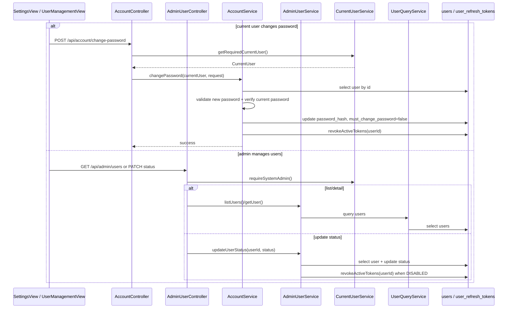

# Argus 用户与账号模块整体流程与代码定位

> 适用读者：准备系统学习 Argus `user` 包及其账号安全、管理员用户管理能力的开发者。
>
> 本文聚焦 `user` 模块本身，以及它和 `auth`、前端 settings/admin 页面、refresh token 失效机制之间的协作关系。

---

## 1. 文档目标

这份文档回答 7 个问题：

1. Argus 的 `user` 模块到底负责哪些事。
2. `auth` 模块和 `user` 模块的职责边界是什么。
3. 当前登录用户修改密码怎么走。
4. 系统管理员查看用户、禁用用户怎么走。
5. `mustChangePassword`、账号状态、refresh token 吊销是如何联动的。
6. 前端 settings 页和 admin 用户管理页分别怎么接后端。
7. 这一整套流程在项目里的具体代码位置分别在哪里。

---

## 2. 模块总览

Argus 的 `user` 模块不是登录鉴权模块，而是“登录之后的用户域能力”，当前主要由两条线组成：

```text
个人账号安全线
SettingsView / AccountPasswordForm
    ↓
AccountController
    ↓
AccountService
    ↓
UserMapper + PasswordHasher + PasswordPolicyValidator + RefreshTokenService

管理员用户管理线
UserManagementView
    ↓
AdminUserController
    ↓
AdminUserService / UserQueryService
    ↓
UserMapper + RefreshTokenService
```

从职责上看：

- `auth` 模块负责登录、注册、刷新 token、登出、当前用户信息。
- `user` 模块负责“已登录之后”的账户安全和后台用户管理。
- `AccountService` 负责当前用户改密。
- `AdminUserService` 负责管理员查看用户和启用 / 禁用用户。
- `UserQueryService` 负责对 `users` 表做通用查询，并被 `CurrentUserService` 复用。

这套设计的关键价值是：

- 登录态建立由 `auth` 完成。
- 登录后的账号安全操作由 `user` 负责。
- 管理员用户管理和业务用户自助改密虽然都在 `user` 包里，但权限边界完全不同。

---

## 3. 代码目录定位

### 3.1 后端 user 目录

路径：`Argus-backend/src/main/java/com/argus/rag/user`

```text
user/
├── controller/
│   ├── AccountController.java
│   └── AdminUserController.java
├── mapper/
│   └── UserMapper.java
├── model/
│   ├── dto/
│   │   ├── ChangePasswordRequest.java
│   │   └── UpdateUserStatusRequest.java
│   ├── entity/
│   │   └── User.java
│   └── vo/
│       └── AdminUserItemResponse.java
└── service/
    ├── AccountService.java
    ├── AdminUserService.java
    └── UserQueryService.java
```

### 3.2 与 user 强关联但不在 user 目录的代码

- `Argus-backend/src/main/java/com/argus/rag/auth/CurrentUserService.java`
- `Argus-backend/src/main/java/com/argus/rag/auth/security/RefreshTokenService.java`
- `Argus-backend/src/main/java/com/argus/rag/auth/service/PasswordHasher.java`
- `Argus-backend/src/main/java/com/argus/rag/auth/service/PasswordPolicyValidator.java`

这些类的重要性在于：

- `user` 模块不自己处理登录，但强依赖当前登录用户身份。
- `user` 模块不自己管 token 存储，但会主动吊销 refresh token。

### 3.3 MyBatis XML 位置

- `Argus-backend/src/main/resources/mappers/UserMapper.xml`

当前这个 XML 很轻，只承载登录时 `selectByLoginIdForUpdate` 这类定制 SQL。
用户管理和改密的大部分更新操作仍然走 MyBatis-Plus `BaseMapper`。

### 3.4 前端配合代码

- `Argus-frontend/src/api/auth.ts`
- `Argus-frontend/src/api/admin-user.ts`
- `Argus-frontend/src/stores/auth.ts`
- `Argus-frontend/src/views/settings/SettingsView.vue`
- `Argus-frontend/src/views/admin/UserManagementView.vue`
- `Argus-frontend/src/components/AccountPasswordForm.vue`

### 3.5 相关数据表

当前和 `user` 模块最直接相关的表有两张：

- `sql/schema.sql` 中的 `users`
- `sql/schema.sql` 中的 `user_refresh_tokens`

它们分别承载：

1. 用户主数据与状态
2. refresh token 会话数据

---

## 4. 配置层流程

### 4.1 `user` 模块本身几乎没有独立 yml 配置

和 `auth`、`qa` 不同，`user` 模块当前没有自己的配置类或专门的 yml 段。

它的业务规则主要直接写在：

1. `users` 表结构
2. `CurrentUserService`
3. `AccountService`
4. `AdminUserService`

### 4.2 用户域最核心的三个状态字段都在 `users` 表里

位置：

- `sql/schema.sql`

当前最关键的三个用户状态字段是：

- `system_role`
- `status`
- `must_change_password`

它们分别控制：

1. 是管理员还是普通用户
2. 账号是否已被禁用
3. 登录后是否必须先改密码

### 4.3 账号状态校验统一收口在 `CurrentUserService`

位置：

- `CurrentUserService.loadUserById()`

当前请求在拿到登录用户后，还会再做两层检查：

1. 用户必须存在
2. 用户状态不能是 `DISABLED`

这意味着：

- 被管理员禁用后，不只是不能再拿新 token
- 已有登录态在后续请求里也会被挡住

### 4.4 管理员能力当前只靠系统角色判断

位置：

- `CurrentUserService.requireSystemAdmin()`

当前后台用户管理没有独立权限表，而是简单地依据：

- `system_role == ADMIN`

### 4.5 改密和禁用账号都会联动 refresh token 吊销

位置：

- `AccountService.changePassword()`
- `AdminUserService.updateUserStatus()`

也就是说：

- 改密码后，原 refresh token 会失效
- 管理员禁用用户后，该用户所有活跃 refresh token 也会被吊销

---

## 5. 数据模型与状态模型

### 5.1 `users`

`users` 表当前主要字段包括：

- `id`
- `user_code`
- `username`
- `email`
- `display_name`
- `password_hash`
- `system_role`
- `status`
- `must_change_password`
- `last_login_at`
- `created_at`
- `updated_at`

这张表不仅存登录信息，也存后台管理状态。

### 5.2 `user_refresh_tokens`

`user_refresh_tokens` 当前主要字段包括：

- `user_id`
- `token_id`
- `token_hash`
- `expires_at`
- `revoked_at`
- `created_at`

它的意义是：

- access token 短期使用
- refresh token 持久会话由这张表控制

### 5.3 `ChangePasswordRequest`

改密入参当前只有两个字段：

- `currentPassword`
- `newPassword`

这说明后端把“确认新密码”留给了前端表单层处理。

### 5.4 `AdminUserItemResponse`

管理员用户详情 / 列表当前字段包括：

- `userId`
- `userCode`
- `username`
- `email`
- `displayName`
- `systemRole`
- `status`
- `mustChangePassword`
- `lastLoginAt`

### 5.5 `UserQueryService.UserRecord`

这是一个跨模块使用的精简 record，当前字段包括：

- `userId`
- `userCode`
- `displayName`
- `systemRole`
- `status`
- `mustChangePassword`

它的重要性在于：

- `CurrentUserService` 并不直接操作完整 `User` 实体
- 而是通过 `UserQueryService` 拿一个足够做鉴权和状态判断的精简模型

### 5.6 当前 `user` 模块的能力边界要明确

虽然叫 `user` 模块，但当前真正落地的能力主要是：

1. 当前用户改密码
2. 管理员查看用户
3. 管理员启用 / 禁用用户

并没有看到当前版本支持：

- 创建用户
- 删除用户
- 修改用户角色
- 修改个人资料

---

## 6. 用户与账号模块详细流程（完整落地版）

下面将 `user` 模块主链拆成 27 步，对应到项目实际代码位置。

### 第 1 步：登录成功后，前端会把 `currentUser` 放进 auth store

位置：

- `Argus-frontend/src/stores/auth.ts`
- `Argus-frontend/src/api/auth.ts`

`user` 模块本身不负责登录，但它后续所有动作都建立在这个 `currentUser` 之上。

### 第 2 步：`mustChangePassword` 会直接影响前端落地页和路由重定向

位置：

- `auth.ts -> resolveAuthorizedPath()`
- `auth.ts -> resolveRoleRedirect()`

当前逻辑是：

- 只要 `mustChangePassword = true`
- 用户就会被导向 `/app/settings`

### 第 3 步：当前用户改密页面主入口是 `SettingsView.vue`

位置：

- `Argus-frontend/src/views/settings/SettingsView.vue`

这个页面会根据 `authStore.currentUser?.mustChangePassword` 决定是否展示强制修改密码提示。

### 第 4 步：改密前端表单先做本地校验

位置：

- `SettingsView.vue`
- `AccountPasswordForm.vue`
- `validateChangePasswordForm(...)`

当前“确认新密码”等交互校验都在前端处理。

### 第 5 步：前端改密 API 是 `POST /api/account/change-password`

位置：

- `Argus-frontend/src/api/auth.ts`
- `AccountController.java`

### 第 6 步：AccountController 只暴露一个入口：改当前登录用户的密码

位置：

- `AccountController.changePassword()`

这条链路不是管理员操作别人密码，而是当前用户改自己的密码。

### 第 7 步：改密时后端先读取当前登录用户

位置：

- `currentUserService.getRequiredCurrentUser()`

如果当前未登录，会直接抛 401。

### 第 8 步：AccountService 是改密真正的主编排层

位置：

- `AccountService.changePassword()`

### 第 9 步：改密先做新密码策略校验

位置：

- `PasswordPolicyValidator.validate(request.newPassword())`

也就是说：

- 旧密码是否正确是一回事
- 新密码是否满足复杂度规则是另一回事

### 第 10 步：后端再按当前 userId 加载 users 表中的用户

位置：

- `userMapper.selectById(currentUser.userId())`

### 第 11 步：如果用户不存在或没有密码哈希，则直接报错

位置：

- `AccountService.changePassword()`

当前错误口径是：

- `用户不存在`

### 第 12 步：后端用 PasswordHasher 校验当前密码是否正确

位置：

- `passwordHasher.matches(...)`

### 第 13 步：新密码不能和当前密码相同

位置：

- `AccountService.changePassword()`

这条规则是单独写死在 service 里的，而不是通用密码策略的一部分。

### 第 14 步：改密成功后会更新 password_hash，并把 mustChangePassword 置回 false

位置：

- `AccountService.changePassword()`

这意味着：

- 强制改密一旦完成
- 这条限制就会被解除

### 第 15 步：改密成功后会吊销该用户所有活跃 refresh token

位置：

- `refreshTokenService.revokeActiveTokens(currentUser.userId())`

所以从安全上看，这条链路不是“静默换密码继续用旧会话”，而是会让旧 refresh token 失效。

### 第 16 步：前端改密成功后会先把 store 里的 `mustChangePassword` 暂时改成 false

位置：

- `authStore.changePassword()`

然后再尝试重新请求 `fetchCurrentUser()` 做一次状态刷新。

### 第 17 步：如果是强制改密场景，前端改密成功后会自动跳去 homePath

位置：

- `SettingsView.vue`

### 第 18 步：管理员用户管理页面主入口是 `UserManagementView.vue`

位置：

- `Argus-frontend/src/views/admin/UserManagementView.vue`

这个页面当前主要支持：

1. 查看用户列表
2. 查看用户详情
3. 启用 / 禁用用户

### 第 19 步：管理员用户列表接口是 `GET /api/admin/users`

位置：

- `AdminUserController.listUsers()`

虽然 controller 上写的是 `/admin/users`，但结合前端 baseURL `/api`，前端实际调用路径就是 `/api/admin/users`。

### 第 20 步：所有管理员用户接口都会先过 `requireSystemAdmin()`

位置：

- `AdminUserController`
- `CurrentUserService.requireSystemAdmin()`

当前后台用户管理完全是“系统管理员专属”能力。

### 第 21 步：AdminUserService 当前把查询职责下沉到 UserQueryService

位置：

- `AdminUserService.listUsers()`
- `AdminUserService.getUser()`
- `UserQueryService`

### 第 22 步：UserQueryService 当前按 ID 升序返回全部用户

位置：

- `UserQueryService.listUsers()`

这里当前没有做分页、搜索或过滤。

### 第 23 步：管理员禁用 / 启用用户入口是 `PATCH /api/admin/users/{userId}/status`

位置：

- `AdminUserController.updateUserStatus()`
- `AdminUserService.updateUserStatus()`

### 第 24 步：修改用户状态时先查用户是否存在，再更新 `status`

位置：

- `AdminUserService.updateUserStatus()`

### 第 25 步：如果目标状态是 DISABLED，会额外吊销该用户所有 refresh token

位置：

- `AdminUserService.updateUserStatus()`

这条联动非常关键，因为它保证：

- 被禁用用户不仅后续不能刷新会话
- 现有 refresh 会话也会失效

### 第 26 步：前端当前会阻止管理员在 UI 上禁用自己

位置：

- `UserManagementView.vue`

当前页面里：

- 如果列表项的 `userId === currentUserId`
- 状态切换按钮会被禁用并显示“当前用户”

### 第 27 步：即便绕过前端，禁用后的用户在后续请求中也会被 CurrentUserService 挡住

位置：

- `CurrentUserService.loadUserById()`

因为这里会再次校验：

- `status != DISABLED`

所以账号禁用最终是后端收口，不依赖前端按钮禁用。

---

## 7. 改密与管理员用户管理时序图



---

## 8. 与 auth 的边界关系

### 8.1 auth 负责“进入系统”，user 负责“进入系统之后的账号控制”

更准确地说：

- `auth` 负责 login / register / refresh / logout / me
- `user` 负责 change-password 和 admin user management

### 8.2 `CurrentUserService` 是 auth 和 user 的连接点

位置：

- `CurrentUserService`

它把登录态用户从 `UserContext` 拉出来，再通过 `UserQueryService` 回查数据库，最终形成 user 模块可用的 `CurrentUser`。

### 8.3 `mustChangePassword` 是 auth 登录态和 user 改密链路之间的桥

位置：

- `users.must_change_password`
- `CurrentUser.currentUser.mustChangePassword`
- `authStore.resolveAuthorizedPath()`
- `AccountService.changePassword()`

### 8.4 refresh token 吊销是 auth 安全基础设施，但被 user 模块主动触发

这说明 user 模块虽然不管 token 的签发，却能在关键安全操作之后主动失效旧会话。

---

## 9. 前端配合机制

### 9.1 settings 页面当前自己内联了一套改密表单

位置：

- `SettingsView.vue`

### 9.2 `AccountPasswordForm.vue` 组件存在，但当前没有看到实际页面引用

位置：

- `Argus-frontend/src/components/AccountPasswordForm.vue`

这意味着当前仓库里实际上存在两套改密 UI 思路：

- 一个独立组件
- 一个 settings 页内联实现

但当前主路径用的是 settings 页内联表单。

### 9.3 admin 用户管理页当前没有用户创建、删除、编辑表单

位置：

- `UserManagementView.vue`

当前前端真实接到页面上的只有：

- 列表
- 详情侧栏
- 启用 / 禁用

### 9.4 admin 页面当前做了一个前端保护：禁止禁用当前登录管理员自己

位置：

- `UserManagementView.vue`

这个保护是有价值的，但它不是最终安全边界；最终仍以后端状态校验为准。

---

## 10. 异常与返回结构

### 10.1 当前 `user` 模块接口统一走 `ApiResponse<T>` 包装

例如：

- `POST /api/account/change-password`
- `GET /api/admin/users`
- `GET /api/admin/users/{userId}`
- `PATCH /api/admin/users/{userId}/status`

### 10.2 改密主链路里常见的业务错误

当前比较常见的错误包括：

- `当前请求未登录`
- `用户不存在`
- `当前密码不正确`
- `新密码不能与当前密码相同`
- 密码策略校验相关错误

### 10.3 管理员用户管理链路里常见的业务错误

当前比较常见的错误包括：

- `当前用户不是系统管理员`
- `用户不存在`
- `用户 ID 非法`

### 10.4 用户被禁用后的报错收口在 CurrentUserService

当前口径是：

- `账号已被禁用`

---

## 11. 当前版本需要特别留意的点

下面这些不是抽象设计，而是当前仓库实现里非常值得记住的事实。

### 11.1 `user` 模块当前不是完整用户中心，而是“改密 + 管理员启停用户”

从 controller / service 看，目前没有这些主路径：

- 用户创建
- 用户删除
- 用户角色修改
- 用户资料编辑

### 11.2 admin 用户管理当前更接近“只读列表 + 状态开关”，不是完整 CRUD

位置：

- `AdminUserController`
- `AdminUserService`

### 11.3 改密和禁用账号都会吊销 refresh token，这是当前最关键的安全联动点之一

位置：

- `AccountService.changePassword()`
- `AdminUserService.updateUserStatus()`

### 11.4 `mustChangePassword` 的清除动作在后端和前端各有一层

位置：

- 后端：`AccountService` 把数据库字段改为 false
- 前端：`authStore.changePassword()` 先把当前内存态改为 false，再尝试重新拉取当前用户

这意味着前端体验上会更快，但最终真相仍以后端数据库和 `fetchCurrentUser()` 为准。

### 11.5 `AccountPasswordForm.vue` 当前看起来是预备组件，主页面实际上没接它

这个点适合后面整理前端时顺手收敛，否则会长期保持两套改密表单实现。

### 11.6 后端管理员接口路径风格和其他模块略有不同

位置：

- `AdminUserController` 写的是 `/admin/users`

但结合前端 baseURL `/api` 和服务上下文，前端实际调用仍是：

- `/api/admin/users`

这在调试路由时值得注意。

---

## 12. 对简历和面试最值得保留的讲法

### 12.1 建议重点保留的 5 个工程点

1. 项目把登录鉴权和登录后账号管理分层处理，`auth` 负责会话建立，`user` 负责改密和管理员用户控制。
2. 当前用户改密不是简单改表，而是串联了密码策略校验、旧密码校验、`mustChangePassword` 清除和 refresh token 全量吊销。
3. 管理员禁用用户也会联动吊销 refresh token，保证被禁用账号的会话尽快失效。
4. `CurrentUserService` 每次都通过数据库回查当前用户并校验状态，因此账号禁用是后端收口，不依赖前端 UI。
5. 前端通过 `mustChangePassword` 做强制改密路由收口，形成了从登录态到账号安全页的闭环。

### 12.2 面试时建议收口的地方

1. 不要把当前后台用户管理讲成完整 IAM 平台，它现在还只是轻量用户管理。
2. 不要忽略和 refresh token 的联动，这其实是 user 模块里最有工程价值的一段。
3. 不要把前端的“禁用当前用户按钮”当作核心安全机制，真正的安全边界还是后端状态校验。

---

## 13. 推荐阅读顺序

如果你第一次系统学习这个模块，建议按下面顺序阅读：

1. `Argus-backend/src/main/java/com/argus/rag/user/controller/AccountController.java`
2. `Argus-backend/src/main/java/com/argus/rag/user/service/AccountService.java`
3. `Argus-backend/src/main/java/com/argus/rag/user/controller/AdminUserController.java`
4. `Argus-backend/src/main/java/com/argus/rag/user/service/AdminUserService.java`
5. `Argus-backend/src/main/java/com/argus/rag/user/service/UserQueryService.java`
6. `Argus-backend/src/main/java/com/argus/rag/auth/CurrentUserService.java`
7. `Argus-backend/src/main/resources/mappers/UserMapper.xml`
8. `Argus-frontend/src/stores/auth.ts`
9. `Argus-frontend/src/views/settings/SettingsView.vue`
10. `Argus-frontend/src/views/admin/UserManagementView.vue`
11. `Argus-frontend/src/api/auth.ts`
12. `Argus-frontend/src/api/admin-user.ts`
13. `sql/schema.sql`

这样可以先建立“后端安全链路 -> 管理端能力 -> 前端状态收口”的整体视图。

---

## 14. 一句话总结

Argus 的 `user` 模块本质上是一套“登录后的账号安全与管理员用户控制层”，它不负责建立登录态，但负责在改密、账号禁用、强制改密等关键场景下，通过 `users` 状态字段和 refresh token 吊销机制把用户安全边界真正落到系统里。