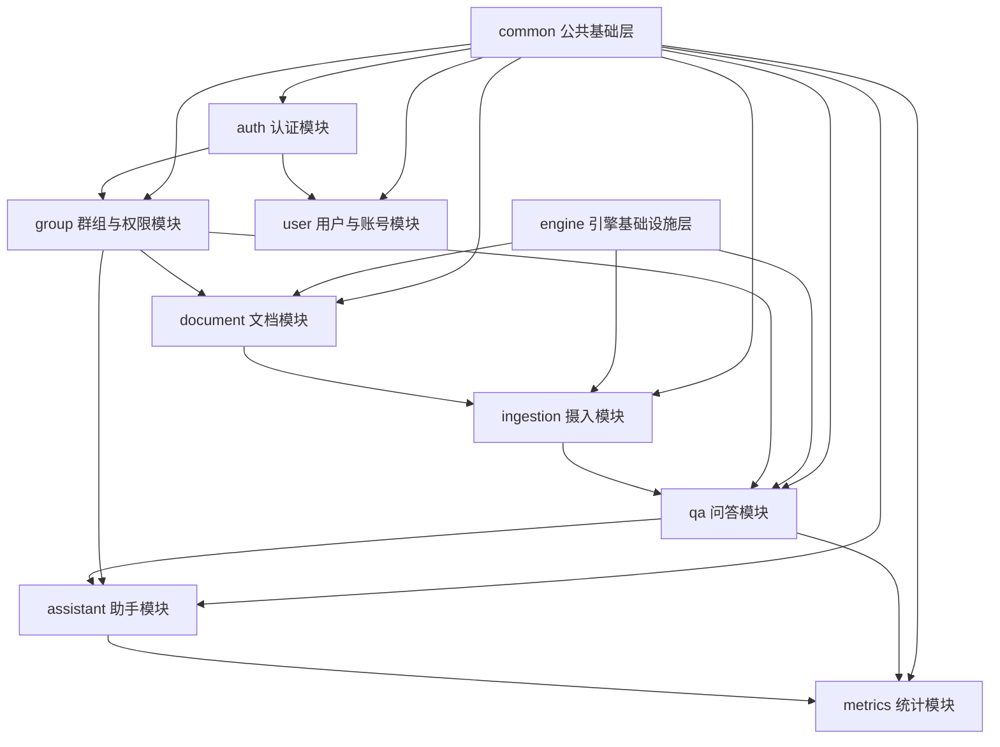

# Argus 全项目模块文档导航与阅读顺序

> 适用读者：已经开始看 Argus 文档，但希望先拿到一张“全局地图”，知道每份文档分别解决什么问题、模块之间怎么串、自己应该先读哪几份的人。

---

## 1. 文档目标

这份导航文档主要解决 6 个问题：

1. Argus 当前已经有哪些核心模块详解文档。
2. `auth`、`document`、`ingestion`、`qa`、`assistant`、`group`、`user`、`metrics`、`common`、`engine` 这 10 个模块分别属于哪一层。
3. 如果你是第一次进入项目，最推荐的阅读顺序是什么。
4. 如果你只关心某条主线，比如认证、知识库、RAG、助手、后台统计，应该从哪几份文档切入。
5. 当前模块之间最关键的依赖关系是什么。
6. 除了模块详解以外，项目里还有哪些背景、启动、版本演进文档值得一起看。

---

## 2. 一张图先看全局

如果先不管具体类名，只看项目主结构，Argus 当前最适合按下面 5 层来理解：

```text
基础公共层
common + engine

身份与权限边界层
auth + user + group

知识资产链路层
document + ingestion

AI 应用层
qa + assistant

运营与观测层
metrics
```

再把它放进真实业务协作链里，可以压缩成下面这张总图：



这张图可以先记住 4 个判断：

1. `common` 是后端统一契约层，几乎所有模块都踩在它上面。
2. `engine` 是对象存储、ES、PgVector 这类底层适配层，不直接承载业务页面，但强支撑 document / ingestion / qa。
3. `group` 不是一个孤立页面，而是 document / qa / assistant 的业务权限边界。
4. `metrics` 不是全局埋点平台，当前更像 QA 与 Assistant 的 LLM 调用统计面板。

---

## 3. 核心模块文档导航

下面这 10 份是当前最核心的模块详解文档，也是你真正建立项目骨架认知时最值得优先看的部分。

### 3.1 基础公共层

1. [common/公共基础模块整体流程与代码定位.md](common/公共基础模块整体流程与代码定位.md)
   作用：统一响应、异常、日志切面、请求级用户上下文、共享枚举的后端公共地基层。

2. [engine/引擎基础设施模块整体流程与代码定位.md](engine/引擎基础设施模块整体流程与代码定位.md)
   作用：对象存储、ES 索引与关键词检索、PgVector 语义检索的底层适配层。

### 3.2 身份与权限边界层

3. [auth/认证模块整体流程与代码定位.md](auth/认证模块整体流程与代码定位.md)
   作用：登录、注册、刷新、登出、JWT 解析、Refresh Token、当前用户获取的完整认证链路。

4. [user/用户与账号模块整体流程与代码定位.md](user/用户与账号模块整体流程与代码定位.md)
   作用：登录后的当前用户改密、管理员用户列表/详情/状态切换，以及 mustChangePassword 的前后端联动。

5. [group/群组与权限模块整体流程与代码定位.md](group/群组与权限模块整体流程与代码定位.md)
   作用：群组创建、邀请、申请加入、成员管理，以及 document / qa / assistant 共享的群组访问边界。

### 3.3 知识资产链路层

6. [document/文档模块整体流程与代码定位.md](document/文档模块整体流程与代码定位.md)
   作用：文档上传、秒传/分片上传能力、预览、删除、下载与摄入触发入口。

7. [ingestion/摄入模块整体流程与代码定位.md](ingestion/摄入模块整体流程与代码定位.md)
   作用：上传完成后的异步 ETL 编排、重试、失败收口、向量/索引同步和状态更新总链路。

8. [ingestion/摄入流水线内部技术链路详解.md](ingestion/摄入流水线内部技术链路详解.md)
   作用：专门深挖 reader、parser、文本清洗、结构分块、chunk 落库、向量写入这条内部技术流水线。

### 3.4 AI 应用层

9. [qa/问答模块整体流程与代码定位.md](qa/问答模块整体流程与代码定位.md)
   作用：RAG 问答主链，覆盖 query planning、混合检索、证据筛选、答案生成和 citations 组装。

10. [assistant/助手模块整体流程与代码定位.md](assistant/助手模块整体流程与代码定位.md)
   作用：助手会话、对话上下文、Agent 调用、SSE 流式输出，以及知识库工具如何复用 qa 检索能力。

### 3.5 运营与观测层

11. [metrics/LLM调用统计模块整体流程与代码定位.md](metrics/LLM调用统计模块整体流程与代码定位.md)
   作用：QA 与 Assistant 的 token、费用、成功率、排行、趋势等后台统计链路。

---

## 4. 推荐的默认阅读顺序

如果你现在没有特别强的目标，只想“先系统看懂这个项目”，我建议按下面顺序读：

1. [Argus-会话背景.md](Argus-会话背景.md)
2. [common/公共基础模块整体流程与代码定位.md](common/公共基础模块整体流程与代码定位.md)
3. [auth/认证模块整体流程与代码定位.md](auth/认证模块整体流程与代码定位.md)
4. [user/用户与账号模块整体流程与代码定位.md](user/用户与账号模块整体流程与代码定位.md)
5. [group/群组与权限模块整体流程与代码定位.md](group/群组与权限模块整体流程与代码定位.md)
6. [document/文档模块整体流程与代码定位.md](document/文档模块整体流程与代码定位.md)
7. [engine/引擎基础设施模块整体流程与代码定位.md](engine/引擎基础设施模块整体流程与代码定位.md)
8. [ingestion/摄入模块整体流程与代码定位.md](ingestion/摄入模块整体流程与代码定位.md)
9. [ingestion/摄入流水线内部技术链路详解.md](ingestion/摄入流水线内部技术链路详解.md)
10. [qa/问答模块整体流程与代码定位.md](qa/问答模块整体流程与代码定位.md)
11. [assistant/助手模块整体流程与代码定位.md](assistant/助手模块整体流程与代码定位.md)
12. [metrics/LLM调用统计模块整体流程与代码定位.md](metrics/LLM调用统计模块整体流程与代码定位.md)

这个顺序的逻辑是：

- 先建立统一后端基础规则。
- 再理解身份和业务权限边界。
- 再进入文档资产从上传到摄入的生命周期。
- 最后再看 QA / Assistant 这种建立在知识资产和权限边界之上的 AI 应用层。

---

## 5. 按目标选择阅读路线

如果你不是想“全都看”，而是带着具体问题进入项目，下面这几条路线更高效。

### 5.1 我只想先看认证和权限怎么控

建议顺序：

1. [common/公共基础模块整体流程与代码定位.md](common/公共基础模块整体流程与代码定位.md)
2. [auth/认证模块整体流程与代码定位.md](auth/认证模块整体流程与代码定位.md)
3. [user/用户与账号模块整体流程与代码定位.md](user/用户与账号模块整体流程与代码定位.md)
4. [group/群组与权限模块整体流程与代码定位.md](group/群组与权限模块整体流程与代码定位.md)

适合你关心的问题：

- 登录态怎么恢复
- 当前用户怎么取
- 管理员权限怎么判断
- 普通业务用户和系统管理员如何隔离
- 群组 owner / member 怎么影响 document / qa / assistant

### 5.2 我只想看知识库文档是怎么进系统的

建议顺序：

1. [document/文档模块整体流程与代码定位.md](document/文档模块整体流程与代码定位.md)
2. [engine/引擎基础设施模块整体流程与代码定位.md](engine/引擎基础设施模块整体流程与代码定位.md)
3. [ingestion/摄入模块整体流程与代码定位.md](ingestion/摄入模块整体流程与代码定位.md)
4. [ingestion/摄入流水线内部技术链路详解.md](ingestion/摄入流水线内部技术链路详解.md)

适合你关心的问题：

- 文件怎么上传到对象存储
- 文档什么时候进入摄入
- preview_text、document_chunks、向量、ES 索引分别什么时候生成
- parser / chunking / vector add 具体怎么做

### 5.3 我只想看 RAG 问答主链

建议顺序：

1. [group/群组与权限模块整体流程与代码定位.md](group/群组与权限模块整体流程与代码定位.md)
2. [engine/引擎基础设施模块整体流程与代码定位.md](engine/引擎基础设施模块整体流程与代码定位.md)
3. [ingestion/摄入模块整体流程与代码定位.md](ingestion/摄入模块整体流程与代码定位.md)
4. [qa/问答模块整体流程与代码定位.md](qa/问答模块整体流程与代码定位.md)

适合你关心的问题：

- 检索前权限是怎么控的
- 向量检索和关键词检索从哪来
- chunk 数据是怎么准备好的
- 最终答案如何基于证据生成

### 5.4 我只想看助手模块

建议顺序：

1. [assistant/助手模块整体流程与代码定位.md](assistant/助手模块整体流程与代码定位.md)
2. [qa/问答模块整体流程与代码定位.md](qa/问答模块整体流程与代码定位.md)
3. [group/群组与权限模块整体流程与代码定位.md](group/群组与权限模块整体流程与代码定位.md)
4. [metrics/LLM调用统计模块整体流程与代码定位.md](metrics/LLM调用统计模块整体流程与代码定位.md)

原因是：

- 助手自己的会话、对话、SSE 主链先看助手文档。
- 助手的知识库工具复用了 qa 检索能力，所以第二篇要看 qa。
- 助手能不能访问群组知识库取决于 group 权限边界。
- 助手的 LLM 调用统计最后会流入 metrics。

### 5.5 我只想看后台管理与运营视角

建议顺序：

1. [user/用户与账号模块整体流程与代码定位.md](user/用户与账号模块整体流程与代码定位.md)
2. [metrics/LLM调用统计模块整体流程与代码定位.md](metrics/LLM调用统计模块整体流程与代码定位.md)
3. [auth/认证模块整体流程与代码定位.md](auth/认证模块整体流程与代码定位.md)

适合你关心的问题：

- 管理员能管哪些用户状态
- mustChangePassword 如何驱动后台使用流程
- 当前系统对 QA / Assistant 的调用统计展示到什么粒度

### 5.6 我只想做面试 / 简历讲述收口

建议顺序：

1. [Argus-会话背景.md](Argus-会话背景.md)
2. [common/公共基础模块整体流程与代码定位.md](common/公共基础模块整体流程与代码定位.md)
3. [auth/认证模块整体流程与代码定位.md](auth/认证模块整体流程与代码定位.md)
4. [group/群组与权限模块整体流程与代码定位.md](group/群组与权限模块整体流程与代码定位.md)
5. [document/文档模块整体流程与代码定位.md](document/文档模块整体流程与代码定位.md)
6. [ingestion/摄入模块整体流程与代码定位.md](ingestion/摄入模块整体流程与代码定位.md)
7. [qa/问答模块整体流程与代码定位.md](qa/问答模块整体流程与代码定位.md)
8. [assistant/助手模块整体流程与代码定位.md](assistant/助手模块整体流程与代码定位.md)
9. [metrics/LLM调用统计模块整体流程与代码定位.md](metrics/LLM调用统计模块整体流程与代码定位.md)

因为这条路线最容易形成一套完整表达：

- 统一基础设施
- 身份认证与权限边界
- 知识资产进入系统
- RAG 问答和助手应用落地
- 调用统计和后台观察

---

## 6. 模块之间最值得记住的 5 条主线

如果你读文档时不想记太多细节，先记住这 5 条主线就够了。

### 6.1 身份主线

`common -> auth -> user`

代表问题：

- 请求怎么从 JWT 变成当前用户
- 当前用户状态怎么回库校验
- 改密和管理员用户状态控制怎么和认证体系衔接

### 6.2 业务授权主线

`group -> document / qa / assistant`

代表问题：

- 为什么 document、qa、assistant 都离不开 group
- 为什么群组模块不是“附属功能”，而是业务权限边界

### 6.3 知识资产主线

`document -> engine -> ingestion`

代表问题：

- 文件怎么进对象存储
- 文档怎么被读取、解析、切 chunk、写向量、建索引

### 6.4 AI 应用主线

`ingestion -> qa -> assistant`

代表问题：

- QA 为什么能检索到文档 chunk
- 助手为什么能复用知识库检索
- 哪些能力是直接做答案生成，哪些只是做召回

### 6.5 运营观测主线

`qa / assistant -> metrics`

代表问题：

- 哪些模块的 LLM 调用会记账
- token / cost / successRate / trend / rank 是怎么聚合出来的

---

## 7. 补充文档导航

除了上面那些核心模块详解，当前 docs 根目录下还有几类辅助文档，适合在不同阶段配合使用。

### 7.1 背景与上下文类

1. [Argus-会话背景.md](Argus-会话背景.md)
   适合用途：快速理解这套文档最初是按什么学习目标和讲述口径整理出来的。

2. [CONTEXT.md](CONTEXT.md)
   适合用途：了解项目阶段性上下文和协作背景。

### 7.2 启动与配置类

3. [启动流程与配置加载说明.md](启动流程与配置加载说明.md)
   适合用途：你准备从“怎么启动、配置从哪来、profile 怎么生效”这个角度补全项目理解时看。

4. [project-init.md](project-init.md)
   适合用途：回看项目初始化背景和初始搭建思路。

### 7.3 助手专项补充类

5. [assistant-module-guide.md](assistant-module-guide.md)
   适合用途：想单独补看 assistant 相关设计思路或专项说明时看。

### 7.4 版本演进与历史决策类

6. [V1.0-项目文档.md](V1.0-项目文档.md)
7. [V2.0-项目文档.md](V2.0-项目文档.md)
8. [V2.0-设计决策.md](V2.0-设计决策.md)
9. [V3.0-项目文档.md](V3.0-项目文档.md)
10. [V3.0-设计决策.md](V3.0-设计决策.md)
11. [V4.0-项目文档.md](V4.0-项目文档.md)
12. [V4.0-设计决策.md](V4.0-设计决策.md)

适合用途：

- 你想理解项目为什么演化成现在这样
- 你想把“当前实现”和“历史方案”区分开
- 你准备做架构复盘或设计决策复盘

### 7.5 规划类

13. [系统后续改造升级计划.md](系统后续改造升级计划.md)
   适合用途：了解当前实现之外，项目后续可能演进的方向。

---

## 8. 当前文档覆盖范围怎么理解

当前这套 docs 已经把 Argus 的核心主链基本覆盖到了：

1. 公共基础规则
2. 认证与权限边界
3. 文档资产上传与摄入
4. RAG 问答与助手
5. 统计与后台观察

如果从“模块级认知”角度看，当前最主要的骨架已经齐了。

但如果从“专题级深挖”角度看，仍然可以继续细拆：

- 启动与配置加载链
- 检索链内部详解
- 前端路由与页面关系图
- 数据库表关系总览

也就是说：

- 现在已经足够用于整体理解和面试讲述
- 如果你后面要做更深的技术复盘，还可以继续按专题扩展

---

## 9. 一句话总结

把 Argus 当前这套文档当成一张地图来用，最有效的方式不是“从头到尾全顺读”，而是先抓住 `common / auth / group / document / ingestion / qa / assistant / metrics` 这条主骨架，再按你自己的目标去插读 `user`、`engine`、启动说明和版本演进文档。这样既能快速建立全局认知，也不会在一开始陷进过细的实现细节里。