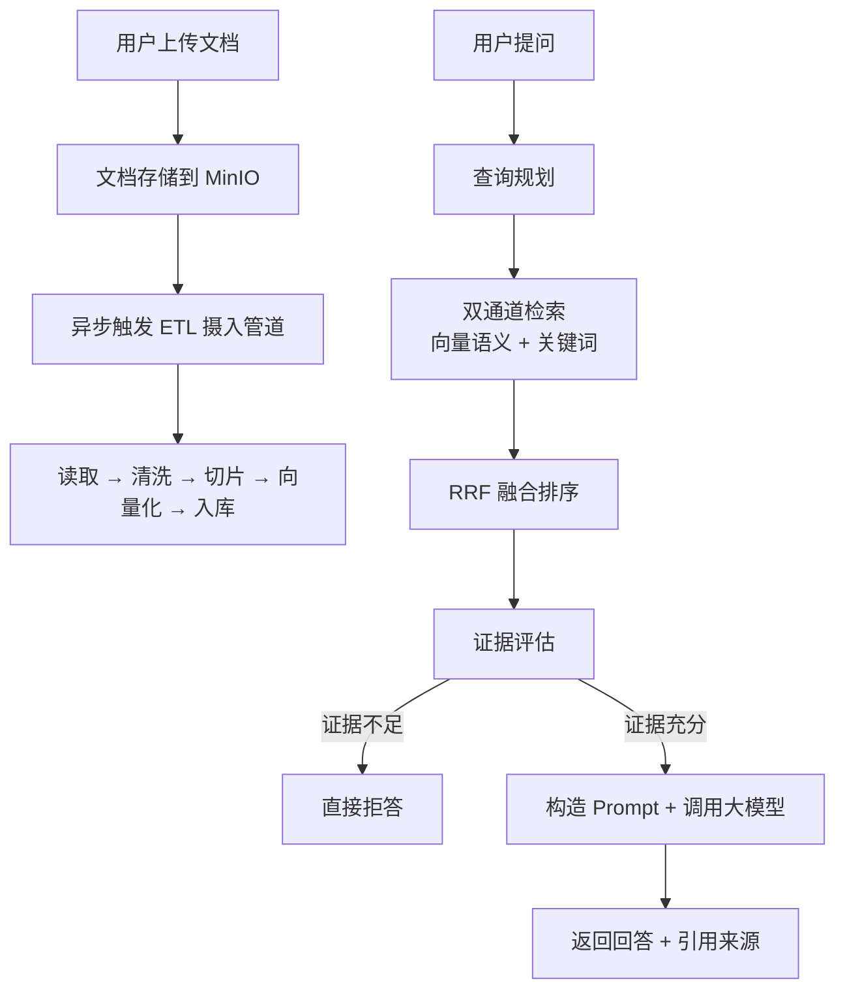

# Argus RAG 全链路详解

## 一、全局鸟瞰图

整套系统的核心任务是：**用户上传文档 → 系统自动处理文档 → 用户提问时检索相关片段 → 大模型基于检索结果生成回答**。

用一张流程图表示：



---

## 二、离线阶段：文档摄入管道（Ingestion Pipeline）

这是"让知识库有东西可查"的过程。用户上传一个文档后，系统在**后台异步**执行以下 7 步：

### 第 1 步：触发入口

```
用户点击上传 → 前端调用 DocumentController 上传接口
                → 文件存到 MinIO 对象存储
                → 文档记录写入 PostgreSQL（状态 = PROCESSING）
                → 发布 Spring ApplicationEvent 事件
                → DocumentIngestionAsyncService 监听事件，异步启动 ETL
```

关键类：`DocumentIngestionAsyncService`，带 `@Retryable` 重试机制（最多 3 次，退避 2s/4s/8s）。

### 第 2 步：查找文档 + 读取文件（Extract）

```java
DocumentEntity doc = findDocument(documentId, groupId);
StoredObjectDocumentReader reader = new StoredObjectDocumentReader(storageService, parserFactory, doc);
List<Document> rawDocuments = reader.get();
```

- 从 MinIO 下载文件二进制流
- 根据文件后缀名选择解析器（`DocumentParserFactory` 简单工厂模式）：
  - `.txt` → `TxtDocumentParser`
  - `.md` → `MdDocumentParser`
  - `.pdf` → `PdfDocumentParser`
  - `.docx` → `DocxDocumentParser`
- 解析为 Spring AI 的 `Document` 对象（纯文本 + 元数据）

### 第 3 步：文本清洗（Transform）

```java
List<Document> cleanedDocuments = textCleanupTransformer.apply(rawDocuments);
```

`TextCleanupTransformer` 去除：
- 连续空行、首尾空白
- 不可见特殊字符
- 保留有效文本内容

### 第 4 步：预览文本落库

```java
String previewText = cleanedText.substring(0, Math.min(cleanedText.length(), 200));
// 写入 documents 表的 preview_text 字段
```

取清洗后文本前 200 个字符，存到数据库，供前端文档列表预览使用。

### 第 5 步：结构感知切片（Transform）⭐

这是整个摄入管道最核心的步骤。

```java
List<Document> chunks = chunkTransformer.apply(cleanedDocuments);
```

`StructureAwareChunkTransformer` 的切片策略：

1. **按 Markdown 标题拆分为章节** — 识别 `#`、`##`、`###` 等标题行，把文档切成一个个章节
2. **章节内按 token 预算再拆** — 如果某个章节太长（超过 `chunkTokenBudget`，默认约 240 token），在段落边界（连续空行）处继续拆分
3. **段落内按硬上限拆** — 如果单个段落就超过 `maxChunkTokenBudget`（约 320 token），硬拆
4. **相邻切片保留 overlap** — 重叠约 32 token，保证上下文连贯性
5. **跳过代码块** — 识别 ` ``` ` 围栏，不在代码块内部做标题切分

最终每个切片携带元数据：`documentId`、`chunkIndex`（在文档中的序号）、`groupId` 等。

### 第 6 步：切片落库（Load）

```java
chunkService.saveChunks(groupId, documentId, chunks);
```

把每个切片写入 PostgreSQL 的 `document_chunks` 表，记录：
- `chunk_id`（自增主键）
- `document_id`（关联文档）
- `chunk_text`（切片文本）
- `chunk_index`（切片在文档中的序号，用于后续检索时的邻居窗口扩展）
- `group_id`（所属群组）
- `metadata_json`（附加元数据）

### 第 7 步：向量写入（Load）

```java
vectorService.ingestChunks(chunkEntities);
```

`VectorIngestionService` 执行：

1. **先删除旧向量** — `vectorStore.delete(filter)` 按 `documentId` 过滤，避免重复
2. **分批写入新向量** — 每批 `addBatchSize`（默认 9 条）
3. **向量化** — Spring AI 的 `VectorStore.add()` 内部自动调用 **DashScope text-embedding-v3** 模型，将每个切片文本转为 **512 维向量**
4. **存储到 PostgreSQL pgvector** — 向量 + 元数据一起存入 `vector_store` 表

### 最终状态

```java
markDocumentStatus(documentId, groupId, "READY", null, LocalDateTime.now());
```

文档状态从 `PROCESSING` → `READY`，表示"可被检索"。

如果任何步骤失败，`@Recover` 方法会把状态标记为 `FAILED` 并记录失败原因。

---

## 三、在线阶段：RAG 问答链路

用户在前端输入问题并点击发送后，系统执行以下完整链路。

### 第 1 步：入口接收

```
前端 POST /api/qa/ask（或 SSE 流式 /api/qa/ask/stream）
         ↓
QaController.askQuestion() 接收 AskQuestionRequest { groupId, question }
```

### 第 2 步：查询规划（Query Planning）🧠

```java
QueryPlanResult queryPlan = queryPlanningService.plan(question);
```

调用 **Kimi moonshot-v1-8k** 大模型分析用户问题，决定用哪种检索策略：

| 策略 | 含义 | 示例 |
|------|------|------|
| `DIRECT` | 问题已足够清晰，直接检索 | "pgvector 写入失败" → 检索 `["pgvector 写入失败"]` |
| `REWRITE` | 问题口语化，需要改写 | "请问上传流程是什么" → 检索 `["上传流程", "文档上传流程"]` |
| `DECOMPOSE` | 问题包含多个子问题，需拆分 | "上传流程和切片策略" → 检索 `["上传流程", "切片策略"]` |

Prompt 模板在 `prompts/query-planning/user.st`，要求大模型**只输出 JSON**：
```json
{"strategy": "REWRITE", "queries": ["文档上传流程"]}
```

**安全回退**：如果规划失败（大模型异常、返回格式错误），自动回退为 `DIRECT` 策略，用原始问题直接检索。

配置开关：`rag.qa.query-planning-enabled: true`（dev 环境已开启）。

### 第 3 步：双通道混合检索 ⭐⭐⭐

这是 RAG 的核心。`HybridChunkRetrievalService.retrieve()` 对每个规划好的查询语句，**并行执行两个通道**：

#### 通道 A：向量语义检索（PgVector）

```java
List<VectorHit> vectorHits = vectorVectorRetrievalAdapter.search(groupId, query, 50);
```

- 将查询文本通过 **DashScope text-embedding-v3** 转为 512 维向量
- 在 PostgreSQL pgvector 中执行 **余弦相似度搜索**（`cosine_distance`）
- 通过 `FilterExpression` 强制加 `groupId` 过滤，确保只搜当前群组
- 返回 top-50 个最相似的切片，每个带余弦相似度分数
- 返回后**二次校验** `groupId`（防御式编程，防止跨群组数据泄露）

**擅长**：理解语义相似性。比如问"怎么把文件传上去"能匹配到"文档上传流程"。

#### 通道 B：关键词检索（pg_trgm）

```java
List<KeywordHit> keywordHits = pgKeywordSearchService.search(groupId, query, 50);
```

- 使用 PostgreSQL 的 `pg_trgm` 扩展（三字符组相似度）
- SQL：`similarity(chunk_text, query)` 计算文本相似度
- 按相似度降序排列，返回 top-50
- 降级策略：查询失败返回空列表，不中断主链路

**擅长**：精确匹配专有名词。比如问"pgvector"能精确找到包含"pgvector"的切片。

#### 两个通道的对比

| 维度 | 向量语义检索 | 关键词检索 |
|------|------------|----------|
| 底层技术 | DashScope embedding + pgvector 余弦距离 | PostgreSQL pg_trgm 三字符组相似度 |
| 擅长场景 | 语义理解（同义词、换种说法） | 精确匹配（专有名词、错误代码） |
| 返回数量 | top-50 | top-50 |
| 分数范围 | 余弦相似度 [0, 1] | trgm 相似度 [0, 1] |

### 第 4 步：RRF 融合排序 🔄

两个通道各返回 50 条结果，需要用一种算法合并排序。

```java
// 伪代码
for each candidate in candidates:
    candidate.rrfScore += 1 / (RRF_K + vectorRank)  // 向量排名贡献
    candidate.rrfScore += 1 / (RRF_K + keywordRank)  // 关键词排名贡献
```

**RRF（Reciprocal Rank Fusion）** 的核心思想：

- 如果一个切片在**两个通道都排名靠前**，它的融合分数会很高
- 本系统设置 `RRF_K = 0`，意味着排名越靠前权重越大（`1/1=1` vs `1/2=0.5`）
- 最终分数范围被归一化到 `[0, 1]`

举个例子：

| 切片 | 向量排名 | 关键词排名 | RRF 分数 |
|------|---------|----------|---------|
| A | 1 | 3 | 1/1 + 1/3 = 1.33 → 归一化 |
| B | 10 | 1 | 1/10 + 1/1 = 1.10 |
| C | 2 | 2 | 1/2 + 1/2 = 1.00 |

A 在两个通道都不错，融合后排第一。

融合后按 RRF 分数降序排列，取 top-K（默认 5）。

### 第 5 步：聚类分组 + 邻居窗口扩展 📎

```java
List<RetrievalCluster> clusters = buildClusters(rankedCandidates);
```

**聚类**：同一个文档中**连续**的切片合并为一个"类簇"。

比如一篇文档的切片 3、4、5 都命中了，它们会被合并为一个簇，以排名最高的切片（比如 4）作为"主切片"。

**邻居窗口扩展**：在主切片的基础上，向前向后各扩展 `neighborWindow=1` 个切片。

```
原始命中：chunkIndex = 4
扩展后：chunkIndex = 3, 4, 5（前后各扩展 1 个）
```

这样做的目的是：**给大模型提供更完整的上下文**，避免只看到一个孤立片段。

### 第 6 步：构建证据窗口文本

```java
String evidenceText = buildEvidenceWindow(row, cluster, chunkWindowCache);
```

把扩展窗口内的所有切片文本拼接起来，加上文件名前缀：

```
文件名：Argus-设计文档.md
## 第三章 上传流程
用户通过前端选择文件...（chunk 3 文本）
## 第三章 上传流程（续）
系统校验文件大小...（chunk 4 文本）
系统调用 MinIO 存储...（chunk 5 文本）
```

每个证据被赋予一个编号：`E1`、`E2`、`E3`...

### 第 7 步：证据充分度评估 🚦

```java
EvidenceLevel evidenceLevel = evaluateEvidenceLevel(documents);
```

这是一个**关键的防幻觉机制**，根据检索结果判断"证据够不够回答这个问题"：

| 等级 | 条件 | 行为 |
|------|------|------|
| `NONE` | 最高分 < 0.75（噪声） | **直接拒答**，不调用大模型 |
| `WEAK` | 单通道命中 + 最高分 < 0.85 | **谨慎回答**，要求大模型声明"依据有限" |
| `PARTIAL` | 双通道命中 或 候选数 ≥ 2 | **部分回答**，未覆盖部分必须说明无法确认 |
| `SUFFICIENT` | 双通道命中 + 最高分 ≥ 0.85 | **正常回答** |

**为什么需要这个？** 因为 pgvector 即使对完全不相关的问题，也会返回 top-k 结果（只是分数低）。比如问"贵公司今年的财务报告怎么样？"，pgvector 可能返回一些碰巧向量距离近的噪声切片，最高分只有 0.71。如果不做证据评估，大模型会"一本正经地胡说八道"。

阈值 0.75 的含义：
- 单通道 rank-1 归一化分数约 0.63 → 不够
- 双通道 rank-1 归一化分数约 0.86 → 够
- 0.75 确保只有**两个通道都认为相关**的文档才能通过

### 第 8 步：证据不足拦截 ✋

在 `QaChatService.askWithUsage()` 和 `askStream()` 中：

```java
if (evidenceLevel != null && evidenceLevel.ordinal() < EvidenceLevel.PARTIAL.ordinal()) {
    return AskQuestionResponse.unanswered(INSUFFICIENT_CODE, INSUFFICIENT_MESSAGE, List.of());
}
```

**证据等级低于 PARTIAL（即 NONE 或 WEAK）时，直接返回拒答响应，根本不调用大模型。**

这避免了：
- 浪费大模型 token
- 大模型在噪声证据上产生幻觉回答
- 用户被误导

### 第 9 步：构造 Prompt + 调用大模型 🤖

证据通过评估后，构造三个层次的 Prompt：

**System Prompt**（`qa/system.st`）：
```
你是群组知识问答助手，只能依据给定证据回答，不得补充外部知识或猜测。
请严格输出 JSON...
```

**User Prompt**（`qa/user.st` + `qa/rag-context.st`）：
```
{query}

以下是可用证据。每条证据都有 evidenceId。
你只能基于这些证据回答，不能超出证据范围进行臆测。
---------------------
E1: 文件名：xxx.md
    切片文本内容...
E2: 文件名：yyy.pdf
    切片文本内容...
---------------------

问题：{question}
证据等级：{evidenceLevel}
回答策略：{evidenceGuidance}

执行要求：
1. 你只能依据已提供的检索证据回答...
2. 不允许臆测、不允许扩展常识...
3. 你的输出必须满足当前证据等级约束...
```

调用 **Kimi moonshot-v1-8k** 生成回答，要求输出结构化 JSON：
```json
{
  "answered": true,
  "answer": "根据文档 E1 和 E2，上传流程分为三步...",
  "reasonCode": null,
  "reasonMessage": null
}
```

**容错机制**：
- 如果结构化 JSON 解析失败，自动回退为 `QaAnswerParser` 原文解析
- 如果回退也失败，返回格式错误响应

### 第 10 步：组装引用 + 返回响应 📋

```java
AskQuestionResponse.answered(
    result.output().answer().trim(),
    citationAssembler.assembleDocuments(documents)
);
```

`CitationAssembler` 把检索到的文档信息组装为引用列表，每个引用包含：
- 证据编号（E1、E2...）
- 文件名
- 切片内容摘要
- 相似度分数
- 检索来源（向量/关键词/混合）
- 文档 ID（供前端跳转）

前端收到响应后，右侧展示引用来源，用户可以点击查看原文。

---

## 四、流式模式（SSE）的差异

上面讲的是同步模式（`/qa/ask`）。流式模式（`/qa/ask/stream`）的差异只在**第 9 步**：

- 同步：`qaChatClient.call().chatResponse()` → 一次性返回完整回答
- 流式：`qaChatClient.prompt().stream()` → 返回 `Flux<ChatResponse>`，逐 token 推送

流程中其他所有步骤（查询规划 → 双通道检索 → RRF 融合 → 证据评估）**完全一致**，都是在流式输出之前完成的。

SSE 事件类型：
- `token` — 大模型逐 token 输出的文本片段
- `citation` — 流结束后推送引用来源
- `usage` — 用量信息（prompt tokens、completion tokens）
- `error` — 证据不足时推送错误事件

---

## 五、数据流向总览

```
┌─────────────────────────────────────────────────────────┐
│                    离线摄入管道                            │
│                                                         │
│  MinIO ──读取──→ 解析器 ──→ 文本清洗 ──→ 结构感知切片     │
│                                                      │   │
│                                            ┌─────────┘   │
│                                            ↓             │
│                                    PostgreSQL            │
│                                    ├── documents 表      │
│                                    ├── document_chunks 表│
│                                    └── vector_store 表   │
│                                         (pgvector)       │
└─────────────────────────────────────────────────────────┘

┌─────────────────────────────────────────────────────────┐
│                    在线问答链路                            │
│                                                         │
│  用户问题                                                │
│    ↓                                                     │
│  查询规划（Kimi 分析 → DIRECT/REWRITE/DECOMPOSE）        │
│    ↓                                                     │
│  ┌──────────────┐    ┌──────────────┐                   │
│  │ 向量语义检索  │    │ 关键词检索    │                   │
│  │ (pgvector +   │    │ (pg_trgm +   │                   │
│  │  DashScope    │    │  SQL          │                   │
│  │  embedding)   │    │  similarity)  │                   │
│  └──────┬───────┘    └──────┬───────┘                   │
│         └──────┬────────────┘                           │
│                ↓                                         │
│         RRF 融合排序 → 聚类 → 邻居扩展 → 证据窗口        │
│                ↓                                         │
│         证据充分度评估                                    │
│           ├─ NONE/WEAK → 直接拒答                        │
│           └─ PARTIAL/SUFFICIENT →                       │
│                ↓                                         │
│         构造 Prompt → Kimi 生成 → 结构化 JSON             │
│                ↓                                         │
│         组装引用 → 返回前端                               │
└─────────────────────────────────────────────────────────┘
```

---

## 六、关键设计亮点总结

| 设计点 | 实现 | 解决的问题 |
|--------|------|-----------|
| **混合检索** | 向量语义 + 关键词双通道 | 语义理解 + 精确匹配兼顾 |
| **RRF 融合** | `1/(k+rank)` 加权 | 不同通道分数不可比，用排名融合 |
| **结构感知切片** | 按标题→段落→硬上限三级拆分 | 保持语义完整性，避免断章取义 |
| **邻居窗口扩展** | 主切片前后各扩展 1 个 | 提供完整上下文，减少信息缺失 |
| **证据评估** | 4 级评估 + 阈值过滤 | 防止噪声证据导致大模型幻觉 |
| **查询规划** | LLM 分析 → DIRECT/REWRITE/DECOMPOSE | 口语化问题也能精准检索 |
| **结构化输出 + 回退** | JSON 解析失败 → 原文解析 | 兼顾大模型输出稳定性和容错 |
| **重试机制** | `@Retryable` 3 次 + `@Recover` 兜底 | 摄入管道的 transient 失败自动恢复 |
| **群组隔离** | 检索时强制 `groupId` 过滤 + 二次校验 | 防止跨群组数据泄露 |

---

有什么具体的步骤想深入聊的，随时问我。